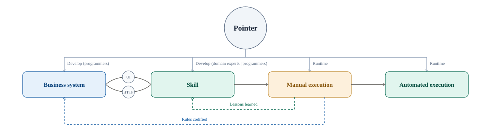
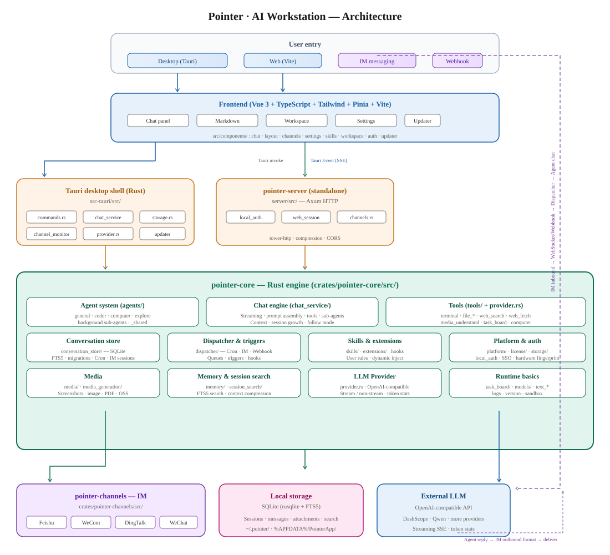

# Pointer

**Open-source desktop agent foundation for the enterprise.**

Build and run digital employees on the computer people already use, and keep them running stably on a server. Both the agent and the model can stay inside your own environment, with no per-seat fees. The desktop app and the web app share the same capabilities, on Windows, macOS, and Linux.

| You want | Get it here |
| --- | --- |
| Ready to use, out of the box | [Official download](https://pointer.readflowai.com/download) |
| Deploy inside your company | [GitHub Releases](https://github.com/chinphing/agent-pointer/releases) |

[简体中文](README.zh-CN.md)

[](LICENSE)

## Why Pointer

A digital employee has to work inside a real office setup. It needs a license that allows commercial use, a small footprint, a long stretch of real use, eyes and hands on the desktop, and a model vendor you choose.

<table>
  <thead>
    <tr>
      <th></th>
      <th>Typical agents</th>
      <th>Pointer</th>
    </tr>
  </thead>
  <tbody>
    <tr>
      <td>Product form</td>
      <td>Open-source agents are mostly CLI, for developers</td>
      <td><strong>A desktop app</strong>, and open source. <strong>Everyone in the company can use it</strong></td>
    </tr>
    <tr>
      <td>Open source, commercial use</td>
      <td>Desktop apps are usually priced per seat</td>
      <td><strong>Free to use, and free to customize.</strong> <a href="LICENSE">Apache 2.0</a></td>
    </tr>
    <tr>
      <td rowspan="3">Resource use</td>
      <td>About 300 MB installer download</td>
      <td><strong>About 25 MB</strong></td>
    </tr>
    <tr>
      <td>1 GB+ resident memory</td>
      <td><strong>About 300 MB</strong></td>
    </tr>
    <tr>
      <td>One task can take 100%+ CPU. Extra tasks crowd out other work</td>
      <td><strong>About 10% of one CPU core</strong> while running. <strong>10+ sub-agents at once</strong>. Other tasks are completely unaffected</td>
    </tr>
    <tr>
      <td>Long conversations</td>
      <td>When the context fills up, you start a new chat, and earlier work is easy to lose</td>
      <td><strong>Stay in one conversation for as long as you want.</strong> It pages automatically, compresses context automatically, and you can mark milestones for quick recall</td>
    </tr>
    <tr>
      <td>Computer control</td>
      <td>No hands or eyes, or browser-only / accessibility-tree control</td>
      <td><strong>Built-in vision computer control</strong>: read screenshots, then use the mouse and keyboard on desktop apps. It can control any GUI application on the computer (still being improved), filling the last capability gap for digital employees</td>
    </tr>
    <tr>
      <td>Vendors</td>
      <td>Tied to a specific vendor's models, or a specific vendor's ecosystem</td>
      <td><strong>Not tied to a specific vendor's models</strong>, and not tied to a specific vendor's ecosystem</td>
    </tr>
  </tbody>
</table>

A digital employee should not compete with a person for the computer. The memory and CPU figures above are there so it can stay on an everyday work machine. Pointer has already seen more than 3 months of high-intensity use in real business work, nearly 1000M tokens a day.

## What Pointer does

Pointer is more than a runtime for Skills. It builds the business system, helps turn manual work into a Skill that drives it through its UI and HTTP interfaces, and carries what manual runs teach back into the Skill and the system itself.



### General agent capabilities

| Capability | What you get |
| --- | --- |
| Agent system | Built-in general, coder, computer, and explore. [Sub-agents](docs/user/subagents.md) can run in the background so the main conversation can continue |
| Chat engine | Streaming, prompt assembly, and tool calling; long conversations, context compression, and milestone recall |
| Tools | Terminal, file read/write/search, web search and fetch, task board; vision computer control for GUI apps (still being improved) |
| Skills and extensions | [Skills](docs/user/skills.md), [plugins](docs/user/plugins.md), and user rules; external tools via [MCP](docs/user/mcp.md) |
| Dispatch and triggers | Scheduled tasks, [webhooks](docs/user/webhook.md), and IM inbound events enter chat through one dispatcher |
| Entry points | Desktop, web, [cloud host](docs/user/cloud-host.md), and [Feishu, DingTalk, WeCom, and WeChat](docs/user/im-channels.md) |
| Model access | OpenAI-compatible APIs. Qwen and DeepSeek are built in; Doubao, Kimi, Zhipu, OpenRouter, and others can be added—no single-vendor lock-in |

### What was added for Skill development and testing

After a role is written as a reusable Skill, you need a shared format, an easy install path, editing in the conversation, and a way to validate it at scale.

| What you need | What Pointer provides |
| --- | --- |
| Write in a shared format | [Skills](docs/user/skills.md) use a common skill format, compatible with Codex and similar directories. Instructions, references, scripts, and assets stay separate |
| Install, then turn it on | Enable skills in the library, including zip import. Existing skills can be imported from Codex, Claude, OpenClaw, and Hermes |
| Author and edit in the conversation | Creating, editing, reviewing, and packaging goes to the coding sub-agent. A skill can also ship inside a [plugin](docs/user/plugins.md) |
| Skill validation | Run the Skill under high-concurrency background sub-agents in isolated environments, and sweep many test samples quickly to check stability and correctness |
| Fill in a missing runtime | If Node, Python, or another runtime is missing, install it in the conversation and keep testing the skill |

Start with [getting started](docs/user/getting-started.md).

## Roadmap

1. Keep improving Skill and plugin development.
2. Support Skill authorization across multiple accounts.
3. Add sandbox-based, server-side per-user isolation.
4. More to come.

## Architecture

The desktop app, web app, and IM channels share one `pointer-core`. The UI handles interaction; orchestration, tools, Skills, and sessions live in the core.



Layer notes: [docs/developer/architecture.md](docs/developer/architecture.md).

## Documentation

| Audience | Start here |
| --- | --- |
| Users | [docs/user/](docs/user/README.md) |
| Developers | [docs/developer/](docs/developer/README.md) |
| Contributors | [CONTRIBUTING.md](CONTRIBUTING.md) · [DEVELOPMENT.md](DEVELOPMENT.md) |
| Security | [SECURITY.md](SECURITY.md) |
| Changes | [CHANGELOG.md](CHANGELOG.md) |

Full index: [docs/README.md](docs/README.md).

## Develop

The desktop app is Tauri 2 and Vue 3. The web UI is the same interface served by `pointer-server`. Chat, tools, Skills, and agents live in `crates/pointer-core`.

```bash
npm install
npm run tauri:dev          # desktop
npm run server:dev         # then npm run web:dev for the browser UI
npm test
cargo test --workspace
```

Leave `POINTER_EDITION` unset for local work. Details: [DEVELOPMENT.md](DEVELOPMENT.md).

## Release

Bump the root `VERSION` file, sync, then push a `v*.*.*` tag. CI builds Windows / macOS / Linux and opens a draft on [GitHub Releases](https://github.com/chinphing/agent-pointer/releases).

```bash
# edit VERSION, then:
npm run version:sync
npm run version:check

git tag v0.1.2
git push origin v0.1.2

# or build packages on this machine:
npm run tauri:build
npm run server:build
```

Details: [docs/contributing/cross-platform-build.md](docs/contributing/cross-platform-build.md) · [docs/contributing/versioning.md](docs/contributing/versioning.md).

## Acknowledgments

Pointer learned from and was inspired by:

- [OpenClaw](https://github.com/openclaw/openclaw) by Peter Steinberger and the [OpenClaw Foundation](https://openclaw.org)
- [Hermes Agent](https://github.com/NousResearch/hermes-agent) by Nous Research

## License

Apache License 2.0. Copyright 2026 刘新星 (https://pointer.readflowai.com). Trademarks and official domains are described in [NOTICE](NOTICE).
