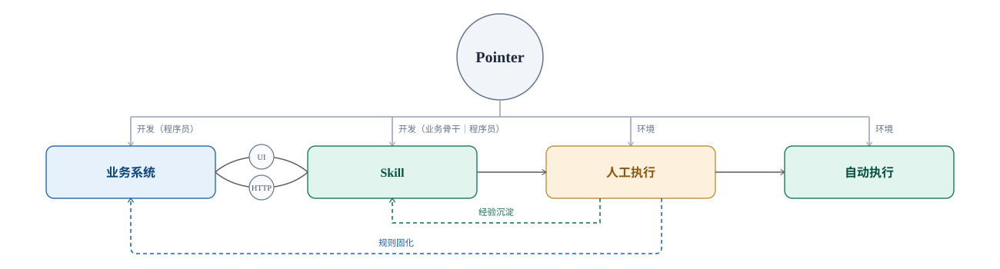
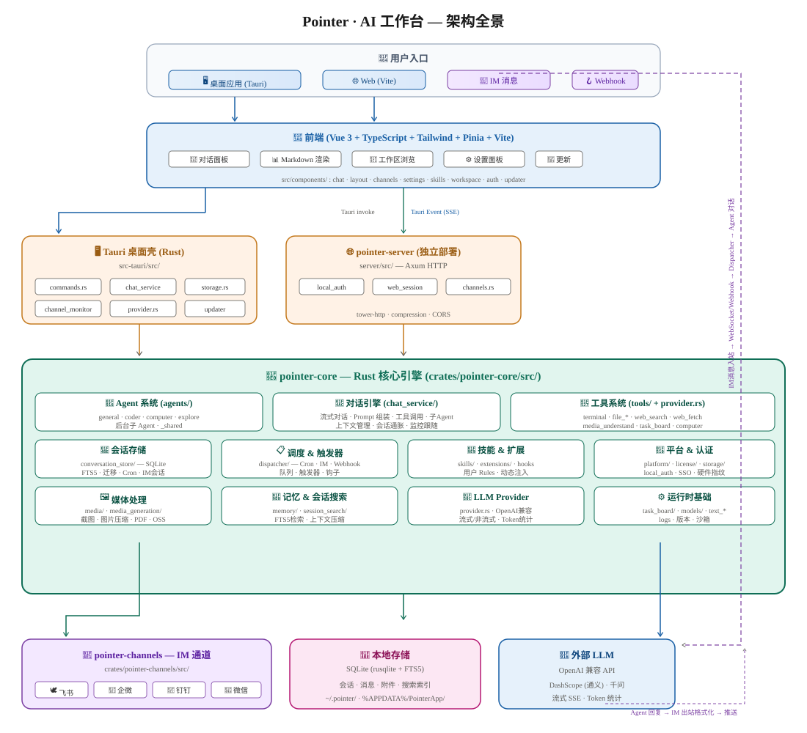

# Pointer

**开箱即用、超级低资源消耗的桌面智能体基座，用来打造数字员工。面向开发者和企业。**

把数字员工做出来，跑在员工日常用的电脑上，也能在服务器上长期跑。智能体和模型都可以留在你自己的环境里，也不按坐席收费。桌面端和 Web 端能力一致，支持 Windows、macOS、Linux。

| 你想要 | 怎么拿 |
| --- | --- |
| 装上就能用 | [官网下载](https://pointer.readflowai.com/download) |
| 放进公司自己的环境 | [GitHub Releases](https://github.com/chinphing/agent-pointer/releases) |

[English](README.md)

[](LICENSE)

## 为什么选择 Pointer

数字员工要在真实办公环境里干活：协议能商用、资源占用低、扛得住长时间跑，还得看得见屏幕、动得了鼠标键盘，模型也得你自己选。

<table>
  <thead>
    <tr>
      <th></th>
      <th>常见智能体</th>
      <th>Pointer</th>
    </tr>
  </thead>
  <tbody>
    <tr>
      <td>产品形态</td>
      <td>开源的多半是命令行，主要给开发用</td>
      <td><strong>桌面版 + Web 服务端</strong>，而且开源。<strong>企业里谁都能上手</strong>。<strong>同一套 harness</strong>：开发和运行技能一致性更高</td>
    </tr>
    <tr>
      <td>企业特性</td>
      <td>每个人自己配账号和密钥，技能靠手动拷贝分发，没有统一管控</td>
      <td><strong>统一登录、统一 API Key 管理、统一 Skill 分发和权限管理</strong></td>
    </tr>
    <tr>
      <td>开源商用</td>
      <td>桌面版多半按席位收费</td>
      <td><strong>完全免费，想怎么改就怎么改。</strong><a href="LICENSE">Apache 2.0</a></td>
    </tr>
    <tr>
      <td rowspan="3">资源占用</td>
      <td>安装包下载约 300 MB</td>
      <td><strong>约 25 MB</strong></td>
    </tr>
    <tr>
      <td>常态内存 1 GB 以上</td>
      <td><strong>约 300 MB</strong></td>
    </tr>
    <tr>
      <td>一个任务就能把 CPU 打满。多开几个任务，本机其他工作就卡了</td>
      <td><strong>运行大约吃单核 10%</strong>。<strong>十几个子智能体同时跑也没问题</strong>，其他任务基本不受影响</td>
    </tr>
    <tr>
      <td>超长会话</td>
      <td>上下文一满就得新开，以前聊过的容易丢</td>
      <td><strong>想一直聊就一直聊。</strong>自动分页、自动压缩上下文，重要节点可标里程碑，随时跳回去</td>
    </tr>
    <tr>
      <td>供应商</td>
      <td>绑死某一家模型，或绑死某一家生态</td>
      <td><strong>模型随便换</strong>，生态也不绑死</td>
    </tr>
  </tbody>
</table>

数字员工不该跟真人抢电脑。上面这些内存和 CPU 数字，就是为了让它安心待在日常办公的机器上。Pointer 已经在真实业务里高强度跑了三个多月，每天差不多用掉 1000M Token。

## Pointer 能做什么

Pointer 不只是一个跑 Skill 的运行时。它开发业务系统，把人工流程做成 Skill（经 UI 与 HTTP 接口驱动业务系统），再把人工执行沉淀的经验和确定性规则，分别回写到 Skill 和业务系统本身。



### 通用 Agent 能力

| 能力 | 说明 |
| --- | --- |
| Agent 系统 | 内置 general、coder、computer、explore。[子智能体](docs/user/subagents.md) 可后台并行，主对话不用停 |
| 对话引擎 | 流式输出、Prompt 组装、工具调用；支持超长会话、上下文压缩、里程碑召回 |
| 工具执行 | 终端、文件读写检索、联网搜索与抓取、任务板；电脑侧靠纯视觉操控有界面的软件（还在打磨） |
| 技能与扩展 | [Skills](docs/user/skills.md)、[插件](docs/user/plugins.md)、用户 Rules；外部工具接 [MCP](docs/user/mcp.md) |
| 调度与触发 | 定时任务、[Webhook](docs/user/webhook.md)、IM 入站，经统一调度进对话 |
| 多入口 | 桌面端、Web 端、[云主机](docs/user/cloud-host.md)，以及[飞书、钉钉、企业微信、微信](docs/user/im-channels.md) |
| 模型接入 | OpenAI 兼容接口。内置千问、深度求索，也可接豆包、Kimi、智谱、OpenRouter 等，不绑死一家 |

### 为 Skill 开发与测试补上的能力

岗位流程写成可复用 Skill 之后，要写得顺、装得上、在对话里改得动，还能大批量验证稳不稳、对不对。

| 场景 | 怎么做 |
| --- | --- |
| 按通用格式来写 | [Skills](docs/user/skills.md) 用常见的技能说明格式，和 Codex 一类目录兼容。说明、参考资料、脚本、资源分开放 |
| 装进技能库再打开 | 技能库里勾选启用，也支持 zip 导入。本机已有的 Codex、Claude、OpenClaw、Hermes 技能可以一键迁过来 |
| 对着对话就能改 | 新建、修改、审查、打包交给写代码的子智能体。也可以打进[插件](docs/user/plugins.md)一起发 |
| Skill 验证 | 用高并发的后台子 Agent，在隔离环境里跑 Skill，快速过大量测试样本，看执行稳不稳、对不对 |
| 缺环境就补环境 | 缺 Node、Python 之类，对话里装好再继续测 |

想上手，看 [快速上手](docs/user/getting-started.md)。

## 路线图

1. 继续完善技能开发与插件开发功能。
2. 支持多账号下的技能授权。
3. 实现基于沙箱的服务端用户隔离。
4. 更多……

## 架构

桌面端、Web 端、IM 通道共用一套 `pointer-core`：界面只负责交互，编排、工具、Skills、会话都在核心层。



分层说明见 [docs/developer/architecture.md](docs/developer/architecture.md)。

## 文档

| 读者 | 入口 |
| --- | --- |
| 用户 | [docs/user/](docs/user/README.md) |
| 开发者 | [docs/developer/](docs/developer/README.md) |
| 贡献者 | [CONTRIBUTING.md](CONTRIBUTING.md) · [DEVELOPMENT.md](DEVELOPMENT.md) |
| 安全 | [SECURITY.md](SECURITY.md) |
| 变更 | [CHANGELOG.md](CHANGELOG.md) |

完整索引：[docs/README.md](docs/README.md)。

## 开发

桌面端是 Tauri 2 + Vue 3，Web 端由 `pointer-server` 提供同一套界面。对话、工具、Skills、Agent 都在 `crates/pointer-core`。

```bash
npm install
npm run tauri:dev
npm run server:dev
npm run web:dev
```

日常开发不用设 `POINTER_EDITION`。细节见 [DEVELOPMENT.md](DEVELOPMENT.md)。

## 发布

改根目录 `VERSION`，同步版本号，再推一个 `v*.*.*` 标签。CI 会打 Windows / macOS / Linux 包，并在 [GitHub Releases](https://github.com/chinphing/agent-pointer/releases) 生成草稿。

```bash
# 编辑 VERSION 后：
npm run version:sync
npm run version:check

git tag v0.1.2
git push origin v0.1.2

# 或在本机打安装包：
npm run tauri:build
npm run server:build
```

打包细节：[docs/contributing/cross-platform-build.md](docs/contributing/cross-platform-build.md)；版本号规则：[docs/contributing/versioning.md](docs/contributing/versioning.md)。

## 致谢

Pointer 的不少设计受到这些项目启发，在此致谢：

- [OpenClaw](https://github.com/openclaw/openclaw)（Peter Steinberger / [OpenClaw Foundation](https://openclaw.org)）
- [Hermes Agent](https://github.com/NousResearch/hermes-agent)（Nous Research）

## 许可证

Apache License 2.0。版权所有 © 2026 刘新星（https://pointer.readflowai.com）。商标与官方域名见 [NOTICE](NOTICE)。
