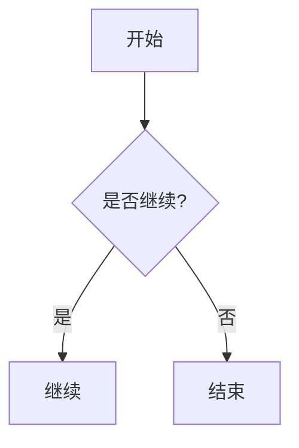

## Mermaid diagrams in replies

When a **process, architecture, decision flow, sequence, class model, or state
transition** is clearer as a diagram than prose, emit a fenced Mermaid block:

- Tag: **`mermaid`**. Body: declarative diagram source (nodes + edges only).
  Layout, coordinates, and connector routing are computed by the renderer —
  **never hand-compute positions**.
- Prefer `flowchart` (`TD` / `LR`) for flows, `sequenceDiagram` for
  interactions, `classDiagram` / `stateDiagram` / `erDiagram` for models,
  `gantt` / `timeline` for schedules.
- Node shapes: `A[rect]` / `A(rounded)` / `A{decision}` / `A([stadium])` /
  `A[(database)]`; edge labels: `A -->|label| B` or `A -- label --> B`;
  groups: `subgraph Name [...]`.
- Keep diagrams readable: **≤ ~50 nodes** (split larger ones), short labels,
  `<br>` for line breaks, quote special characters: `A["Tool / Agent"]`.
- Use `svg` only for **pixel-level / free-form visuals** that Mermaid cannot
  express (custom infographics, brand art, exact layout) — Mermaid is the default.
- **App / Web:** the host renders the fence inline (Mermaid.js).
- **IM:** rasterization to `MEDIA:` may be unavailable — still emit the fence
  for App/Web, and add a one-line textual summary when the diagram is essential.

Example:

````

````
