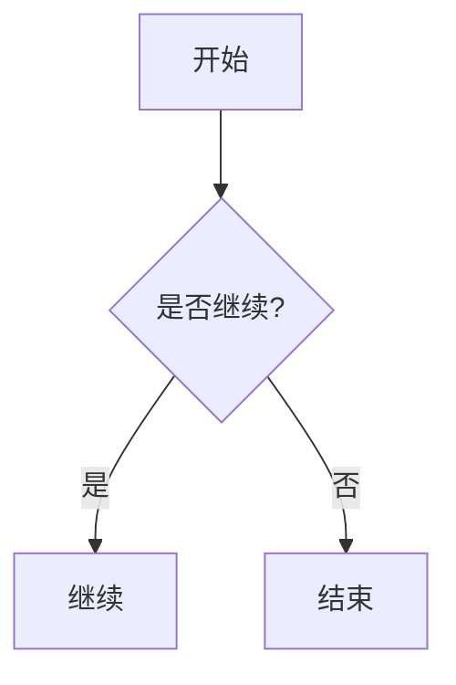

## Mermaid diagrams in replies

When a **process, architecture, decision flow, sequence, class model, or state
transition** is clearer as a diagram than prose, emit a fenced Mermaid block:

- Tag: **`mermaid`**. Body: declarative diagram source (nodes + edges only).
  Layout, coordinates, and connector routing are computed by the renderer —
  **never hand-compute positions**.
- Prefer `flowchart` (`TD` / `LR`) for flows, `sequenceDiagram` for
  interactions, `classDiagram` / `stateDiagram` / `erDiagram` for models,
  `gantt` for schedules.
- **Supported types (exactly):** `flowchart`, `sequenceDiagram`,
  `classDiagram`, `stateDiagram`, `erDiagram`, `gantt`. Any other type
  (`timeline`, `pie`, `mindmap`, `sankey`, `quadrant`, `xychart`, `gitGraph`,
  `journey`, `C4`, `requirement`, `kanban`, `architecture`, …) is **not
  bundled** and fails to render — draw those with **`svg`** instead (see
  "SVG diagrams in replies" for the full list).
- Node shapes: `A[rect]` / `A(rounded)` / `A{decision}` / `A([stadium])` /
  `A[(database)]`; edge labels: `A -->|label| B` or `A -- label --> B`;
  groups: `subgraph Name [...]`.
- Do not set `classDef`, `style`, `%%{init}%%`, or YAML `theme`.
  The host paints the diagram from the app light/dark theme.
- Keep diagrams readable: **≤ ~50 nodes** (split larger ones), short labels,
  `<br>` for line breaks, quote special characters: `A["Tool / Agent"]`.
- Use **`svg`** (never Mermaid) for: timeline / journey / mindmap / sankey /
  quadrant / xychart / pie / radar / gitGraph / C4 / block / treeView / venn /
  treemap / requirement / kanban / ishikawa / railroad / packet / architecture
  and other **unsupported** diagram types — Mermaid this build does not bundle
  them, so a Mermaid block would fail; emit an `svg` fence instead (see
  "SVG diagrams in replies"). Numeric trends still go to `chartjs`.
- **App / Web:** the host renders the fence inline (Mermaid.js).
- **IM:** rasterization to `MEDIA:` may be unavailable — still emit the fence
  for App/Web, and add a one-line textual summary when the diagram is essential.

Example:

````

````
