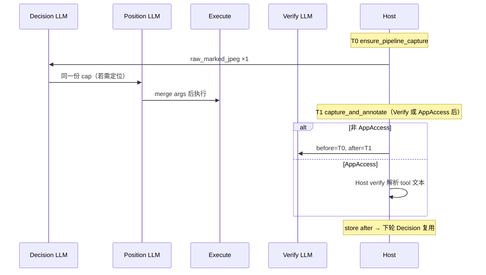

# Advanced 电脑操控模块化流水线

Advanced 档在 `computerAdvancedPipeline=true`（默认）时启用四阶段宿主编排，替代单轮 LLM 内嵌 Verify/Location/Recheck 七段式。

## 流程

每轮动作循环：

1. **决策（Decision）** — 流式 LLM + 原生 tool call；输入 `[DECISION_CONTEXT]` + 单张当前截图
2. **定位（Position）** — 流式 LLM + thinking + 虚拟 submit 工具；输入原图 + 标注图（需空间参数时）
3. **执行（Execute）** — 宿主 merge 定位结果后执行 desktop tool + 可选 `task_board_*` sidecar
4. **校验（Verify）** — 非 AppAccess 工具：流式 Verify LLM + `submit_verify` 工具（操作前/后截图）；AppAccess：仅 Host verify（非 LLM）

任务完成轮次仅跑 **决策**（无 root desktop tool 时结束）。

决策阶段**不传**坐标 / overlay index（由 Position 补全或宿主跳过 Position）。Advanced 下**不调用** `action_verify` sidecar，校验由 Verify LLM 或 AppAccess Host verify 写入 tier history。

## 代码位置

| 模块 | 路径 |
|------|------|
| 编排 | `crates/pointer-core/src/agents/computer/pipeline/round.rs` |
| OperationFamily 路由 | `crates/pointer-core/src/agents/computer/pipeline/operation.rs` |
| Vision 组装 | `crates/pointer-core/src/agents/computer/pipeline/vision_pack.rs` |
| JSON LLM | `crates/pointer-core/src/agents/computer/pipeline/json_llm.rs` |
| 虚拟 submit 工具 | `crates/pointer-core/src/agents/computer/pipeline/module_tools.rs` |
| 提示词 | `crates/pointer-core/src/agents/computer/prompts/modules/` |
| 宿主编排 hook | `crates/pointer-core/src/chat_service/computer_pipeline_loop.rs` |

## 阶段总览：定位 / 校验开关

| 阶段 | 触发条件 | 输入 | 输出格式 |
|------|----------|------|----------|
| **Decision** | 每轮（除纯结束轮） | `[DECISION_CONTEXT]` + 当前标注截图 | 决策工具（`click` / `input` / …）：仅 `action`（及 `text`/`lines` 等语义字段），**不含** x/y/index/路由 |
| **Position** | 见下表「需定位 = 是」 | `[POSITION_CONTEXT]` + 原图 + 数字标注图 + bbox 列表 | 虚拟 tool call（`submit_position_*`）；thinking 开启 |
| **Execute** | Position merge 后（或跳过 Position 时） | 完整 tool args | **纯文本** tool result |
| **Verify LLM** | 非 AppAccess root desktop tool 执行后 | `[VERIFY_CONTEXT]` + 操作前/后截图 + 操作摘要 | 虚拟 tool call（`submit_verify`）→ `VerifyConclusion` |
| **Host verify（AppAccess）** | `launch_app` / `list_apps` 执行后 | OS API / tool 文本解析（非 LLM） | `pass` / `fail` / `n/a` 写入 tier history |

### 定位跳过规则（`needs_positioning_for_tool`）

宿主在以下情况**不跑** Position LLM：

- 固定跳过：`wait`、`hotkey`、`input_focused`、`clipboard_*`、`mouse_scroll_current`、`list_apps`、`launch_app`
- 决策工具不输出路由；index/at 由 Position 模块的 `submit_position_*` 工具名决定
- Decision 误输出空间/路由字段时，宿主在 Position 前删除（`sanitize_decision_tool_args`）

决策工具 schema：`decision_tools/schemas.yaml`（`additionalProperties: false`）。工具附录：`decision_tools/prompts/*.md`（独立于执行期 `tools/prompts/mouse.md` 等）。

实现：`crates/pointer-core/src/agents/computer/pipeline/operation.rs`。

### Position / Verify wire 格式（`wire_format.rs`）

按 `OperationFamily` 选择 user wire 布局；共用 helper 负责 JPEG part、text part、tag 前缀。

| 格式 | 阶段 | 适用 Family | 内容 |
|------|------|-------------|------|
| `AnnotatedDualScreen` | Position | click/hover/scroll/drag/input/modified_click/captcha | `[POSITION_CONTEXT]` + 当前屏 + 标注屏 + bbox 列表 |
| `BeforeAfterScreenshots` | Verify | 默认（视觉类工具） | `[VERIFY_CONTEXT]` + before/after 截图 |
| `ClipboardWithScreenshots` | Verify | Clipboard | `[VERIFY_CONTEXT]` + `[Tool result]` + before/after 截图 |

新增工具组定制格式：在 `wire_format.rs` 增加 variant + `for_family` 映射 + `build` 实现。

## OperationFamily 与 prompt 路由

| Family | 工具前缀 / 名称 | 定位 prompt | 校验 |
|--------|-----------------|-------------|------|
| pointer_click | `mouse_click_*`, … | `position/pointer_click.md` | Verify LLM `verify/pointer_click.md` |
| pointer_hover | `hover`, `mouse_move` → `mouse_hover_*` | `position/pointer_hover.md` | Verify LLM |
| scroll | `mouse_scroll_*` | `position/scroll.md` | Verify LLM |
| drag | `mouse_drag_*` | `position/drag.md` | Verify LLM |
| input | `input_index`, `input_at`, `input_focused` | `position/input.md` | Verify LLM `verify/input.md` |
| modified_click | `modified_click_*` | `position/modified_click.md` | Verify LLM |
| captcha | `captcha_verify_*` | `position/captcha.md` | Verify LLM |
| hotkey | `hotkey` | 跳过 | Verify LLM `verify/hotkey.md` |
| wait | `wait` | 跳过 | Verify LLM `verify/wait.md` |
| clipboard | `clipboard_*` | 跳过 | Verify LLM `verify/clipboard.md` |
| app_access | `list_apps`, `launch_app` | 跳过 | **Host verify only**（不跑 Verify LLM） |

## 各工具：定位 / 校验 / 输出

| 工具组 | 具体工具 | Family | 需定位 | 需校验 | 校验方式 | 工具执行输出（文本） |
|--------|----------|--------|--------|--------|----------|----------------------|
| 单击 / 悬停 / 滚动 / 拖拽 / 输入 / 改键 / 验证码 | 见 OperationFamily | 各对应 family | 见上表 | 是 | Verify LLM 前后截图对比 | tool hint 文本 |
| 快捷键 / 等待 / 剪贴板 | `hotkey` / `wait` / `clipboard_*` | 各对应 | 否 | 是 | Verify LLM（剪贴板：空/错误宿主 fail；其余 tool+截图） | hint / `Clipboard text: …` |
| 应用列表 | `list_apps` | AppAccess | 否 | 是 | Host 解析 tool 文本 | Codex 行 + hint |
| 启动应用 | `launch_app` | AppAccess | 否 | 是 | Host OS API + tool 文本 | `Goal: … OK/FAILED — …` |
| Sidecar | `task_board_*` | — | 否 | 否 | 不跑 Verify | task board 文本 |
| Sidecar（旧） | `action_verify` | — | — | Advanced 下禁用 | — |

### `launch_app` / `list_apps` Host verify

执行后轮询 2–4s（`launch_app`），要求目标 app `running && frontmost`（macOS 还需可见窗口 ≥50×50）。结果写入 tool 文本：`Goal: … OK — … Verified: …` 或 `FAILED — …`。宿主解析后写入 tier history（`verify: verified - pass` / `fail`），**不**调用 Verify LLM。

应用 list/launch 行为见 [computer-app-access.md](./computer-app-access.md)。

### `clipboard_read` / `clipboard_write` Verify LLM

Verify wire 注入 **[Tool result]**（工具返回的剪贴板正文）以及 before/after 截图。主判据为 tool 文本与 `goal` 是否一致；截图用于辅助核对（如界面上可见的 API key、复制 toast 是否与剪贴板内容一致）。剪贴板字节本身不可见于屏幕，以 [Tool result] 为准。

**Host 短路（不跑 Verify LLM）：** `clipboard_read` 正文为空、`clipboard_write` 报告 `Copied 0 characters`、或 tool 报错/无结果 → 宿主直接 `fail`（`wrong_operation`）。

## Host post-execute 规则

实现：`run_pipeline_post_execute_verify`（`computer_pipeline_loop.rs`）。

1. **AppAccess** — OS 截屏刷新缓存；解析 tool 文本 → `pass` / `fail` / `n/a`；AppAccess pass 时工具卡保留原始 tool 文本
2. **其他 desktop 工具** — `run_verify_phase`：T0 before + T1 after 截图 → Verify LLM → `VerifyConclusion`；`loading_detected` 时 wait 2.5s 重采 after 并重跑；**Clipboard** 空剪贴板/零写入/tool 错误由宿主直接 fail；**工具执行返回 `ERROR:` / `FAILED —`** 由宿主直接 fail（不跑 Verify LLM）；其余走 Verify LLM
3. **记录** — `set_pipeline_last_operation` + `apply_pipeline_verify_result` + `store_pipeline_after_capture`
4. **工具卡 UI** — 非 AppAccess：`执行摘要` + `Verify: pass/fail (…)`；AppAccess fail 为摘要 + `Verify: fail`

## JSON 输出格式

### Position 空间策略抽象（`position_strategy.rs`）

按 **OperationFamily** 选择 [`PositionSpatialModel`]，统一三类能力：

| 模型 | Family | Position JSON | 执行路由 |
|------|--------|---------------|----------|
| `SingleIndexOrAt` | click/hover/input | `{index}` 或 `{x,y,reference_index}` | `*_index` / `*_at` |
| `SingleIndexOrXy` | scroll/captcha | `{index}` 或 `{x,y}` | `mouse_scroll_*` 等 |
| `MultipleIndexOrXy` | drag/modified_click | `{indices:[…]}` 或 `{positions:[{x,y},…]}` | `mouse_drag_*` / `modified_click_*` |

[`merge_position_output`] 在 merge 阶段直接写入执行参数字段（如 drag 的 `from_index`/`to_index`，modified_click 的 `indices`/`positions`），无独立 adapter 层。

**执行路由：** 以 Position LLM 调用的 submit 工具名为准（`submit_position_index` / `submit_position_at` / …），解析时写入 `PositionModuleOutput.submit_route`；`resolve_execution_tool` 据此选择 `*_index` 或 `*_at`，不再仅凭字段形状推断（避免 `reference_index` 被误当目标 index）。

新增 family 或执行工具字段差异：扩展 `PositionSpatialModel` 或在 `merge_multiple_index_or_xy` 中增加 family 分支，不必改 `operation.rs` 主流程。

### Position LLM 输出（merge 进 tool args）

**Thinking vs tool output（硬分离）：** Position / Verify 开启 thinking。分析 **只写 `reasoning_content`**（简短证明；Verify 通常 4–8 句）；`content` 留空；结论 **只通过** 虚拟 `submit_*` tool call 提交（Position：坐标/索引 JSON；Verify：`action_result` 等 schema 字段，`step_summary` 限一句）。默认 Position / Verify thinking budget **1024**。见 `module_tools.rs`、`prompts/modules/position/*.md`、`verify/*.md`。

Schema 定义：`position_strategy.rs`（`schemas.rs` 委托）。

| Family | JSON 字段 | 说明 |
|--------|-----------|------|
| PointerClick / PointerHover / Input | **二选一**：`{ index }` 或 `{ x, y, reference_index }` | index = 目标 overlay；reference_index = at 路线锚点 R |
| Scroll / Captcha | **二选一**：`{ index }` 或 `{ x, y }` | 互斥，不可混用 |
| Drag / ModifiedClick | **二选一**：`{ indices: [N,…] }` 或 `{ positions: [{x,y},…] }` | merge 时映射为执行工具字段（drag → `from_index`/`to_index` 等） |

### Verify LLM 输出（统一 schema）

| 字段 | 类型 | 必填 | 说明 |
|------|------|------|------|
| `action_result` | `pass` \| `fail` \| `pending` \| `n/a` | 是 | 本步是否达成 goal |
| `loading_detected` | boolean | 是 | `true` → 宿主 wait 2.5s 后**重跑一次** Verify |
| `failure_cause` | `wrong_operation` \| `precision_miss` | `fail` 时必填 | 操作选错 vs 点偏 / 没点上 |
| `step_summary` | string | `pass` 时必填 | 一行进度摘要（≤400 字），注入下轮 `[DECISION_CONTEXT]` |

类型定义：`VerifyModuleOutput` → `VerifyConclusion`（`pipeline/types.rs`）。

### Decision tool call 公共字段

| 字段 | 适用 | 说明 |
|------|------|------|
| `goal` | 几乎全部 | 本步子目标（必填） |
| `action` | 可选 | 自然语言意图，供 Position / Verify 上下文 |
| `app` | `launch_app` | 应用名 / bundle id / exe |
| `include_all` | `list_apps` | 默认省略；仅首次列表找不到目标时再 `true` retry |
| `index` / `x` / `y` / … | Advanced 决策阶段不传 | 由 Position merge 或宿主注入 |

Decision 阶段原生工具的 **`doc_source` / `doc_markdown`** 使用 `decision_tools/prompts/*.md`（语义字段专用，不含坐标/索引）；勿与执行期 `tools/prompts/mouse.md` 混用，勿将 `communication.md` 当作 `doc_source`（会吞掉附录块）。

### Vision 输入标签（LLM 可见）

| 阶段 | 文本标签 | 图像字段 | 槽位标签 |
|------|----------|----------|----------|
| Decision | `[DECISION_CONTEXT]` | `raw_marked_jpeg`（T0） | `[Current screen]` |
| Position | `[POSITION_CONTEXT]` | `raw_marked_jpeg` + `annotated_marked_jpeg` | `[Current screen]` + `[Annotated current screen]` |
| Verify | `[VERIFY_CONTEXT]` | before = T0；after = T1 新采 | `[Screen before action]` + `[Screen after action]` |

---

## 截图采集与使用

### 单轮时间线



| 时刻 | 宿主动作 | 用途 |
|------|----------|------|
| **T0** | `ensure_pipeline_capture` | Decision / Position；Verify before 快照 |
| **T0→T1** | Position（可选）→ 执行 desktop tool | 桌面变化 |
| **T1** | `capture_and_annotate` | Verify after；或 AppAccess 后刷新缓存 |

**跨轮复用：** 每轮工具执行后 OS 截屏一次；下轮 T0 复用该帧作为 `[Current screen]`。

Decision 注入前会 `strip_images_from_prior_messages`，避免历史消息堆积旧截图。

### 调试模式本地落盘

| 流水线阶段 | 落盘时机 | 槽位标签 |
|------------|----------|----------|
| **Decision** | `inject_decision_vision_message` | `[Current screen]` |
| **Position** | `run_post_decision_phases` | `[Current screen]` + `[Annotated current screen]` |
| **Verify** | `run_verify_phase` | `[Screen before action]` + `[Screen after action]` |

目录：`{app_data_dir}/computer-captures/{YYYY-MM-DD}/{conversation_id}/`

**调试模式 UI（与工具卡相同）：** 开启 **调试模式**（标题栏 Bug / `debugMenusEnabled`）或 LLM 请求落盘时，Position 与 Verify 以合成工具卡展示（`computer_pipeline_position` / `computer_pipeline_verify`），通过 `tool_call_start` + `tool_call_status` 挂在当轮 assistant 消息下；展开可查看 **参数**（wire 输入）、**思考内容**、**输出内容**（JSON），不展示 System Prompt。

---

## 配置

`AGENT.md` config:

```yaml
computerAdvancedPipeline: "true"
computerPipelineModelDecision: "qwen3.5-flash"
computerPipelineModelPosition: "qwen3.5-plus"
computerPipelineModelVerify: "qwen3.5-flash"
computerPipelineThinkingBudgetPosition: "1024"
computerPipelineThinkingBudgetVerify: "1024"
```

| 阶段 | 配置键 | 默认模型 | 思考预算 |
|------|--------|----------|----------|
| Decision | `computerPipelineModelDecision` | `qwen3.5-flash` | 跟随当前 tier |
| Position | `computerPipelineModelPosition` | `qwen3.5-plus` | `computerPipelineThinkingBudgetPosition`（默认 **1024**） |
| Verify | `computerPipelineModelVerify` | `qwen3.5-flash` | `computerPipelineThinkingBudgetVerify`（默认 **1024**） |

Decision 沿用当前 tier 的 thinking 开关与预算。Position / Verify **开启** thinking，使用 `computerPipelineThinkingBudgetPosition` / `verifyThinkingBudget`。

**结构化输出：** 流式 `stream_pipeline_module_with_tools` + 虚拟 `submit_position_*` / `submit_verify` 工具（`tool_choice: auto`）。`reasoning_content` → 调试卡「思考内容」；`tool_calls[0].arguments` → 「输出内容」。不传 `response_format`。

详见 [model-thinking-api.md](../llm/model-thinking-api.md)。

## 模块间通信

- **决策输入**：`last_operation_summary` + `last_verify` + tier history + 下轮 `[Current screen]`
- **校验输出**：Verify LLM 或 AppAccess Host verify 写入 tier history；`loading_detected` 时宿主重跑 Verify
- **截图缓存**：post-execute 后 `store_pipeline_after_capture`；下轮 Decision 复用

## 与旧架构对比

| 项目 | Advanced 模块化流水线 | Primary / pipeline 关闭 |
|------|----------------------|-------------------------|
| 定位 | 独立 Position LLM | 决策轮内自报坐标 / index |
| 校验 | Verify LLM + 前后截图；AppAccess 用 Host verify | `action_verify` sidecar 或七段式内嵌 |
| `launch_app` | Host verify（OS API） | 同左 |
| Verify LLM | **运行**（除 AppAccess） | **不运行** |
