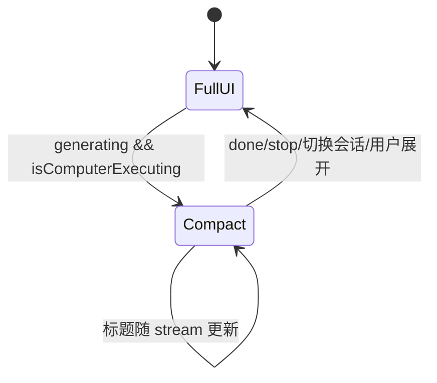

# 电脑操控紧凑态（Dock Bar）

> 执行电脑操控时，将整个 **OS 窗口**收缩为一行浮条，贴当前显示器右下角；结束后**默认自动展开**。

## 已确认产品决策

| 项 | 决策 |
|----|------|
| 收缩层级 | **OS 窗口**（Tauri `setSize` / `setPosition`）；Web 端降级为 viewport 内 fixed 浮条 |
| 结束行为 | **默认自动展开**（恢复进入前的窗口 bounds 与完整 UI） |
| 触发范围 | **lead computer**：执行即收缩；**子 agent computer**：按任务目标（§操作目标） |
| 操作 Pointer 自身 | **不收缩**（`computerTarget: self`） |

## 操作目标（任务意图 · 已实现）

区分依据是 **委派任务的目标**，不是运行时点击坐标或前台应用。

| `computerTarget` | 含义 | 紧凑态 |
|------------------|------|--------|
| `self` | 任务目标是 **Pointer 自身 UI**（设置页、应用内按钮等） | **不收缩** |
| `external`（默认） | 任务是 **其他软件 / 桌面**（浏览器、微信、Excel 等） | 收缩 |

### 谁来判定？

1. **Lead agent 显式声明**（推荐）：`run_subagent` 参数 **`computerTarget`**，写入 `AgentTrace.computerTarget`。
2. **主机推断**（兜底）：解析 `instruction` + `title` 中的措辞（如「Pointer 设置」「本应用」→ `self`；其余 → `external`）。

### 收缩逻辑（`shouldShrinkComputerWindow`）

```
computer 在执行
  ├─ lead === computer → 收缩
  └─ 子 agent computer
        ├─ computerTarget === self → 不收缩
        └─ computerTarget === external（或未写、推断为外部）→ 收缩
```

### 实现落点

| 层 | 文件 |
|----|------|
| 参数 / 推断 | `tools/run_subagent.rs` → `resolve_computer_operation_target` |
| 写入 trace | `run_subagent_delegation.rs`、`supervisor.rs`（computer 子任务） |
| 前端门控 | `computerExecuting.ts` → `shouldShrinkComputerWindow`；`useComputerCompactMode.ts` |
| Lead 提示 | `tools/prompts/run_subagent.md`、`agents/general/AGENT.md` |

### 反模式

- **用前台应用判断** — 子 agent 对外操作时用户仍可能在看 Pointer 聊天窗。
- **用点击坐标推断任务目标** — 与「任务是否要操作 Pointer」不是同一层语义。
- **子 agent 一律不收缩** — 对外任务仍需让出桌面空间。

## 目标

用户启动电脑操控后，Pointer 主窗口让出桌面空间，仅保留右下角一行状态条：

- 标题（1～2 行）：思考中 / 当前工具 / 任务板收缩摘要
- **终止**：`chat.stop()`
- **展开**：手动恢复完整界面（不等任务结束）

## 触发与退出

### 进入紧凑态

同时满足：

1. `chat.generating === true`
2. 当前会话存在 **活跃的 computer 执行**（见下文检测规则）
3. 无阻塞弹窗：`MacosComputerPermissionsModal`、`ComputerScreenPickerModal` 未打开（关闭后再进入）
4. 设置项 `computerAutoCompact !== false`（默认 `true`）

### 退出紧凑态

| 场景 | 行为 |
|------|------|
| 生成结束（`done` / `stop` 完成） | **自动展开**（默认） |
| 用户点「展开」 | 立即展开；若仍在 generating，不再自动收缩（本会话内记住「用户已手动展开」直至本轮结束） |
| 用户点「终止」 | `stop()` → 结束后自动展开 |
| 切换会话 / 切换 lead agent | 立即展开并恢复窗口 |

### Computer 执行检测（lead + 子 agent）

在 `useComputerCompactMode` 中实现 `isComputerExecuting(conv, activeMessageId)`：

```ts
// 1. 单 agent：lead 即 computer
if (settings.agentMode === 'single' && leadAgentId === 'computer' && generating) → true

// 2. 活跃 assistant 消息
const msg = messages.find(m => m.id === activeMessageId)
if (!msg) return false

// 3. 消息级 agent
if (msg.agentId === 'computer' && generating) → true

// 4. agentTrace：任一 computer trace 为 running
if (msg.agentTrace?.some(t => t.id === 'computer' && t.status === 'running')) → true

// 5. 兜底：当前轮存在进行中的 computer 族工具（mouse/hotkey/input/…）
if (generating && messageHasComputerTools(msg) && hasInProgressComputerTool(msg)) → true
```

说明：

- supervisor 委派 computer 时，`agent_step` 会将 trace `id === 'computer'` 且 `status === 'running'` 写入活跃消息（见 `AgentTrace`）。
- 子 agent 工具调用带 `traceId`，标题区读 **computer trace 对应** 的 toolCalls（或主消息上可见的 computer 工具）。
- `hideToolNames` 中的 sidecar（`task_board_patch`、`action_verify`）不参与标题，与聊天区一致。

## OS 窗口行为（桌面端）

### 进入

1. 保存：`outerPosition`、`outerSize`、`isMaximized`
2. 若最大化 → `unmaximize`
3. 临时放宽 `minWidth` / `minHeight`（或 compact 专用最小值）
4. 定位到**当前窗口所在 monitor** 右下角（与 `ComputerMonitor` / 选屏逻辑同一坐标系）
5. 尺寸：
   - 单行：高 ~44px，宽 `clamp(280, 40vw, 420)`
   - 双行（有任务板）：高 ~56px

### 退出

恢复保存的 position / size / maximized；恢复 tauri.conf 中的 min 尺寸约束。

### Tauri 权限

在 `src-tauri/capabilities/default.json` 增加：

- `core:window:allow-set-size`
- `core:window:allow-set-position`
- `core:window:allow-outer-position`
- `core:window:allow-outer-size`

可选 Rust command：`get_window_monitor_bounds`（多显示器右下角计算）。

### 平台

| 平台 | 注意点 |
|------|--------|
| macOS | Overlay title bar + 隐藏标题；紧凑态 `decorations: false`；恢复时先几何再 `reapply`（详见 [macos-window-chrome.md](../guides/macos-window-chrome.md) §5） |
| Windows | **`decorations: false` 全程**；右下角定位由 Rust `place_computer_compact_window` 用物理坐标 + `work_area` |
| Linux | 同 Windows 无系统标题栏；定位用 **xcap 显示器边界**（与 Computer 选屏同源）+ **LogicalPosition**，`set_size` 后延迟再 `set_position`（GTK）；Wayland 若 `outer_position` 恒为 (0,0) 则回退主屏 |
| Web | 无 OS API → 仅 `position: fixed` 浮条 + 主内容隐藏 |

## 浮条 UI

组件：`ComputerCompactBar.vue`

```
┌────────────────────────────────────────────────────────┐
│ [icon]  行1: 任务板收缩摘要（可选）          [终止][展开] │
│         行2: 思考中… / 工具 displayLabel · summary      │
└────────────────────────────────────────────────────────┘
```

### 行2（主状态，必有）

| 条件 | 文案 |
|------|------|
| 有 `running` / `pending` / `pending_approval` 的 computer 工具 | `{displayLabel} · {displaySummary}` |
| 工具参数流式中 | `执行中…` 或 `toolNamePreview` |
| 无活跃工具、LLM streaming | `思考中...`（与 `ThinkingIndicator` 一致） |
| 等待选屏 | `请选择操控屏幕…` |
| 已停止 | `已停止`（短暂显示后随自动展开消失） |

数据：`chat.activeGeneratingMessageId`、`visibleToolCalls()`、`toolCall.displayLabel` / `displaySummary`（后端 `tools/display.rs`）。

### 行1（任务板，可选）

存在活跃 task board 时显示，格式对齐 `TaskBoardPanel` summary：

```
{goal} · {done}/{total} · {当前 in_progress 项 title}
```

数据：`chat.parentBoardsBoundToMessage(convId, activeMessageId)` 中 `isActive === true` 的 document。

## 模块

```
src/composables/useComputerCompactMode.ts    # 状态机 + isComputerExecuting
src/composables/useComputerCompactTitle.ts   # 双行标题派生
src/composables/useComputerCompactWindow.ts  # Tauri 窗口 shrink/restore
src/components/chat/ComputerCompactBar.vue
src/lib/taskBoardCollapsedLine.ts            # 从 TaskBoardPanel 抽出 summary 一行
App.vue                                      # compact 时只渲染 Bar + 隐藏 AppShell
stores/settings.ts                           # computerAutoCompact?: boolean
```

## 状态机



手动展开：设置 `userExpandedOverride = true`，直至 `generating` 变为 false 后清零，避免与用户「自动展开」冲突。

## 边界

- 紧凑态不打开 Settings / SkillPicker；若已打开则先展开
- `terminalLivePopup`：紧凑态不展示；展开后可见
- 用户拖拽紧凑窗口：允许；展开仍恢复**进入前** bounds
- API 失败：降级为应用内 fixed 浮条，并 `console.warn`

## 分期

### P0

- `ComputerCompactBar` + 标题派生 + `isComputerExecuting`（含子 agent）
- Tauri 窗口收缩/恢复
- 终止 / 展开；结束后自动展开
- 设置项 `computerAutoCompact`（默认开）

### P1

- 双行任务板标题
- 权限/选屏弹窗延迟进入
- 进入/退出 200ms 动画

## 验收

1. Lead = computer：发送任务后窗口收缩至当前屏右下角一行。
2. Supervisor 委派 computer：子 agent `running` 期间同样收缩；computer 结束后若整轮仍在 generating 但无 computer 执行 → **不保持收缩**（仅 computer 执行期间收缩）。
3. 工具行实时显示「鼠标 · …」「快捷键 · …」等。
4. 任务结束后 **自动展开** 且窗口位置/尺寸与进入前一致。
5. macOS / Windows / Linux 冒烟通过；Web 为 fixed 浮条降级。

[返回设计索引](README.md)
