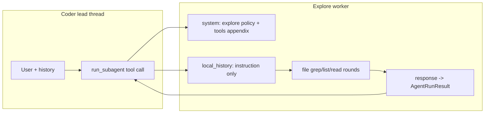

# Explore 子代理实现方案（供 Coder 使用）

> 设计对照稿：描述目标行为与实现落点；若与代码不一致，以仓库当前实现为准，并应回更本文或实现。

## 1. 与官方文档的对齐关系

参考 [Cursor Subagents / 内置 Explore](https://cursor.com/cn/docs/subagents) 的设计要点，映射到本仓库现状：

| Cursor 概念 | pointer-app 对应 |
|------------|------------------|
| 独立上下文窗口 | [`run_sub_agent`](../../crates/pointer-core/src/chat_service/sub_agent.rs) 仅构造 `local_history`：单条 user = `instruction`，无主线程历史（与 [`run_subagent.md`](../../crates/pointer-core/src/tools/prompts/run_subagent.md) 一致）。 |
| 中间过程噪声隔离在子会话 | 子 Agent 内工具往返留在子循环；父线程收到序列化 [`AgentRunResult`](../../crates/pointer-core/src/agents/mod.rs)（元数据 + **`content`**：**Markdown** 侦察摘要）。 |
| Explore：搜索与分析代码库 | 子 worker 专注 `file:list` / `file:grep` / `file:glob` / `file:read`（只读），产出 **Markdown** 结构化结论（路径、符号、数据流）。 |
| 子代理默认更快模型（成本/速度） | 当前子调用复用同一 `OpenAIProvider`（`prov.stream_chat`），**未**按 Agent 切换模型；若要对齐官方「更快模型」，需后续在 `AgentDef.config` 或设置中增加「子 Agent 覆盖模型」并在 `run_sub_agent` 构造 provider 时应用（可选阶段）。 |
| 自定义子代理 `readonly: true` | 本仓库工具粒度为**工具名**（[`resolve_agent_tools`](../../crates/pointer-core/src/chat_service/agent_tool_allowlist.rs)），`file` 单工具包含读写方法；只读采用 **提示词约束 + 线程上下文内硬拒绝**（见 §3.4）。 |
| 不可嵌套委派 | 已实现：`allowed_tools` 剔除 `run_subagent`，子循环内硬拒绝（[`agent_tool_pass.rs`](../../crates/pointer-core/src/chat_service/agent_tool_pass.rs) 子 Agent 工具分支）；Lead 侧 `run_subagent` 委派见 [`run_subagent_delegation.rs`](../../crates/pointer-core/src/chat_service/run_subagent_delegation.rs)。 |

主循环与子循环对多工具调用均为 **顺序** `for` 执行（非并行），与文档中「并行起多个子代理」相比，当前产品语义更接近 **阻塞式 handoff**；多区域探索可通过 **多次 `run_subagent` 调用**（多轮或多工具批次内顺序执行）达成，每次子上下文仍隔离。

## 2. 目标行为（产品语义）

- **explore** 是一个 **builtin worker**（`role: worker`），`id` 固定为 **`explore`**。
- **职责**：在 workspace 内完成「定位代码 / 追踪引用 / 理清模块边界」类任务，**不**改代码、**不**跑 shell、**不**跑 lint（避免与「探索」无关的副作用和噪声）。
- **输出**：统一交付 **Markdown** 摘要（章节化证据与 trace）。子 Agent 通过 **`response`** 的 **`tool_args.text`** 提交；父级从 **`run_subagent`** 工具结果的 **`content`** 字段读取同一字符串（旁路为 id / 名等元数据）。子会话每轮仍遵循宿主 **JSON tool envelope**（见通信层），**不得**把裸 Markdown 当作 assistant 正文。
- **启用方式**：与用户设置 [`allowAgents`](../guides/pointer-run-subagent.md) 一致——将 `explore` 加入列表后，[`delegatable_sub_agents_system_block`](../../crates/pointer-core/src/agents/mod.rs) 会注入元数据，coder 才能合法 `run_subagent`。

## 3. 代码与资源改动（核心）

1. **builtin bundle**  
   在 [`BUILTIN_AGENT_BUNDLES`](../../crates/pointer-core/src/agents/mod.rs) 中注册 `id: "explore"`：
   - [`crates/pointer-core/src/agents/explore/AGENT.md`](../../crates/pointer-core/src/agents/explore/AGENT.md)
   - [`crates/pointer-core/src/agents/explore/COMMUNICATION.md`](../../crates/pointer-core/src/agents/explore/COMMUNICATION.md)

2. **`AgentProfile` 扩展**  
   在 [`AgentProfile`](../../crates/pointer-core/src/agents/mod.rs) 中增加 `Explore`（serde `snake_case` → `explore`），供扩展点与 `file` 工具按 profile 做只读硬闸（与 `AgentProfile::Computer` 用法类似）。

3. **访问策略（工具白名单）**  
   frontmatter 建议：
   - `allowTools`: **`file`**, **`task_board`**
   - **不要**包含：`terminal`, `read_lints`, `run_subagent`, `skill`（默认）
   - `denyTools`: 可空

4. **只读硬闸**  
   在 [`file` 工具注册处](../../crates/pointer-core/src/tools/file.rs)：当线程上下文为 `AgentProfile::Explore` 且 `method` 为 `write` / `edit` 时拒绝并打 **warn** 日志。主/子会话在 `ToolRegistry::invoke` 前通过 [`FileToolLeadProfileGuard`](../../crates/pointer-core/src/agents/mod.rs) 设置 `lead_agent_profile`。

5. **单元测试**  
   [`agents/mod.rs` builtin 测试](../../crates/pointer-core/src/agents/mod.rs)、[`run_subagent.rs` 校验测试](../../crates/pointer-core/src/tools/run_subagent.rs) 覆盖 `explore` 注册与 `allowAgents` 校验。

## 4. Explore 的 AGENT.md 内容要点（英文正文）

与 [Cursor 文档](https://cursor.com/cn/docs/subagents) 中「search-agent」示例一致，正文应写明：

- **使命**：只读探索仓库，返回 **高信号** 证据（路径 + 少量行号/片段），不做实现。
- **工具习惯**：优先 `grep`/`glob`/`list` 再 `read`；大文件用 `lineStart`/`lineEnd`/`maxBytes`；批量 `paths` 读；
  工具失败写入 **Open questions** / **Coverage**，不得静默忽略。
- **追踪与卫生**：默认每个方向的 trace **≤10 hop**（任务可覆盖）；遇 **cycle** 显式标注；hop 可标 **prod/test/…**；
  **敏感信息**仅 `REDACTED` + 位置指针；**inventory** 有默认剪枝并在 **Coverage** 留痕。
- **完成判据**（呼应父级 [`instruction`](../../crates/pointer-core/src/tools/prompts/run_subagent.md)）。
- **输出格式**：**Markdown** 交付（固定章节 + Evidence 微格式 + 负向 grep）；经 **`response` → `tool_args.text`**；父级读工具结果 **`content`**。文末 **Pattern examples** 仅展示 Markdown 正文（详见 `explore/AGENT.md`）。

### 4.1 How to explore workdir（固定章节，防迷失）

在 `AGENT.md` 正文中增加独立章节 **「How to explore workdir」**，用**有序步骤**写死探索流程（不写无意义的开发维护说明），目标与质量标准如下。

**质量标准（自检清单）**

- **全面、少遗漏**：在 `instruction` 范围内建待查清单，逐项用工具划掉；列出已搜索项与未覆盖盲区（若有）。
- **结论必有证据与出处**：path + 行号或 grep 摘要；禁止无出处推断；不足则写入 **Open questions**。
- **调用链双向可追溯**：Backward（callee ← caller）与 Forward（entry → downstream）；输出中带路径与行号范围。

**建议流程骨架**

1. **Restate scope** — 含 Lead context 时区分待验证与父级已声称已读。
2. **Bound workspace（若适用）** — 有边界清单时先定组件范围，再漫游。
3. **Inventory** — `list`/`glob`；记录剪枝理由（含默认跳过的依赖/构建大目录，除非任务点名）。
4. **Anchor** — `grep` 再 `read` 邻域；多命中时列出候选并说明取舍。
5. **Trace backward** — 至 instruction 边界或 hop 上限 / cycle。
6. **Trace forward** — 至关键行为或 I/O 边界，同上。
7. **Cross-check** — 双向链汇合或解释矛盾。
8. **Deliver** — 固定小节 + **Coverage**（含 negative searches）；推翻 Lead 事实时加 **Corrections to lead context**。

### 4.2 是否「直接复用」通用智能体的标准流程？

- 复用的是**方法论**，须**写进** `AGENT.md` 为可执行步骤；子 Agent 无父对话系统提示。
- 须落地为 **`file` 顺序**与**输出字段**，否则易漂移。

## 5. Coder Agent 侧如何「使用」explore

实现落点：[`coder/AGENT.md`](../../crates/pointer-core/src/agents/coder/AGENT.md) 中 **Delegating to the `explore` worker** 与 **`run_subagent`** 段；[`run_subagent.md`](../../crates/pointer-core/src/tools/prompts/run_subagent.md) 含 Lead context、**`explore` vs local reconnaissance** 与 **`run_subagent` 调用示例**；[`guides/pointer-run-subagent.md`](../guides/pointer-run-subagent.md) 含用户向设置与界限摘要。

- **何时委派**：多轮仍无法收敛地图、跨目录侦察、`instruction` 可自描述。
- **何时不委派**：单点修改、路径已明、完成标准写不清。
- **`instruction`**：目标、范围、禁止写代码、交付物、完成标准。
- **主→子事实传递**：已验证路径、排除项、空 grep、截断诚实；版式 **Lead context (trusted)** / **Already checked** / **Still unknown**；Lead context 以子 Agent **抽查验证**为准。

### 5.1 Lead→explore：补充检查清单

- **证据分级**：`USER_STATED` / `READ_AT path:Lx–Ly` / `GREPPED …`；推断放 **Assumptions (unverified)**。
- **显式否定与空结果**。
- **停止条件与深度上限**（与 `maxSubAgentToolRounds` 心理预期一致）。
- **非目标 / 排除区**。
- **假设排序**（高优先级先证）。
- **环境锚**（分支、flag、多 workspace）。
- **预算与截断诚实**（Partial / capped）。
- **子 Agent 回馈**：**Corrections to lead context**。
- **元数据**：`agentId: "explore"`；稳定 **`taskId`**。

## 6. 前端 / 设置

[`SettingsDialog.vue`](../../src/components/settings/SettingsDialog.vue) 经 `listAgents()` 展示 worker；`explore` 为 builtin，无需硬编码。默认是否写入 `allowAgents` 由产品决定（当前默认不自动加入，见 [`pointer-run-subagent.md`](../guides/pointer-run-subagent.md)）。

## 7. 可选后续

- 子 Agent **模型覆盖**（`run_sub_agent` 内按 agent 覆盖 `model`）。
- **并行**多个 `run_subagent`（工具循环并发与取消、UI 状态）。

## 8. 相关用户文档

- [`guides/pointer-run-subagent.md`](../guides/pointer-run-subagent.md) — `allowAgents`、`explore` 行为摘要。

## 9. 实现状态（对照用）

| 项 | 状态 |
|----|------|
| explore builtin + `AgentProfile::Explore` | 已实现 |
| `file` write/edit 硬闸 + `FileToolLeadProfileGuard` | 已实现 |
| coder / `run_subagent` 提示与示例 | 已实现 |
| 单测 `explore` 加载与 `validate_run_subagent_target` | 已实现 |
| 前端 `AgentProfile` 含 `explore` | 已实现（`src/types/chat.ts`） |
