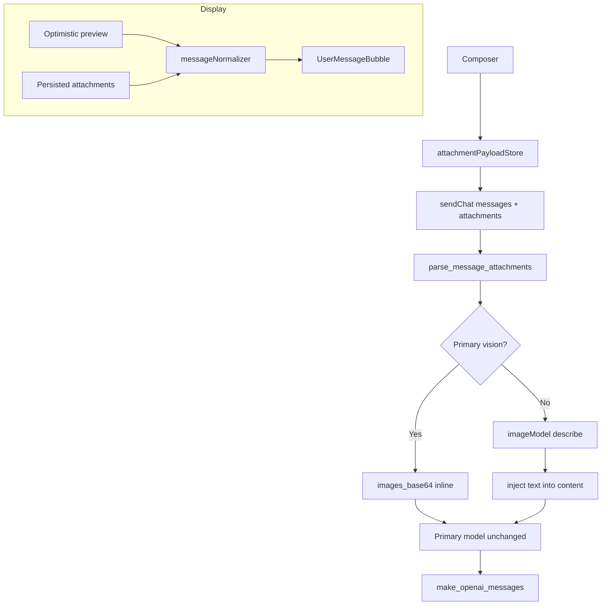
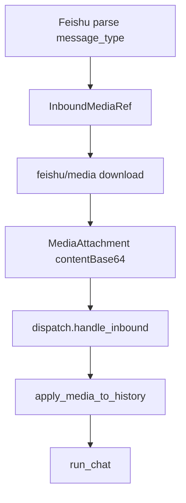

# 多媒体支持设计方案

> 参考 OpenClaw 双管线架构（输入 wire / 显示 normalize）。主会话模型不强制切换，按能力分支 inline 或 media-understanding 理解后注入文本。

---

## 1. 目标

- Composer 支持图片、文档、音频、视频附件（视频单文件上限 30 MB，与 IM 入站一致）
- 主模型保持用户所选 agent 模型不变
- Vision 主模型：图片 inline 发给 LLM
- 非 Vision 主模型：独立 `imageModel` 理解图片，描述文本注入 user message
- App（Tauri）与 Web 端行为一致

---

## 2. 架构



---

## 3. 数据模型

### 3.1 ChatMessage.attachments

| 字段 | 说明 |
|------|------|
| `id` | UUID |
| `kind` | `image` / `document` / `audio` / `video` / `file` |
| `mimeType` | MIME |
| `fileName` | 原始文件名 |
| `sizeBytes` | 大小 |
| `storageRelPath` | 相对 `conversation-media/{convId}/`；处理时注入 `pointer-media://` URI 与 **Local path** 供模型 `file_read`（对齐 OpenClaw `MediaPath` / `media://inbound/`） |
| `contentBase64` | **仅 wire**，持久化前剥离 |
| `derivedText` | 文档提取或 imageModel 描述（可选缓存） |

Computer Agent 截图仍用 `imagesBase64` inject，与用户附件 `attachments` 分离。

### 3.2 mediaModelOverrides

```typescript
mediaModelOverrides: {
  image?: { providerId: string; model: string }  // 默认 qwen + qwen3.5-plus
  audio?: { providerId: string; model: string }
  video?: { providerId: string; model: string }
  imageGeneration?: { providerId: string; model: string }  // image_generate 工具
  videoGeneration?: { providerId: string; model: string }  // video_generate 工具
}
```

生成工具默认模型（未配置 override 时）：

| 服务商 | 图片 | 视频 |
|--------|------|------|
| 千问 DashScope | `wan2.7-image-pro` | `happyhorse-1.0-t2v`（有首帧图时自动切 `happyhorse-1.0-i2v`） |
| 豆包 Volcengine Ark | `doubao-seedream-5-0-lite-260128` | `doubao-seedance-2-0-260128` |

路由规则：优先 `mediaModelOverrides.imageGeneration` / `videoGeneration` 的 `providerId`；否则若配置了豆包 provider 则走豆包，否则走千问。工具参数 `model` 可单次覆盖。

---

## 4. 后端模块

| 模块 | 路径 | 职责 |
|------|------|------|
| capabilities | `media/capabilities.rs` | `model_supports_vision` 启发式 |
| store | `media/store.rs` | 落盘、读取、media ticket 路径 |
| apply | `media/apply.rs` | 编排理解、写 `images_base64` / 注入 text |
| understand | `media/understand.rs` | imageModel 单次 vision 描述 |
| media_generation | `media_generation/` | `image_generate` / `video_generate` 工具：DashScope Wan/Qwen-Image、Volcengine Seedream/Seedance |
| media_generate | `tools/media_generate.rs` | 工具注册与 async dispatch |

挂载点：`session_inner::run_chat_inner`，在 `maybe_compress_history` **之前**调用 `apply_media_to_history`（传入 `run_id`，多媒体理解 token 写入 `token_usage_store`，独立 `agent_instance_id`）。

生成工具 async 路径：`agent_tool_pass.rs` → `dispatch_media_generate_async`；产出保存至 `generated-media/{conversation_id}/`，工具结果含 `MEDIA:<path>` 行。计费上报支持 `tokens` / `per-image` / `per-sec` 三种模式（见 `media_generation/billing.rs`）。

**`final_reply` 工具**：注册时使用 `ToolEntry::with_final_reply(true)`（默认 `false`）。当该工具**单独**调用且成功时，宿主不再发起后续 LLM 回合，而是将工具输出作为最终 assistant 消息交付（含 `MEDIA:` 附件内联展示）。当前启用：`image_generate`、`video_generate`。

---

## 5. 前端模块

| 模块 | 路径 | 职责 |
|------|------|------|
| attachmentSupport | `src/lib/attachmentSupport.ts` | MIME accept、大小限制 |
| attachmentPayloadStore | `src/lib/attachmentPayloadStore.ts` | base64/object URL 不进 Pinia |
| messageNormalizer | `src/lib/messageNormalizer.ts` | 附件渲染模型 |
| AttachmentChip | `components/chat/AttachmentChip.vue` | Composer 预览条 |
| UserMessageBubble | 扩展 | 图片/文档卡片 |

---

## 6. 限制

| 项 | 值 |
|----|-----|
| 单图 inline 上限 | 2 MB |
| 单图硬上限 | 6 MB |
| 文档文本提取上限 | 256 KiB |
| 扫描 PDF 页图 OCR 上限 | 10 页 / 单页 6 MB（纯 Rust `lopdf` 提取嵌入图，无 poppler/ghostscript） |
| PDF 文本 OCR 回退阈值 | 抽取文本 &lt; 48 字符时视为无效（页码/水印），走页图 OCR |
| 单视频 Composer 上限 | 30 MB |
| Composer video | 允许（需本机 ffmpeg 方可理解） |

---

## 7. 分阶段

- **P0（已完成）**：图片 + 文档、vision 分支、Composer UI、imageModel 默认
- **P1（已完成）**：设置页 image/audio 理解模型、语音转写注入、audio bubble 播放
- **P2（已完成）**：IM 渠道 inbound 媒体、PDF/视频理解、ffmpeg Skill 引导安装
- **P2b'（已完成）**：扫描/图片型 PDF：`pdf-extract` 文本失败后，`lopdf` 提取页内嵌 JPEG/栅格图 → 图片理解模型 OCR

---

## 8. 设置项

### 模式选择（用户可见）

通用 Agent、编程 Agent、多媒体理解与电脑操控均在 **设置 → 智能体 → 模式选择** 中配置运行模式；用户选模式，不直接选模型。

| 区域 | 模式作用 |
|------|----------|
| 通用 / 编程 Agent | 主会话 LLM 按所选模式解析模型 |
| 图片 / 语音 / 视频理解 | 非 vision 主模型或抽帧理解时按所选模式解析模型 |
| 电脑操控 | 新会话初始视觉模式（快速 / 标准 / 专家，对应 primary / intermediate / advanced） |

各模式对应的具体模型在 **调试模式** 下配置（`agentModeLlm` / `mediaModeLlm` / `computerTierLlm`）。

### 图片 / 视频生成（用户可选模型）

`image_generate` / `video_generate` 仍暴露模型下拉；选项来自各服务商 `models` 列表，并按 `modelConfigs` 中 **可生成图片 / 可生成视频** 过滤。

生成类模型已并入千问、豆包等服务商配置；每个模型可配置：

| 字段 | 含义 |
|------|------|
| `supportsVision` | 是否支持视觉理解 |
| `canGenerateImage` | 是否可生成图片 |
| `canGenerateVideo` | 是否可生成视频 |

在 **设置 → 模型服务 → 模型定制** 中勾选；未配置时对已知模型名自动推断默认值。

### 旧版 `mediaModelOverrides`

仍作为 legacy 回退（无模式配置时）；新安装默认走模式解析。

在 **设置 → 智能体 → 图片 / 视频生成** 中配置：

| 项 | 作用 | 默认 |
|----|------|------|
| 图片生成 | `image_generate` 工具 | wan2.7-image-pro 或 Seedream 5.0 |
| 视频生成 | `video_generate` 工具 | HappyHorse 1.0 或 Seedance 2.0 |

配置写入 `local_platform_settings.json`，重启后保留。

### 计费记录

生成调用写入 `token_usage_store`，独立 `agent_instance_id`（`media-image-generate` / `media-video-generate`）：

| 模式 | 来源 | 记录方式 |
|------|------|----------|
| ProviderTokens | DashScope 响应 `usage.total_tokens` | 原样上报 |
| PerImage | Seedream 等按张计费 | 合成 tokens（约 1 万张 = 1e8 tokens 量级映射） |
| PerVideoSecond | Seedance 1.x 按秒 | 合成 tokens（约 2 万 tokens/秒） |
| PerVideoGenerationToken | Seedance 2.0（API 未全面开放） | 预留，模型 key 后缀 `@video-tokens` |

模型名在用量库中带后缀 `@tokens` / `@per-image` / `@per-sec` 以区分计费维度。

---

## 9. 参考

- OpenClaw：`chat-attachments.ts`、`media-understanding/runner.ts`、`attachment-payload-store.ts`
- Pointer 现有：`images_base64`、`make_openai_messages`、`sub_agent_provider`

---

## 10. P2 详细设计

### 10.1 目标与边界

| 范围 | 做 | 不做 |
|------|-----|------|
| 入站 | 飞书 / 企微 / 钉钉 / **微信个人号** WS 图片、文件、语音、视频 | — |
| Composer | 支持 video 上传（30 MB） | — |
| ffmpeg | 系统安装，**不打包**进安装包 | 内置 sidecar |
| 出站 IM | 仍只发文本 | 回复图片/文件 |

主会话模型不切换；渠道下载后写入 `ChatMessage.attachments`，复用 `apply_media_to_history`。

### 10.2 架构



### 10.3 数据模型

**InboundMessage** 扩展：

| 字段 | 说明 |
|------|------|
| `attachments` | `InboundMediaRef[]`，解析阶段仅含渠道 key |

**InboundMediaRef**（wire，不落会话持久化）：

| 字段 | 说明 |
|------|------|
| `kind` | `image` / `document` / `audio` / `video` / `file` |
| `feishuImageKey` / `feishuFileKey` | 飞书下载 key |
| `feishuResourceType` | `image` / `file` / `media` |

dispatch 下载后转为 `MediaAttachment`，与 Composer 一致。

**Dedup**：`message_id + sorted(attachment keys)`，避免同 id 多附件被误杀。

### 10.4 飞书（P2a）

| message_type | 解析 | 下载 API |
|--------------|------|----------|
| `text` | content.text | — |
| `image` | image_key | `GET /im/v1/images/{key}` |
| `file` / `audio` | file_key | `GET .../messages/{id}/resources/{key}?type=file` |
| `media` / `video` | file_key | 同上；502 时 fallback `type=media` |
| `post` | 富文本 + 内嵌 img/media | 逐项 resource 下载 |

单文件上限：**30 MB**（与 OpenClaw 默认一致）。

### 10.4a 微信个人号（iLink Bot）

| item `type` | 解析 | 下载 |
|-------------|------|------|
| `1` TEXT | `text_item.text` | — |
| `2` IMAGE | `image_item.media` + 可选 `aeskey` | CDN AES-128-ECB |
| `3` VOICE | `voice_item.text`（微信 ASR，P0）+ `media` | CDN 解密 + SILK→WAV（P2） |
| `4` FILE | `file_item.media` + `file_name` | CDN 解密 |
| `5` VIDEO | `video_item.media` | CDN 解密 |

CDN：`GET https://novac2c.cdn.weixin.qq.com/c2c/download?encrypted_query_param=...`

### 10.5 ffmpeg：Skill 引导安装（零打包体积）

未检测到 `ffmpeg` + `ffprobe` 时，`apply_media` 注入带标记的提示块：

```text
<!-- pointer-media-deps -->
…请 skill_load_instructions(dev-env-setup) → references/ffmpeg.md …
```

| 场景 | 行为 |
|------|------|
| App 主对话 | general 助手加载 Skill，`terminal` 安装（需用户批准） |
| IM 入站 | 回复短文案 + 提示在 Pointer 客户端说「帮我安装 ffmpeg」 |

### 10.5a 不支持附件 / 处理失败：find-skills 引导

zip、Office（docx/xlsx/pptx）等 Composer 可上传但后端无法内联解析的类型，以及
图片/PDF/音频/视频理解失败时，`apply_media` 注入带标记的提示块：

```text
<!-- pointer-unsupported-attachment -->
<!-- pointer-media-processing-failed -->
…优先级：① 已启用 Skill（模型自判匹配）→ ② find-skills 按需搜索安装 → ③ 写代码最后手段
```

| 场景 | 行为 |
|------|------|
| App 主对话 | 先查「可用 Skills」；有匹配则直接 `skill_load_instructions`，**勿**重复 `npx skills find` |
| 无匹配 | 征得同意后 `find-skills` → 搜索安装 |
| 仍不可行 | `terminal` 一次性脚本或 `coder`（最后手段） |
| 工具审批 | `terminal` / `skill_import` 是否弹批准卡片由 **toolApprovalMode** 决定，无额外 UI |
| IM 入站 | 简短说明需在 Pointer 客户端继续（搜索/安装技能） |

### 10.5b 附件重试（无需重发文件）

首次处理失败后，附件字节已保存在 `conversation-media/`（`storageRelPath`）。用户无需重传：

| 触发 | 行为 |
|------|------|
| 用户说「重试上一条附件」/「重试上一条视频」 | 从 `storageRelPath` 重跑 `apply_media`，替换原消息中的失败注入块 |
| ffmpeg 从未就绪变为就绪 | 自动重试含 `<!-- pointer-media-deps -->` 的失败视频 |
| 已成功（`derivedText` 有值） | 不重试 |

范围：话术重试默认扫描最近 3 条带失败附件的用户消息；视频重试仅处理 `kind=video`。

### 10.6 子阶段

| 阶段 | 内容 | 状态 |
|------|------|------|
| P2a | 飞书 inbound + dispatch + dedup | 已完成 |
| P2a' | 企微 WS image/file/mixed | 已完成 |
| P2a'' | 钉钉 inbound 媒体 | 已完成 |
| P2a''' | 微信 iLink inbound 媒体（CDN+SILK） | 已完成 |
| P2b | PDF 文本提取 | 已完成 |
| P2c | ffmpeg 抽帧 + videoModel | 已完成 |
| polish | 设置页 ffmpeg 检测、video 气泡 | 已完成 |
| polish' | 设置页 ffmpeg 探测执行 `-version`；抽帧失败与未安装区分提示 | 已完成 |
| polish'' | 图片/语音/视频/扫描 PDF 理解 token 计入 `token_usage_store`（独立 instance_id） | 已完成 |
| polish''' | 媒体 `agent_instance_id` 改为 UUID v5（平台 `request_id` 按 `:` 分段，不可含冒号） | 已完成 |
| polish'''' | 不支持附件与媒体处理失败注入 `find-skills` 引导标记 | 已完成 |
| polish''''' | 附件重试：从 `storageRelPath` 重处理，话术触发 + ffmpeg 自动重试 | 已完成 |
