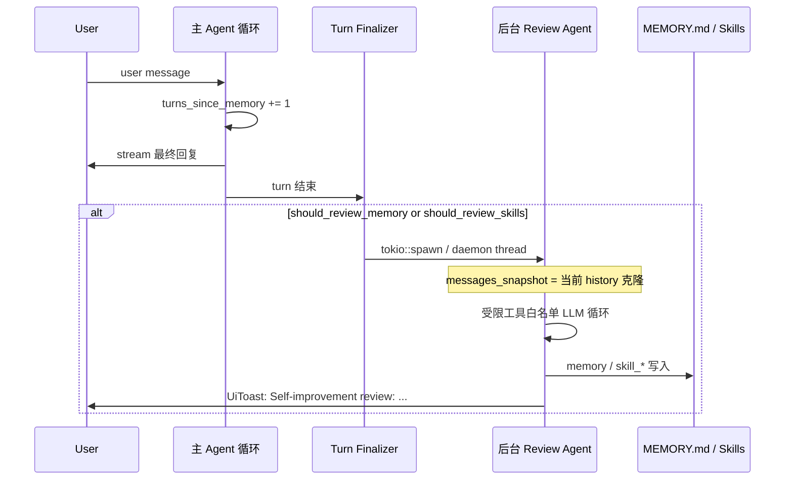
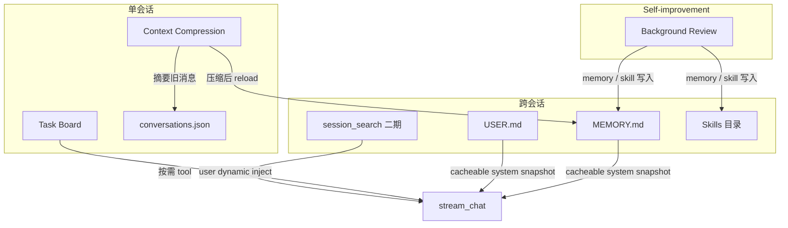

# 跨会话记忆与 Self-improvement Review 设计稿

> **状态**：**P0–P2、P4 已实现**（MEMORY/USER、`memory` 工具、cacheable 注入、压缩后 reload、后台 memory review、`session_search` FTS 索引）。Skill nudge / Curator 仍为后续阶段。

## 1. 背景与术语

### 1.1 参考来源

Hermes 将「长期记忆」与「会话后自省」拆为两条互补链路：


| 能力             | Hermes 实现                             | 社区俗称                                       |
| -------------- | ------------------------------------- | ------------------------------------------ |
| 跨会话 curated 记忆 | `MEMORY.md` + `USER.md` + `memory` 工具 | Persistent Memory                          |
| 会话后后台回顾        | `agent/background_review.py`          | **Self-improvement loop**；社区有时称为 Agent「做梦」 |
| 历史会话检索         | `session_search`（SQLite FTS5）         | 与 memory 互补，按需召回                           |
| Skill 库保洁      | `curator`（空闲 + 周期触发）                  | 与 review 不同触发器，同类 fork 模式                  |


**说明**：Hermes 核心仓库 **没有** 名为 `dream` 的官方模块。Discord 上的 Dream Auto / Dreamer 等为第三方插件，不在本文 MVP 范围内。

### 1.2 Pointer 现状（对照）


| 能力             | Pointer 现状                                                                                                                          |
| -------------- | ----------------------------------------------------------------------------------------------------------------------------------- |
| 跨会话 curated 记忆 | **无**                                                                                                                               |
| 用户画像持久化        | **无**（仅有 `user_settings.json` 等功能配置）                                                                                                |
| 会话内工作记忆        | **Task Board**（见 `[taskboard-lifecycle-and-fields.md](../taskboard-lifecycle-and-fields.md)`）                                       |
| 完整对话持久化        | `conversations.json`（前端列表 + 消息体）                                                                                                    |
| 上下文压缩          | `context_compression.rs`（LLM 摘要旧消息）                                                                                                 |
| 可复用能力包         | **Skills**（见 `[guides/skills-persistence.md](../guides/skills-persistence.md)`）                                                     |
| Prompt 分区与缓存   | `[llm-prompt-assembly-order.md](../internals/llm-prompt-assembly-order.md)`、`[qwen-context-cache.md](../llm/qwen-context-cache.md)` |


**原则**：Task Board = 单会话多步执行状态；Memory = 跨会话关键事实；Session Search = 按需查历史原文。三者不可混用。

---

## 2. 记忆机制（Persistent Memory）

### 2.1 设计目标

- Agent 在**不依赖用户重复说明**的前提下，记住偏好、环境事实、项目约定。
- 记忆体量**有界**（字符上限），迫使 Agent 精炼条目，避免 prompt 膨胀。
- 与 **Qwen / OpenAI prefix cache** 兼容：会话内 system 前缀稳定，压缩后可刷新 snapshot。
- **APP 客户端与 Web 端**共用 `pointer-core` 逻辑；存储路径走 `{data_dir}/PointerApp/`（见 `storage.rs`）。

### 2.2 存储布局

```
{data_dir}/PointerApp/memories/
├── MEMORY.md    # Agent 笔记：环境、项目约定、踩坑、可复用事实
└── USER.md      # 用户画像：偏好、角色、沟通风格、时区等
```

建议默认字符上限（与 Hermes 对齐，可配置）：


| 文件        | 默认上限                      | 典型条目数 |
| --------- | ------------------------- | ----- |
| MEMORY.md | 2 200 chars (~800 tokens) | 8–15  |
| USER.md   | 1 375 chars (~500 tokens) | 5–10  |


条目分隔符：`\n§\n`（section sign）。条目允许多行。

### 2.3 Frozen Snapshot 模式

Hermes 的核心性能策略，Pointer 应原样采用：


| 状态                         | 用途                | 何时更新                     |
| -------------------------- | ----------------- | ------------------------ |
| **System prompt snapshot** | 注入 LLM 的 memory 块 | 会话开始；**上下文压缩完成后** reload |
| **Live entries**（内存 + 磁盘）  | `memory` 工具读写     | 每次工具调用后立即落盘              |


会话中 `memory(action=add)` 会写盘，但 **不** 改变当前会话已注入的 system snapshot。工具返回 JSON 含最新 `entries` 与 `usage`，模型仍可知 live 状态。

压缩后应 **reload snapshot 并重建 cacheable system**（Hermes：`invalidate_system_prompt()` + `load_from_disk()`）。

### 2.4 System prompt 注入位置（拟议）

对齐 `[llm-prompt-assembly-order.md](../internals/llm-prompt-assembly-order.md)`：


| 分区                        | 内容                                                      | 稳定性                      |
| ------------------------- | ------------------------------------------------------- | ------------------------ |
| **cacheable**             | … → `[Environment]` → `**[MEMORY]` / `[USER PROFILE]`** | 会话内冻结；跨日 Environment 可能变 |
| **dynamic**               | `[LOCKED GOAL]` 等                                       | 每轮可能变                    |
| **messages（user inject）** | Task Board、屏幕等                                          | 每轮可能变                    |


Memory 块 **不应** 放入 dynamic 或每轮 user inject，否则会破坏 cacheable 前缀。

渲染示例（注入文本，非 UI 文案）：

```
══════════════════════════════════════════════
MEMORY (agent notes) [67% — 1,474/2,200 chars]
══════════════════════════════════════════════
Project uses Rust workspace at ~/code/pointer-app
§
User prefers concise replies in Chinese for design docs
```

### 2.5 `memory` 工具（拟议）

单工具、多 action（Hermes 同型）：


| action    | 说明                                          |
| --------- | ------------------------------------------- |
| `add`     | 追加条目；超限时返回 `current_entries` 引导 consolidate |
| `replace` | `old_text` 子串匹配唯一条目后替换                      |
| `remove`  | `old_text` 子串匹配后删除                          |


| target   | 含义        |
| -------- | --------- |
| `memory` | MEMORY.md |
| `user`   | USER.md   |


**不写 `read` action**：snapshot 已在 system；live 状态由工具返回 JSON 展示。

**应写入 memory 的信号**（写入工具 schema 描述，英文，供模型阅读）：

- 用户纠正、明确「记住这个」
- 偏好、角色、时区、沟通风格
- 环境事实（OS、工具链、项目结构）
- 稳定项目约定

**不应写入**：

- 任务进度、单次会话临时状态 → Task Board / 对话历史
- 可轻易重新发现的事实
- 大块原始 dump

可复用工作流应优先 **Skills**（`skill_`*），而非 memory。

### 2.6 安全与并发

- 写入前扫描 prompt injection /  exfil 模式；加载 snapshot 时对命中条目替换为 `[BLOCKED: …]` placeholder（live 条目保留供用户删除）。
- 跨平台文件锁 + 临时文件 atomic rename（macOS / Windows / Linux）。
- **External drift 检测**：若磁盘内容与工具 parser 不一致（手动编辑、并发会话），拒绝 mutate 并写 `.bak.<ts>`。

### 2.7 Session Search（二期，可选）

Hermes 用 SQLite FTS5 索引全部会话消息；Pointer 已对齐为 `**conversations.db` canonical 存储**（原 `conversations.json` 仅一次性迁移来源）。

二期拟议：

- `{data_dir}/PointerApp/conversations.db` — **canonical** SQLite store（WAL + FTS5 `cjk_bigram`）；`session_search` 直接查同一库
- 首次启动自动从 `conversations.json` 导入并归档为 `conversations.json.migrated`
- `session_search` 工具：discovery（query）/ scroll（session_id + message_id）/ browse（最近列表）
- 与 memory 分工：memory = 常驻关键事实；session_search = 「上周讨论过 X 吗」

---

## 3. Self-improvement Review 机制

### 3.1 设计目标

主 Agent **先完成用户任务并交付回复**，再在后台 fork 一次受限 LLM 循环，回顾近期对话，决定是否更新 MEMORY/USER 或 Skills。用户无感，除非有写入时展示简短 toast。

社区所称 Agent「做梦」在 Hermes 核心中即此 **Self-improvement loop**（`background_review.py`），**不是**独立 dream 模块。

### 3.2 触发器（Nudge）

两个独立计数器，默认值建议与 Hermes 对齐：


| 维度           | 计数器                  | 默认阈值                             | 配置键（拟议）                      |
| ------------ | -------------------- | -------------------------------- | ---------------------------- |
| **记忆回顾**     | `turns_since_memory` | 每 **10** 个 user turn             | `memoryNudgeInterval`        |
| **Skill 回顾** | `iters_since_skill`  | 每 **10** 次 tool iteration（单轮内累计） | `skillCreationNudgeInterval` |


**记忆**：在 turn **开始前**递增并判定 `should_review_memory`。  
**技能**：在 turn **结束后**根据本轮 tool 迭代次数判定 `should_review_skills`。

**不触发条件**：

- 本轮被用户中断（`interrupted`）
- 无 `final_response`
- 对应工具未启用（无 `memory` 工具 / 无 `skill_manage`）
- `nudgeInterval == 0`（关闭）

恢复会话时从 `conversation_history` 中 user 消息数 hydrate 计数器（Hermes issue #22357 同型）。

### 3.3 执行流程




### 3.4 Review Agent 约束（与 Hermes 对齐）

后台 fork **必须** 满足：


| 约束                                               | 原因                                |
| ------------------------------------------------ | --------------------------------- |
| 工具白名单仅 `memory` + `skill_*`（或 `skill_manage` 等价） | 禁止 shell / file 等副作用              |
| 继承主会话 **cacheable system 快照**（或等价 frozen 块）      | 复用 prefix cache，降成本               |
| **禁用**上下文压缩                                      | 避免 fork 轮换 session_id 破坏主会话       |
| **nudge 计数归零**                                   | 防止「梦中之梦」递归                        |
| 危险操作 auto-deny                                   | 后台线程不可阻塞 UI 审批                    |
| stdout / 中间 status **静默**                        | 用户只见最终 summary                    |
| **不修改**主会话 `history`                             | transcript 保持干净                   |
| 跳过外部 Memory Provider（若未来有）                       | 防止 review prompt 污染 Honcho/Mem0 等 |
| 共享内置 `MemoryStore` 实例                            | review 写入仍落 MEMORY/USER           |


### 3.5 Review Prompt 要点

按触发器选择 prompt（Hermes 三份：memory-only / skill-only / combined）。

**Memory 回顾**（摘要）：

- 用户是否透露 persona、偏好、个人细节、对你行为的期望？
- 值得记 → `memory` 工具；否则回复 `Nothing to save.` 并停止。

**Skill 回顾**（摘要）：

- 鼓励 **主动** 更新：用户纠正风格/流程、新技巧、已加载 skill 过时等。
- 优先 patch **当前会话已加载** 的 skill → 再查 umbrella → 加 `references/` → 最后新建 class-level skill。
- **禁止** 固化「某工具坏了」等环境依赖负向结论。
- Memory 记「用户是谁」；Skill 记「这类任务该怎么做的偏好与步骤」。

完整英文 prompt 落地时放 `crates/pointer-core/src/memory/prompts/`（提示词文件，运行时加载，不写文件名进 prompt 正文）。

### 3.6 用户可见反馈

成功写入后汇总工具结果，发送 `**StreamEvent::UiToast`**（中英文界面文案保持简洁）：

- 示例：`已更新记忆` / `已更新技能：xxx`
- Hermes CLI 等价：`💾 Self-improvement review: Memory updated · Skill patched …`

Toast **不**写入聊天记录、**不**进入模型 payload。

### 3.7 与 Curator 的边界（三期可选）


|     | Self-improvement Review | Curator（Hermes）          |
| --- | ----------------------- | ------------------------ |
| 触发  | 每 N 轮 / 每 N 次 tool call | 空闲 2h + 距上次 7 天          |
| 输入  | 当前会话 snapshot           | 整个 skill 库目录             |
| 动作  | 新增 memory、写/改 skill     | stale/archive、合并重复 skill |


Pointer 若实现 Curator，应复用同一 **fork + 白名单** 模式，但触发器与 prompt 独立。

---

## 4. 与 Pointer 组件关系




**反模式**：

- 在 Task Board 行内存用户偏好 ❌
- 用压缩摘要替代 memory ❌
- 每轮更新 system 中的 memory snapshot ❌

---

## 5. 拟议模块与挂载点（未实现）

### 5.1 代码布局（拟议）

```
crates/pointer-core/src/memory/
├── mod.rs
├── store.rs              # MemoryStore：load/save/add/replace/remove/snapshot
├── tool.rs               # memory 工具 handler + schema
├── background_review.rs  # spawn、prompt、summary、fork 约束
├── prompts/
│   ├── memory_tool.md    # 工具描述（英文）
│   ├── review_memory.md
│   ├── review_skill.md
│   └── review_combined.md
└── session_search/       # 二期
```

### 5.2 挂载点


| 阶段        | 文件 / 钩子                                   | 行为                                                    |
| --------- | ----------------------------------------- | ----------------------------------------------------- |
| 会话开始      | `session_inner.rs` / `AppState`           | `MemoryStore::load_from_disk()`，组装 cacheable memory 块 |
| 每轮 LLM 前  | `turn_context` 等价逻辑                       | `turns_since_memory` 递增                               |
| System 组装 | `single_agent_prompt.rs` 等                | 追加 memory snapshot 到 cacheable                        |
| Turn 结束   | `single_agent_post_stream.rs` / finalizer | 判定 skill nudge；`spawn_background_review`              |
| 压缩前       | `context_compression.rs`                  | 可选：摘要 prompt 追加「保留用户偏好/环境事实」指引                        |
| 压缩后       | 同上                                        | `MemoryStore::reload_snapshot()` + 重建 cacheable       |
| 工具注册      | `tools/mod.rs`                            | 注册 `memory`；general lead 或配置控制可见性                     |
| UI        | `StreamEvent::UiToast`                    | review 摘要                                             |


扩展钩子可选封装：`_memory_cacheable_inject` 作为 `before_main_llm_call` 之前步骤，与 `[agent-extension-hooks.md](../internals/agent-extension-hooks.md)` 一致。

### 5.3 Agent 策略


| Agent                               | memory 工具   | 参与 review                                           |
| ----------------------------------- | ----------- | --------------------------------------------------- |
| general（single lead）                | 默认启用        | 是                                                   |
| coder / explore / research 等 worker | 否           | 否（子 Agent 无独立跨会话记忆）                                 |
| Supervisor 父线程                      | 是           | 是；子 Agent 完成后可将摘要交给父级 memory（`on_delegation` 同型，拟议） |
| Computer                            | 是（环境/UI 惯例） | 是；不记逐步操作日志                                          |


---

## 6. 配置（拟议，`user_settings.json`）

```json
{
  "memoryEnabled": true,
  "userProfileEnabled": true,
  "memoryCharLimit": 2200,
  "userCharLimit": 1375,
  "memoryNudgeInterval": 10,
  "skillCreationNudgeInterval": 10,
  "backgroundReviewEnabled": true
}
```

- `memoryNudgeInterval` / `skillCreationNudgeInterval` 为 `0` 时关闭对应 review 触发。
- APP 与 Web 通过现有 `updateUserSettings` 读写；存储目录 `{data_dir}/PointerApp/memories/` 两端一致。

---

## 7. 分阶段落地计划


| 阶段     | 范围                                               | 状态                                          |
| ------ | ------------------------------------------------ | ------------------------------------------- |
| **P0** | MEMORY.md + USER.md + `memory` 工具 + cacheable 注入 | ✅ `crates/pointer-core/src/memory/`         |
| **P1** | 压缩后 reload snapshot；压缩 prompt 记忆指引               | ✅                                           |
| **P2** | Self-improvement review（memory nudge + 后台 task）  | ✅ 仅 memory                                  |
| **P3** | Skill nudge + combined review prompt             | 未做                                          |
| **P4** | session_search（SQLite FTS）                       | ✅ `crates/pointer-core/src/session_search/` |
| **P5** | Curator / 外部 Memory Provider                     | 未做                                          |


**当前决策**：P0–P2、P4 已落地；P3/P5 按需迭代。

---

## 8. 观测与测试要点（实现时）

- **日志**：`info` — snapshot reload、review spawn、写入条目数；`warn` — drift 拒绝、review 失败、blocked entry。
- **单测**：MemoryStore 增删改查、字符上限、drift、并发锁；review summary 去重（不重复 surfacing 旧 tool 结果）。
- **集成**：压缩后 system 含新 memory；review 不 mutates 主 history；中断 turn 不 spawn review。
- **跨平台**：Windows 文件锁路径、atomic replace 行为与 macOS/Linux 一致。

---

## 9. 相关文档


| 文档                                                                                                    | 关系                          |
| ----------------------------------------------------------------------------------------------------- | --------------------------- |
| `[internals/llm-prompt-assembly-order.md](../internals/llm-prompt-assembly-order.md)`                 | cacheable / dynamic 注入顺序    |
| `[llm/qwen-context-cache.md](../llm/qwen-context-cache.md)`                                           | Frozen snapshot 与 cache 关系  |
| `[internals/agent-extension-hooks.md](../internals/agent-extension-hooks.md)`                         | 可选 hook 挂载                  |
| `[guides/skills-persistence.md](../guides/skills-persistence.md)`                                     | Skills 与 review skill 维度的边界 |
| `[taskboard-lifecycle-and-fields.md](../taskboard-lifecycle-and-fields.md)`                           | Task Board ≠ Memory         |
| `[internals/agent-task-board-and-verification.md](../internals/agent-task-board-and-verification.md)` | 会话内工作状态                     |


---

## 10. 外部参考

- Hermes User Guide — [Persistent Memory](https://github.com/NousResearch/hermes-agent/blob/main/website/docs/user-guide/features/memory.md)
- Hermes — [Self-improvement loop（codex runtime 文档 §）](https://github.com/NousResearch/hermes-agent/blob/main/website/docs/user-guide/features/codex-app-server-runtime.md)
- Hermes 源码 — `tools/memory_tool.py`、`agent/memory_manager.py`、`agent/background_review.py`

