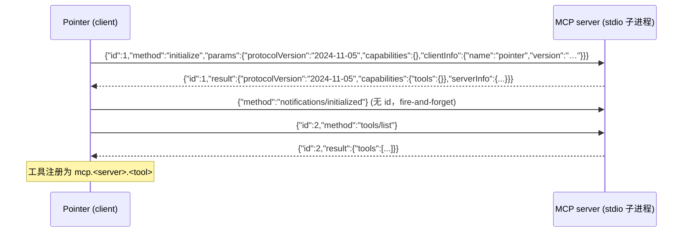
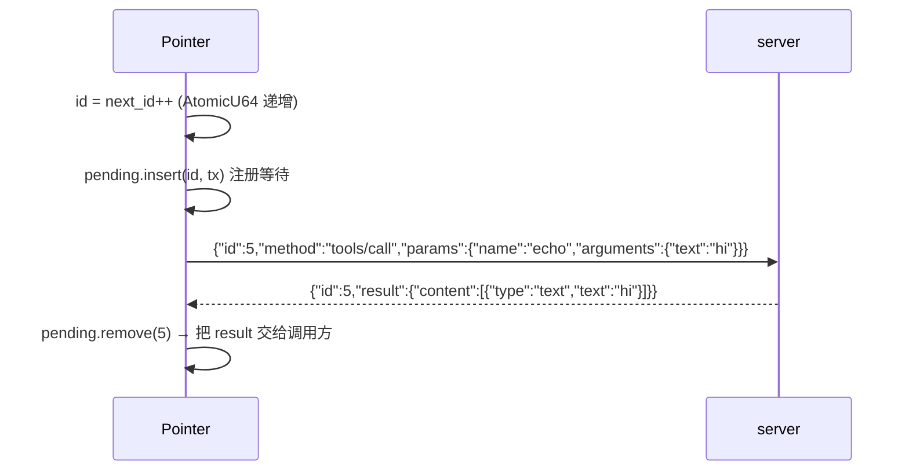

# MCP 客户端接入说明（developer）

> 面向**开发者**。讲 Pointer 作为 MCP **客户端**的实现：如何连接 stdio / HTTP 两种
> 传输的 MCP server、配置载体、装配与生命周期、管理 API、测试。
> 用户使用说明见 [`../user/mcp.md`](../user/mcp.md)；插件内 MCP 声明见
> [`../user/plugins.md`](../user/plugins.md)；整体设计见
> [`../plans/plugin-system-plan.md`](../plans/plugin-system-plan.md) §6.1。

---

## 1. 架构总览

Pointer 是 MCP 客户端，实现位于 `crates/pointer-core/src/plugins/mcp.rs`：

```
McpServerDecl (配置声明)
      │  stdio / http
      ▼
McpClient  ── transport ──► Stdio(子进程管道) | Http(streamable HTTP POST)
      │  request/notify/list_tools/call_tool（JSON-RPC 2.0）
      ▼
McpSessionManager ── 会话表 + 状态表（watchdog 驱动崩溃重启 / degraded）
      ▼
ToolRegistry ── 工具注册 mcp.<server>.<tool>（与插件工具同一审批/allowlist 链路）
```

关键链路：`AppState` 启动/热重载 → `sync_global_mcp_sessions`（全局）或
`activate_mcp_servers`（插件）→ `activate_mcp_servers_with` 按 transport 分派
`connect_stdio` / `connect_http` → 握手 + `tools/list` 注册工具。

## 2. 配置声明（McpServerDecl）

结构：`crates/pointer-core/src/plugins/manifest.rs`

| 字段 | 类型 | 说明 |
|------|------|------|
| `name` | String | server 名（工具命名 `mcp.<name>.<tool>`） |
| `transport` | String | `stdio`（默认）或 `http` |
| `command` | String | stdio：启动命令 |
| `args` | Vec\<String> | stdio：命令参数 |
| `env` | HashMap\<String,String> | stdio：环境变量 |
| `url` | Option\<String> | http：服务地址（必填），端口在 URL 内 |
| `headers` | Option\<HashMap\<String,String>> | http：附加请求头（如 `Authorization`） |

反序列化 `#[serde(default)]` 保证旧配置兼容；序列化时 `url`/`headers` 为 `None`
则跳过，避免空字段落盘。

### 配置载体（全局 MCP）

**主载体：客户端用户配置** `UserSettings.global_mcp_servers`（界面直接读写，
持久化到 `user_settings.json`，桌面/Web 共用）。`AppState::save_global_mcp_servers`
保存列表 + 热重载。

**兼容来源：** `pointer-server.toml` 的 `[[mcp_servers.server]]`（`server_config.rs`
解析 + `PARSED_MCP` 缓存），**仅当用户配置为空时**读取（`GlobalMcpConfig::from_server_config`）。

## 3. 传输协议（stdio 交互详解）

stdio 传输的完整实现位于 `crates/pointer-core/src/plugins/mcp.rs`。

### 3.1 进程建立

```rust
// connect_stdio（mcp.rs:93）
Command::new(command)        // 用户填的启动命令
    .args(args)              // 命令参数
    .envs(env)               // 环境变量
    .current_dir(base_dir)   // 插件目录 / 全局 base_dir
    .stdin(Stdio::piped())
    .stdout(Stdio::piped())
    .spawn()
```

子进程就是普通进程，**没有网络、没有端口**，通信全靠两根管道。

### 3.2 消息格式（三种，newline-delimited）

**协议 = JSON-RPC 2.0 over stdio，每行一个 JSON 对象**（写端 `serde_json::to_writer`
+ 换行 + flush；读端 `BufReader::lines()` 逐行）。

| 类型 | 报文 | 说明 |
|------|------|------|
| 请求 | `{"jsonrpc":"2.0","id":1,"method":"initialize","params":{...}}` | 带 `id`，**必须回响应** |
| 通知 | `{"jsonrpc":"2.0","method":"notifications/initialized","params":{}}` | **无 `id`**，不回 |
| 响应 | `{"jsonrpc":"2.0","id":1,"result":{...}}` 或 `"error":{...}` | 回相同 `id` 的响应 |

### 3.3 握手时序（连接时自动完成）



- 协议版本写死 `MCP_PROTOCOL_VERSION = "2024-11-05"`（mcp.rs:27）
- `initialize` 超时 `DEFAULT_MCP_HANDSHAKE_TIMEOUT_MS = 15_000`（mcp.rs:31）
- 握手失败 → 杀进程，装配报错

### 3.4 调用时序（tools/call）



关键实现：

- **请求→响应匹配**：写请求前先建 `mpsc channel` 塞进
  `pending: HashMap<u64, Sender<Value>>`；后台读线程按 `id` 找到对应 `tx` 发过去
  （mcp.rs:272-283）
- **超时**：`rx.recv_timeout(60s)`，`tools/call` 默认 `DEFAULT_MCP_CALL_TIMEOUT_MS =
  60_000`；超时从 pending 移除并报错
- **调用是纯同步阻塞**，可在 tokio 线程里安全调用（不依赖 async）

### 3.5 后台读线程 + 崩溃处理

```rust
// spawn_reader（mcp.rs:222）
for line in BufReader::new(stdout).lines() {
    // 空行跳过；无 id 的行是服务端主动通知/日志，忽略
    let id = parsed["id"]? else { continue };
    if let Some(tx) = pending.remove(&id) { tx.send(parsed); }
}
// stdout 关闭 = 进程退出
alive = false;
for (_, tx) in pending { tx.send(error{-32000, "MCP server 已退出"}) }
```

服务端崩溃：进程退出 → stdout EOF → 所有在等响应的调用立即收到 `-32000` 错误 →
watchdog（2s 周期）发现进程没了 → 指数退避重建，连续失败 5 次进入「运行异常」停手。

### 3.6 最小 server 示例（e2e 里的 demo）

```bash
#!/bin/bash
while IFS= read -r line; do
  if echo "$line" | grep -q '"initialize"'; then
    echo '{"jsonrpc":"2.0","id":1,"result":{"protocolVersion":"2024-11-05","capabilities":{"tools":{}},"serverInfo":{"name":"demo","version":"1.0"}}}'
  elif echo "$line" | grep -q '"tools/list"'; then
    echo '{"jsonrpc":"2.0","id":2,"result":{"tools":[{"name":"echo",...}]}}'
  elif echo "$line" | grep -q '"tools/call"'; then
    echo '{"jsonrpc":"2.0","id":3,"result":{"content":[{"type":"text","text":"pong"}]}}'
  fi
done
```

> 真实 server 必须回**相同 id**（demo 脚本偷懒写死）；用 `tools/call` 请求里的 id
> 原样返回即可。任何语言实现都行：逐行读 stdin、逐行回 stdout。

### 3.7 http（streamable HTTP，概要）

POST `url`，`Accept: application/json, text/event-stream`；响应解析支持
`application/json` 直读 与 SSE `data:` 事件（取含 `id` 的事件）。

> ⚠️ **async 安全**：`reqwest::blocking::Client` 内部持有 tokio runtime，在 tokio
> 异步上下文（axum handler / `#[tokio::test]`）创建会 panic。因此 HTTP 请求在
> **独立线程内创建/释放 blocking client**（`McpClient::request` / `notify` 的 Http 分支）。
> 已知限制：每次调用独立线程 + 独立连接，无连接复用；工具调用频率低时可接受，
> 若远程服务成为主力路径再评估连接池。

## 4. 生命周期

| 环节 | 行为 |
|------|------|
| 全局（界面配置） | `AppState::new` 装配；`save_global_mcp_servers` / `reload_global_mcp` 热重载（全量关旧会话 → 注销工具 → 重新装配） |
| 插件内声明 | `plugin_enable` 时自动 `activate_mcp_servers`；禁用/卸载 → `shutdown_plugin` + 注销 |
| watchdog | `mcp_watchdog_cycle`（2s 周期）：会话不存在或全部进程退出 → 重建（指数退避）；连续失败 ≥ `MAX_MCP_RESTART_FAILURES`(5) → degraded（停止自动重启） |
| 关闭 | `McpSessionManager::shutdown_plugin`（幂等）；`McpClient::drop` → kill 子进程 / 置死标记 |

## 5. 命名与冲突

- 工具命名：`mcp.<server>.<tool>`（与插件裸工具名区分）
- `doc_source`：`plugin:__global__:mcp:<server>:<tool>`（全局）/ `plugin:<id>:mcp:<server>:<tool>`（插件）
- **同名冲突全局优先**：全局 server 先注册；插件启用同名 server 时 `plugin_enable` 拒绝（不静默覆盖）

## 6. 管理 API

### HTTP（web / 本地服务）

| 方法 | 路径 | 说明 |
|------|------|------|
| GET | `/api/mcp` | 全局 MCP 视图（servers + enabled） |
| PUT | `/api/mcp` | 保存全局 MCP server 列表（body: `Vec<McpServerDecl>`，持久化 + 热重载） |

### Tauri（桌面）

- `list_mcp_servers()` → `GlobalMcpView`
- `save_mcp_servers(servers: Vec<McpServerDecl>)` → `GlobalMcpView`
- `reload_mcp_servers()` / `restart_mcp_server()`（既有）

### 前端

`src/components/settings/panels/McpPanel.vue`（设置 → MCP）：
服务列表 + 状态 + 添加/编辑/删除弹窗（连接方式二选一：远程服务 URL / 本机程序命令）。
API 适配：`src/lib/api.ts` / `tauri.ts` / `web.ts`（`listMcpServers` / `saveMcpServers` / `restartMcpServer`）。

## 7. 测试

`crates/pointer-core/src/plugins/e2e_tests.rs`（`cargo test -p pointer-core --lib plugins::e2e_tests`）：

| 用例 | 覆盖 |
|------|------|
| `global_mcp_basic_flows` | 全局 stdio 装配 + 调用 + 热重载清空 |
| `global_mcp_conflict_rejects_plugin_enable` | 同名冲突全局优先 |
| `global_mcp_saved_via_ui_persists_across_restart` | 界面保存 → 重启 AppState 从 user_settings 恢复 |
| `global_mcp_http_transport_connects_remote_service` | HTTP 远程服务连接 + 调用（本地 Python 最小 server） |
| `global_mcp_crash_recovers_via_watchdog` | 崩溃自动重启 |

> 注意：e2e 需要 `python3`（HTTP 用例的本地测试 server）。

[返回文档总索引](../README.md)
