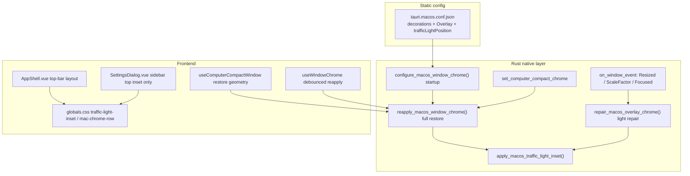

# macOS window chrome and traffic-light alignment

English | [简体中文](../../zh-CN/contributing/macos-window-chrome.md)

This document records the alignment mechanism between the **macOS native traffic lights** and the **frontend top-bar buttons** (sidebar collapse, drag regions, etc.). The problem tends to **recur intermittently** after changing the window shape, the compact dock bar, maximisation and similar scenarios, so read this page before making changes.

For the related UI conventions see [visual-theme.md](../../zh-CN/ui/visual-theme.md); for the compact dock bar shape see [computer-compact-dock-bar.md](../../zh-CN/design/computer-compact-dock-bar.md).

---

## 1. The nature of the problem

macOS uses an **Overlay title bar**: the system draws the traffic lights and the web content extends below the title bar. The alignment relies on **two independent systems**:

| Layer | Owner | Role |
| --- | --- | --- |
| **Native** | AppKit / Tao `inset_traffic_lights` | Traffic-light position, title bar container height |
| **Frontend** | `AppShell.vue` + `globals.css` | Sidebar top-bar height, left inset, vertical centring of the collapse button |

The two have **no single source of truth**. `trafficLightPosition` in the Tauri config only takes effect when the window is created; after changing `decorations` at runtime, resizing, maximising, or restoring from compact mode, the system resets the title bar, so you must **actively reapply / repair**.

Common causes of intermittent misalignment:

1. **Race**: the native inset runs inside `run_on_main_thread` plus delayed tasks, while the frontend layout has already rendered.
2. **Geometry change**: after `Resized` / `ScaleFactorChanged` / maximisation the title bar frame is rewritten by the system and no repair is triggered.
3. **Wrong restore order in compact mode**: reapplying chrome before setSize means the overlay is wiped out by the later geometry operation (see §5 Compact dock bar (Computer Compact) interaction).

---

## 2. Architecture overview

The settings page must not use a full-width top bar. Its two columns align to the top of the window: the left top row is "Back to chat" (on macOS after the traffic-light `traffic-light-inset`, then `pl-2`), and the right-hand row of the same height (`mac-chrome-row` / `h-10`) is the `main-top-chrome` drag region. On Windows / Linux the window buttons sit at the right end of the right-hand drag row. Both navigation and body content start below that row with `pt-3`.

Navigation items share the same left edge as "Back to chat": `pl-3` + `w-3.5` icon + `gap-2` (do not wrap them in a `w-7` icon backdrop, otherwise once fullscreen removes the traffic-light inset the title sits further right than "Back to chat"). In windowed mode only the top row keeps the traffic-light slot, while the navigation below stays `pl-3` (consistent with the conversation sidebar list).

In macOS **native fullscreen** the system hides the traffic lights together with the menu bar; the frontend drops `traffic-light-inset`, and the settings-page "Back to chat" and the conversation sidebar top bar reclaim that space. Exiting fullscreen restores the inset. Windowed maximisation (Option+green button / double-clicking the title bar) keeps the traffic lights, so the inset stays. Windows / Linux / Web have no traffic-light slot on the left, "Back to chat" is already flush left there, and fullscreen needs no further adjustment.

---

## 3. Key constants (change one, check them all)

| Constant | Location | Meaning |
| --- | --- | --- |
| `x: 12`, `y: 17` | `tauri.macos.conf.json` → `trafficLightPosition` | Initial traffic-light offset when Tauri creates the window |
| `INSET_X = 12`, `INSET_Y = 17` | `macos_traffic_lights.rs` | Logical offset of the runtime `inset_traffic_lights`, which must match the conf |
| `padding-left: 4.75rem` | `globals.css` → `.traffic-light-inset` | Horizontal space reserved for the traffic lights by the frontend (about 76px) |
| `height: 2.5rem` | `globals.css` → `.mac-chrome-row` | Sidebar / collapse top-bar row height (40px @ 16px root) |
| `translateY(-1px)` | `globals.css` → `.mac-chrome-row .chrome-icon-btn` | Vertical nudge of the icon relative to the native traffic lights |

**The semantics of `INSET_Y`** (consistent with Tao): title bar container height = close button height + `INSET_Y`. Changing only the CSS row height **cannot** replace the native inset; changing only the conf **cannot** guarantee it still applies after a runtime restore.

---

## 4. The three chrome operations (do not mix up the scenarios)

### 4.1 Full restore `reapply_macos_window_chrome`

**File**: `src-tauri/src/lib.rs`

**Steps**:

1. `set_decorations(true)`
2. `set_title_bar_style(Overlay)`
3. Main thread: `set_compact_surface(false)`, `apply_overlay_titlebar`, `set_traffic_lights_visible(true)`, `apply_inset`
4. Delayed passes: run overlay + inset again after **50ms / 200ms / 500ms** (to absorb the system's asynchronous layout)

**Entry points**:

- Application start `configure_macos_window_chrome`
- Tauri command `reapply_window_chrome` (frontend `reapplyWindowChrome()`)
- Leaving compact mode `restore_full_window_chrome`

**When to use**: restoring from `decorations: false`, the compact dock bar ending, or when you suspect the overlay style was lost.

### 4.2 Light repair `repair_macos_overlay_chrome`

**File**: `src-tauri/src/lib.rs`

**Steps** (without toggling decorations):

- Main thread: `apply_overlay_titlebar` + `set_traffic_lights_visible(true)` + `apply_inset`

**Trigger**: `schedule_macos_overlay_chrome_repair` (120ms debounce)

| Event | reason label |
| --- | --- |
| `WindowEvent::Resized` | `window-resized` |
| `WindowEvent::ScaleFactorChanged` | `scale-factor-changed` |
| `WindowEvent::Focused(true)` | `window-focused` |

**When to use**: everyday resizing, a monitor DPI change, or traffic lights and buttons out of alignment after focusing back with Cmd+Tab.

**Skip condition**: `window_chrome_commands::is_computer_compact_chrome_active()` is true (the traffic lights should not be shown in compact state).

### 4.3 Frontend debounced full reapply

**File**: `src/composables/useWindowChrome.ts`

- `onResized`, and after double-clicking the title bar `toggleMaximize`, call `reapplyWindowChrome()` with a **400ms debounce**
- Acts as a **fallback** for the Rust repair (maximisation and similar scenarios may lose the overlay along with everything else)

---

## 5. Compact dock bar (Computer Compact) interaction

**Files**: `window_chrome_commands.rs`, `useComputerCompactWindow.ts`

| Phase | macOS behaviour |
| --- | --- |
| Entering compact | `decorations: false`, hide the traffic lights, `set_compact_surface(true)` |
| Leaving compact | **macOS**: first `set_computer_compact_chrome(false)` + reapply, then `setSize`/`setPosition` (using the **inner** size, consistent with Tauri `set_size`), then reapply once more; maximisation calls `maximize()` after the chrome has been restored. **Other platforms**: geometry first, then chrome |

**Restore order** (`useComputerCompactWindow.ts`):

- Save the **logical innerSize** + **logical outerPosition** + maximized (converted on the Rust side before shrinking, to avoid dividing by scale again on restore).
- **macOS**: restore chrome → synchronously `setContentSize` + `setFrameTopLeftPoint` on the main thread (Tauri `set_size` goes through GCD asynchronously on macOS and easily races with reapply) → reapply → one more geometry pass on the main thread → `setMovableByWindowBackground(true)`.
- **Win/Linux**: geometry → chrome → reapply.

> In the `decorations: false` compact state, `setSize` computes the layout as if there were no title bar, so re-enabling the overlay after restoring makes the client-area size and the drag region drift out of alignment.

The compact-state flag `COMPUTER_COMPACT_CHROME` (`AtomicBool`) stops resize/focus repair **and** the delayed `schedule_macos_overlay_chrome_pass` task from wrongly showing the traffic lights on the Rust side; after positioning on macOS, `place_computer_compact_window` hides the traffic lights again (resizing may reset the NSWindow button visibility).

When the sub-agent computer **task target is Pointer itself** (`computerTarget: self`), compact mode is not entered. See [computer-compact-dock-bar.md §Operating target](../../zh-CN/design/computer-compact-dock-bar.md#操作目标任务意图--已实现).

---

## 6. Frontend layout and drag regions (independent strategy)

Each UI area is wrapped in `<WindowDragRegion region="…">`; the **strategy is centralised in** `src/lib/windowDragRegions.ts`, so changing one area means changing only its entry — do not scatter `data-tauri-drag-region` / `onChromeMouseDown` around `AppShell`.

| region id | Scenario | Window draggable | macOS native drag |
| --- | --- | --- | --- |
| `sidebar-top-chrome` | Sidebar expanded top bar (A) | ✅ | ✅ |
| `main-top-chrome` | Main-area top bar (D) | ✅ | ❌ (`startDragging`) |
| `collapsed-top-chrome` | Collapsed full-width top bar (H) | ✅ | ✅ |
| `sidebar-body` | Sidebar content (search + list + bottom bar) | ❌ | ❌ |
| `chat-body` | Chat body (E) | ❌ | ❌ |
| `compact-bar-shell` / `compact-bar-status` | Compact dock bar | Shell draggable / text not draggable | Shell ✅ |

Implementation chain: `WindowDragRegion.vue` → `useWindowDragRegion.ts` → `startDragging()`; on macOS the native `setMovableByWindowBackground(false)` + CSS `no-drag` keep the body from dragging the window — **do not** call `preventDefault()` on `mousedown` in the body (it would block text selection).

Layout classes (unrelated to dragging): `.traffic-light-inset`, `.mac-chrome-row`, `.sidebar-chrome`, `.collapsed-top-chrome`, `.main-top-chrome`.

`useWindowChrome().macTrafficLightPadding` is `macTrafficLightInsetActive(os, fullscreen)`: true only on macOS **and not in native fullscreen**, controlling `traffic-light-inset`. The fullscreen state is read in `onResized` (with an 80ms follow-up check) and cached at module level in the composable, to avoid the inset flashing back on the first frame when switching between conversation and settings.

---

## 7. File index

| Path | Responsibility |
| --- | --- |
| `src-tauri/tauri.macos.conf.json` | macOS window creation: decorations, Overlay, trafficLightPosition |
| `src-tauri/src/macos_traffic_lights.rs` | `INSET_X/Y`, `inset_traffic_lights`, compact rounded corners, showing/hiding the traffic lights |
| `src-tauri/src/lib.rs` | Startup configuration, reapply/repair, delayed passes, window event listeners |
| `src-tauri/src/window_chrome_commands.rs` | Compact chrome toggling, the `reapply_window_chrome` command, the compact-state flag |
| `src/composables/useWindowChrome.ts` | Maximise/fullscreen state, macOS debounced reapply; turns off the traffic-light inset in fullscreen |
| `src/lib/desktopOs.ts` | OS detection, `macTrafficLightInsetActive` |
| `src/composables/useComputerCompactWindow.ts` | Compact window geometry and restore order |
| `src/lib/windowDragRegions.ts` | **Per-area drag strategy table (change this file first when changing dragging)** |
| `src/components/layout/WindowDragRegion.vue` | Wrapper component that applies the strategy per region |
| `src/composables/useWindowDragRegion.ts` | Area `mousedown` / double-click maximise |
| `src/components/layout/AppShell.vue` | Top bar and content partition structure (no inline drag logic) |
| `src/lib/tauri.ts` | `reapplyWindowChrome` / `setComputerCompactChrome` invoke |

---

## 8. Anti-patterns (avoid a recurrence)

1. **Changing only `trafficLightPosition` in `tauri.macos.conf.json`**  
   After a runtime restore/resize the `INSET_*` values in `macos_traffic_lights.rs` still win, so the two places must stay in sync.

2. **On macOS, calling `setSize` while restoring from compact with `decorations: false`, or saving outerSize but restoring with `setSize` (inner)**  
   The client-area size will be off and the overlay drag region will break too; on macOS restore the chrome first, then set the geometry with the inner size, then reapply.

3. **On non-macOS, reapplying before setSize/maximize when restoring from compact**  
   This wipes out the overlay title bar; Win/Linux still keep "geometry → chrome".

4. **Only changing CSS on resize without calling repair**  
   Intermittent misalignment mostly comes from the native title bar frame not being updated, not from a mere frontend row-height issue.

5. **Removing the delayed passes (50/200/500ms)**  
   Things can still be misaligned for a short window after startup and restore; these delays are deliberately kept.

6. **Listening for resize repair without setting `COMPUTER_COMPACT_CHROME` in compact state**  
   It would try to show the traffic lights on a borderless window.

7. **Using `decorations: false` as the normal macOS main-window state**  
   The system traffic lights disappear; macOS must use `decorations: true` + Overlay (see `visual-theme.md`).

8. **Inline-editing `data-tauri-drag-region` / `onChromeMouseDown` inside `AppShell`**  
   Change the corresponding region in `windowDragRegions.ts` instead, and wrap it with `WindowDragRegion`.

9. **Wrapping the sidebar top bar with `app-content-no-drag` on the `<aside>` root**  
   At the same specificity as `.window-drag-region--native` it overrides the sidebar top-bar drag; add the body no-drag only to the content area below the top bar.

---

## 9. Troubleshooting checklist

1. Search the logs for `macOS traffic lights inset applied` and check whether the `label` (`window-resized`, `reapply-delayed-200`, etc.) appears after the misalignment.
2. If you see a warn like `close button not found`, the inset ran too early — check whether a delayed pass or a repair is missing.
3. Reproduction path: cold start → resize → maximise → collapse/expand the sidebar → enter/leave the compact dock bar → Cmd+Tab.
4. If it is **always** too high/low (not intermittent), then consider tweaking the `mac-chrome-row` height or `translateY` in `globals.css`, and cross-check `INSET_Y`.
5. After changing the constants, verify them in all three places at once — **conf + Rust + CSS** — and run `tauri dev` for a real-device check.

---

## 10. Closing the window and reopening from the Dock

Closing the main window (red light) **does not quit the process**: `CloseRequested` is intercepted and `hide()` is called, so the app keeps running in the background (the menu-bar tray still works).

| Action | Behaviour |
| --- | --- |
| Click close (red light) | Hides the main window, does not quit |
| Click the Dock icon | `RunEvent::Reopen` → `show` + `focus` (must be handled, otherwise the Dock icon is there but clicking it does nothing) |
| Left-click the tray / "Show Pointer" | Restores the main window as above |
| Tray "Quit" | `app.exit(0)` |

Implementation: `show_main_window` + `RunEvent::Reopen` in `src-tauri/src/lib.rs`.

---

## 11. Change decision table

| What you want to do | Where to change it |
| --- | --- |
| Traffic-light horizontal position | `INSET_X` + `tauri.macos.conf.json` + `.traffic-light-inset` if needed |
| Traffic-light vertical position | `INSET_Y` + conf; fine-tune on the frontend with `mac-chrome-row` / `translateY` |
| Misaligned again after resize | Keep `schedule_macos_overlay_chrome_repair` and the `useWindowChrome` debounce |
| No traffic lights after restoring from compact mode | Check the restore order in `useComputerCompactWindow` and the 250ms delayed reapply |
| A new window shape (e.g. fullscreen/multi-window) | Call `reapply_window_chrome` when leaving the new shape, or hook up a similar repair |
| A blank strip on the left after fullscreen | Confirm `macTrafficLightPadding` becomes false with `isFullscreen()`; this is not maximisation (traffic lights still present) |
| Dock click does not open after closing | Confirm `RunEvent::Reopen` still calls `show_main_window` |

---

## 12. Cross-platform notes

- **Windows / Linux**: `decorations: false` throughout, the top-bar buttons are `WindowControls` (top-right of the main area), **there is no traffic-light logic as described in this document**, and there is no inset to reclaim on the left. The settings-page "Back to chat" is in the same position windowed and fullscreen.
- **Web**: browser chrome, no Tauri window API, likewise no traffic-light slot on the left.
- Any change to the `useWindowChrome` / `AppShell` top bar must consider all three entries at once (see the project development conventions, "cross-entry compatibility").
