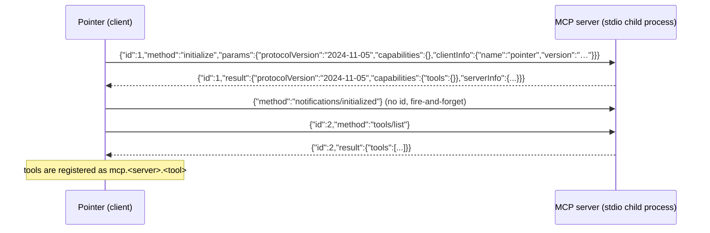
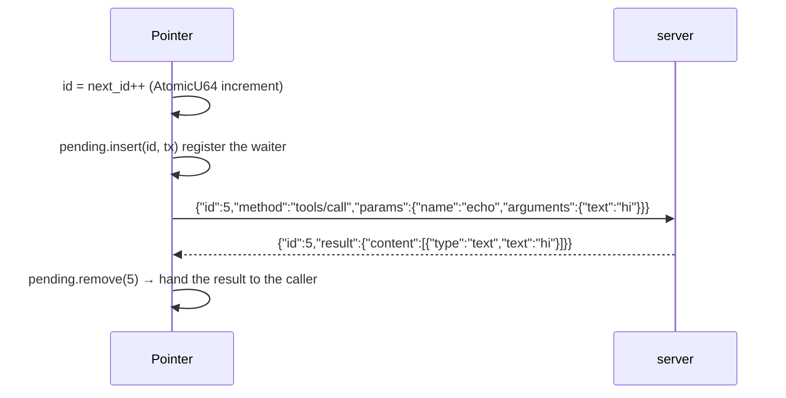

# MCP client integration notes (developer)

English | [简体中文](../../zh-CN/developer/mcp.md)

> For **developers**. Covers how Pointer implements the MCP **client** side: how it connects to MCP servers over the
> stdio / HTTP transports, the configuration carriers, assembly and lifecycle, the management API, and testing.
> For end-user instructions see [`../user/mcp.md`](../user/mcp.md); for MCP declarations inside plugins see
> [`../user/plugins.md`](../user/plugins.md); for the overall design see
> [`../plans/plugin-system-plan.md`](../../zh-CN/plans/plugin-system-plan.md) §6.1 global MCP (not a plugin, P2b).

---

## 1. Architecture overview

Pointer is an MCP client; the implementation lives in `crates/pointer-core/src/plugins/mcp.rs`:

```
McpServerDecl (configuration declaration)
      │  stdio / http
      ▼
McpClient  ── transport ──► Stdio(child process pipes) | Http(streamable HTTP POST)
      │  request/notify/list_tools/call_tool (JSON-RPC 2.0)
      ▼
McpSessionManager ── session table + state table (watchdog drives crash restart / degraded)
      ▼
ToolRegistry ── tool registration mcp.<server>.<tool> (same approval/allowlist path as plugin tools)
```

Key path: `AppState` startup / hot reload → `sync_global_mcp_sessions` (global) or
`activate_mcp_servers` (plugin) → `activate_mcp_servers_with` dispatches by transport to
`connect_stdio` / `connect_http` → handshake + `tools/list` registers the tools.

## 2. Configuration declaration (McpServerDecl)

Structure: `crates/pointer-core/src/plugins/manifest.rs`

| Field | Type | Notes |
|------|------|------|
| `name` | String | server name (tools are named `mcp.<name>.<tool>`) |
| `transport` | String | `stdio` (default) or `http` |
| `command` | String | stdio: the launch command |
| `args` | Vec\<String> | stdio: command arguments |
| `env` | HashMap\<String,String> | stdio: environment variables |
| `url` | Option\<String> | http: service address (required); the port is inside the URL |
| `headers` | Option\<HashMap\<String,String>> | http: extra request headers (such as `Authorization`) |

Deserialization uses `#[serde(default)]` so old configurations stay compatible; on
serialization `url` / `headers` are skipped when they are `None`, so no empty fields are
written to disk.

### Configuration carriers (global MCP)

**Primary carrier: the client user configuration** `UserSettings.global_mcp_servers` (read and written directly by the UI,
persisted to `user_settings.json`, shared by desktop/Web). `AppState::save_global_mcp_servers`
saves the list + hot reloads.

**Compatibility source:** `[[mcp_servers.server]]` in `pointer-server.toml` (parsed by
`server_config.rs` + the `PARSED_MCP` cache), read **only when the user configuration is
empty** (`GlobalMcpConfig::from_server_config`).

## 3. Transport protocol (stdio interaction in detail)

The complete stdio transport implementation lives in `crates/pointer-core/src/plugins/mcp.rs`.

### 3.1 Process setup

```rust
// connect_stdio（mcp.rs:93）
Command::new(command)        // 用户填的启动命令
    .args(args)              // 命令参数
    .envs(env)               // 环境变量
    .current_dir(base_dir)   // 插件目录 / 全局 base_dir
    .stdin(Stdio::piped())
    .stdout(Stdio::piped())
    .spawn()
```

The child process is an ordinary process: **no network, no port** — all communication goes
through the two pipes.

### 3.2 Message format (three kinds, newline-delimited)

**Protocol = JSON-RPC 2.0 over stdio, one JSON object per line** (the write side uses `serde_json::to_writer`
+ newline + flush; the read side uses `BufReader::lines()` line by line).

| Kind | Message | Notes |
|------|------|------|
| Request | `{"jsonrpc":"2.0","id":1,"method":"initialize","params":{...}}` | Carries an `id` and **must get a response** |
| Notification | `{"jsonrpc":"2.0","method":"notifications/initialized","params":{}}` | **No `id`**, no response |
| Response | `{"jsonrpc":"2.0","id":1,"result":{...}}` or `"error":{...}` | Responds with the same `id` |

### 3.3 Handshake sequence (completed automatically on connect)



- The protocol version is hard-coded to `MCP_PROTOCOL_VERSION = "2024-11-05"` (mcp.rs:27)
- `initialize` timeout: `DEFAULT_MCP_HANDSHAKE_TIMEOUT_MS = 15_000` (mcp.rs:31)
- Handshake failure → kill the process; assembly reports an error

### 3.4 Call sequence (tools/call)



Key implementation points:

- **Request→response matching**: before writing a request, an `mpsc channel` is created and
  inserted into `pending: HashMap<u64, Sender<Value>>`; the background reader thread finds the
  matching `tx` by `id` and sends to it (mcp.rs:272-283)
- **Timeout**: `rx.recv_timeout(60s)`; `tools/call` defaults to `DEFAULT_MCP_CALL_TIMEOUT_MS =
  60_000`; on timeout it is removed from `pending` and an error is returned
- **Calls are purely synchronous and blocking**, and are safe to make from a tokio thread (no
  async dependency)

### 3.5 Background reader thread + crash handling

```rust
// spawn_reader（mcp.rs:222）
for line in BufReader::new(stdout).lines() {
    // 空行跳过；无 id 的行是服务端主动通知/日志，忽略
    let id = parsed["id"]? else { continue };
    if let Some(tx) = pending.remove(&id) { tx.send(parsed); }
}
// stdout 关闭 = 进程退出
alive = false;
for (_, tx) in pending { tx.send(error{-32000, "MCP server 已退出"}) }
```

Server crash: the process exits → stdout EOF → every call waiting for a response immediately
receives a `-32000` error → the watchdog (2s period) notices the process is gone → rebuilds with
exponential backoff, and after 5 consecutive failures it stops and enters the "degraded" state.

### 3.6 Minimal server example (the demo used in the e2e test)

```bash
#!/bin/bash
while IFS= read -r line; do
  if echo "$line" | grep -q '"initialize"'; then
    echo '{"jsonrpc":"2.0","id":1,"result":{"protocolVersion":"2024-11-05","capabilities":{"tools":{}},"serverInfo":{"name":"demo","version":"1.0"}}}'
  elif echo "$line" | grep -q '"tools/list"'; then
    echo '{"jsonrpc":"2.0","id":2,"result":{"tools":[{"name":"echo",...}]}}'
  elif echo "$line" | grep -q '"tools/call"'; then
    echo '{"jsonrpc":"2.0","id":3,"result":{"content":[{"type":"text","text":"pong"}]}}'
  fi
done
```

> A real server must reply with the **same id** (the demo script cheats and hard-codes it); just
> return the id from the `tools/call` request unchanged. Any language works: read stdin line by
> line and reply on stdout line by line.

### 3.7 http (streamable HTTP, overview)

POST `url`, `Accept: application/json, text/event-stream`; response parsing supports reading
`application/json` directly and SSE `data:` events (taking the event that contains an `id`).

> ⚠️ **async safety**: `reqwest::blocking::Client` holds a tokio runtime internally, so creating
> it inside a tokio async context (an axum handler / `#[tokio::test]`) panics. HTTP requests
> therefore **create/release the blocking client inside a dedicated thread** (the Http branch of
> `McpClient::request` / `notify`).
> Known limitation: each call uses its own thread + its own connection, with no connection reuse;
> acceptable while tool calls are infrequent — revisit a connection pool if the remote service
> becomes a primary path.

## 4. Lifecycle

| Stage | Behavior |
|------|------|
| Global (configured in the UI) | Assembled by `AppState::new`; `save_global_mcp_servers` / `reload_global_mcp` hot reload (close all old sessions → unregister tools → re-assemble) |
| Declared inside a plugin | `activate_mcp_servers` runs automatically on `plugin_enable`; disable/uninstall → `shutdown_plugin` + unregister |
| watchdog | `mcp_watchdog_cycle` (2s period): the session is missing or all processes exited → rebuild (exponential backoff); `MAX_MCP_RESTART_FAILURES`(5) consecutive failures → degraded (auto-restart stops) |
| Shutdown | `McpSessionManager::shutdown_plugin` (idempotent); `McpClient::drop` → kill the child process / mark it dead |

## 5. Naming and conflicts

- Tool naming: `mcp.<server>.<tool>` (distinct from a plugin's bare tool name)
- `doc_source`: `plugin:__global__:mcp:<server>:<tool>` (global) / `plugin:<id>:mcp:<server>:<tool>` (plugin)
- **Same-name conflicts: global wins**: global servers are registered first; when a plugin enables a server with the same name, `plugin_enable` rejects it (no silent overwrite)

## 6. Management API

### HTTP (web / local server)

| Method | Path | Notes |
|------|------|------|
| GET | `/api/mcp` | Global MCP view (servers + enabled) |
| PUT | `/api/mcp` | Save the global MCP server list (body: `Vec<McpServerDecl>`; persists + hot reloads) |

### Tauri (desktop)

- `list_mcp_servers()` → `GlobalMcpView`
- `save_mcp_servers(servers: Vec<McpServerDecl>)` → `GlobalMcpView`
- `reload_mcp_servers()` / `restart_mcp_server()` (existing)

### Frontend

`src/components/settings/panels/McpPanel.vue` (Settings → MCP):
the server list + status + add/edit/delete dialogs (choose one of two connection modes: a remote service URL / a local program command).
API adapters: `src/lib/api.ts` / `tauri.ts` / `web.ts` (`listMcpServers` / `saveMcpServers` / `restartMcpServer`).

## 7. Tests

`crates/pointer-core/src/plugins/e2e_tests.rs` (`cargo test -p pointer-core --lib plugins::e2e_tests`):

| Case | Coverage |
|------|------|
| `global_mcp_basic_flows` | Global stdio assembly + call + hot reload clearing |
| `global_mcp_conflict_rejects_plugin_enable` | Same-name conflict: global wins |
| `global_mcp_saved_via_ui_persists_across_restart` | Saved from the UI → a restarted AppState restores it from user_settings |
| `global_mcp_http_transport_connects_remote_service` | HTTP remote service connect + call (a minimal local Python server) |
| `global_mcp_crash_recovers_via_watchdog` | Crash auto-restart |

> Note: the e2e tests need `python3` (the local test server for the HTTP case).

[Back to the documentation index](../README.md)
