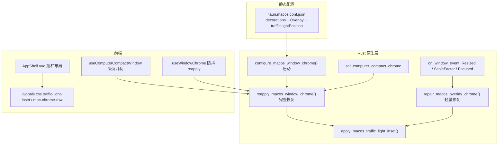

# macOS 窗口 Chrome 与红绿灯对齐

本文档记录 **macOS 原生红绿灯（traffic lights）** 与 **前端顶栏按钮**（侧栏收起、拖拽区等）的对齐机制。该问题容易在改窗口形态、紧凑浮条、最大化等场景后**间歇性复发**，修改前请先读本文。

相关 UI 约定见 [visual-theme.md](../ui/visual-theme.md)；紧凑浮条形态见 [computer-compact-dock-bar.md](../design/computer-compact-dock-bar.md)。

---

## 1. 问题本质

macOS 使用 **Overlay 标题栏**：系统绘制红绿灯，Web 内容延伸到标题栏下方。对齐依赖**两套独立系统**：

| 层 | 负责方 | 作用 |
|----|--------|------|
| **原生** | AppKit / Tao `inset_traffic_lights` | 红绿灯位置、title bar 容器高度 |
| **前端** | `AppShell.vue` + `globals.css` | 侧栏顶栏高度、左留白、收起按钮垂直居中 |

二者**没有单一数据源**。Tauri 配置里的 `trafficLightPosition` 只在窗口创建时生效；运行时改 `decorations`、resize、最大化、从紧凑模式恢复后，系统会重置 title bar，必须**主动 reapply / repair**。

间歇性不对齐的常见原因：

1. **竞态**：原生 inset 在 `run_on_main_thread` + 延迟任务中执行，前端布局已先渲染。
2. **几何变化**：`Resized` / `ScaleFactorChanged` / 最大化后 title bar frame 被系统改写，未触发 repair。
3. **紧凑模式恢复顺序错误**：先 reapply chrome 再 setSize，overlay 会被后续几何操作冲掉（见 §5）。

---

## 2. 架构总览

---

## 3. 关键常量（改一处要对照全部）

| 常量 | 位置 | 含义 |
|------|------|------|
| `x: 12`, `y: 17` | `tauri.macos.conf.json` → `trafficLightPosition` | Tauri 创建窗口时的初始红绿灯偏移 |
| `INSET_X = 12`, `INSET_Y = 17` | `macos_traffic_lights.rs` | 运行时 `inset_traffic_lights` 逻辑偏移，须与 conf 一致 |
| `padding-left: 4.75rem` | `globals.css` → `.traffic-light-inset` | 前端为红绿灯预留的水平空间（约 76px） |
| `height: 2.5rem` | `globals.css` → `.mac-chrome-row` | 侧栏/收起顶栏行高（40px @ 16px root） |
| `translateY(-1px)` | `globals.css` → `.mac-chrome-row .chrome-icon-btn` | 图标相对原生红绿灯的垂直微调 |

**`INSET_Y` 的语义**（与 Tao 一致）：title bar 容器高度 = 关闭按钮高度 + `INSET_Y`。只改 CSS 行高**不能**替代原生 inset；只改 conf **不能**保证运行时恢复后仍生效。

---

## 4. 三种 Chrome 操作（不要混用场景）

### 4.1 完整恢复 `reapply_macos_window_chrome`

**文件**：`src-tauri/src/lib.rs`

**步骤**：

1. `set_decorations(true)`
2. `set_title_bar_style(Overlay)`
3. 主线程：`set_compact_surface(false)`、`apply_overlay_titlebar`、`set_traffic_lights_visible(true)`、`apply_inset`
4. 延迟 pass：**50ms / 200ms / 500ms** 再执行 overlay + inset（消化系统异步布局）

**入口**：

- 应用启动 `configure_macos_window_chrome`
- Tauri command `reapply_window_chrome`（前端 `reapplyWindowChrome()`）
- 紧凑模式退出 `restore_full_window_chrome`

**适用**：从 `decorations: false` 恢复、紧凑浮条结束、怀疑 overlay 样式丢失。

### 4.2 轻量修复 `repair_macos_overlay_chrome`

**文件**：`src-tauri/src/lib.rs`

**步骤**（不切换 decorations）：

- 主线程：`apply_overlay_titlebar` + `set_traffic_lights_visible(true)` + `apply_inset`

**触发**：`schedule_macos_overlay_chrome_repair`（120ms 防抖）

| 事件 | reason 标签 |
|------|-------------|
| `WindowEvent::Resized` | `window-resized` |
| `WindowEvent::ScaleFactorChanged` | `scale-factor-changed` |
| `WindowEvent::Focused(true)` | `window-focused` |

**适用**：日常 resize、换显示器 DPI、Cmd+Tab 回焦后红绿灯与按钮错位。

**跳过条件**：`window_chrome_commands::is_computer_compact_chrome_active()` 为 true（紧凑态不应显示红绿灯）。

### 4.3 前端防抖完整 reapply

**文件**：`src/composables/useWindowChrome.ts`

- `onResized`、双击标题栏 `toggleMaximize` 后 **400ms 防抖** 调用 `reapplyWindowChrome()`
- 作为 Rust repair 的**兜底**（最大化等场景可能连 overlay 一起丢）

---

## 5. 紧凑浮条（Computer Compact）交互

**文件**：`window_chrome_commands.rs`、`useComputerCompactWindow.ts`

| 阶段 | macOS 行为 |
|------|------------|
| 进入紧凑 | `decorations: false`，隐藏红绿灯，`set_compact_surface(true)` |
| 退出紧凑 | **先**恢复窗口几何（size/position/maximize），**再** `set_computer_compact_chrome(false)`，**最后** macOS 延迟 250ms + `reapplyWindowChrome()` |

**恢复顺序很重要**（`useComputerCompactWindow.ts` 注释）：

> resize/maximize 若在 reapply 之后发生，会冲掉 overlay title bar。

紧凑态标志 `COMPUTER_COMPACT_CHROME`（`AtomicBool`）在 Rust 侧阻止 resize/focus repair 误显示红绿灯。

---

## 6. 前端布局落点

| 场景 | 组件 / 类 |
|------|-----------|
| 侧栏展开，右侧收起按钮 | `AppShell.vue` → `.sidebar-chrome` + `.mac-chrome-row` |
| 侧栏收起，全宽顶栏 | `.collapsed-top-chrome` + `.traffic-light-inset` + `.mac-chrome-row` |
| 拖拽区 | `data-tauri-drag-region` + `globals.css` `.titlebar-drag` |
| Windows/Linux 控件 | 主区域顶栏 `WindowControls`（与 macOS 红绿灯无关） |

`useWindowChrome().macTrafficLightPadding` 仅在 `detectDesktopOs() === 'macos'` 时为 true，控制是否加 `traffic-light-inset` / `mac-chrome-row`。

---

## 7. 文件索引

| 路径 | 职责 |
|------|------|
| `src-tauri/tauri.macos.conf.json` | macOS 窗口创建：decorations、Overlay、trafficLightPosition |
| `src-tauri/src/macos_traffic_lights.rs` | `INSET_X/Y`、`inset_traffic_lights`、紧凑圆角、显隐红绿灯 |
| `src-tauri/src/lib.rs` | 启动配置、reapply/repair、延迟 pass、窗口事件监听 |
| `src-tauri/src/window_chrome_commands.rs` | 紧凑 chrome 切换、`reapply_window_chrome` command、紧凑态标志 |
| `src/composables/useWindowChrome.ts` | 最大化状态、macOS 防抖 reapply |
| `src/composables/useComputerCompactWindow.ts` | 紧凑窗口几何与恢复顺序 |
| `src/components/layout/AppShell.vue` | 顶栏结构与 class 绑定 |
| `src/styles/globals.css` | `.traffic-light-inset`、`.mac-chrome-row`、拖拽样式 |
| `src/lib/tauri.ts` | `reapplyWindowChrome` / `setComputerCompactChrome` invoke |

---

## 8. 反模式（避免问题复发）

1. **只在 `tauri.macos.conf.json` 改 `trafficLightPosition`**  
   运行时恢复/resize 后仍以 `macos_traffic_lights.rs` 的 `INSET_*` 为准，两处必须同步。

2. **紧凑模式恢复时先 reapply 再 setSize/maximize**  
   会导致 overlay 被后续几何操作打掉；保持「几何 → chrome → 延迟 reapply」顺序。

3. **resize 时只改 CSS、不调 repair**  
   间歇性错位多来自原生 title bar frame 未更新，不是单纯前端行高问题。

4. **去掉延迟 pass（50/200/500ms）**  
   启动与恢复后短窗口内仍可能对不齐；这些延迟是刻意保留的。

5. **紧凑态未设 `COMPUTER_COMPACT_CHROME` 就监听 resize repair**  
   会在无框窗口上尝试显示红绿灯。

6. **macOS 使用 `decorations: false` 作为主界面常态**  
   系统红绿灯会消失；macOS 必须 `decorations: true` + Overlay（见 `visual-theme.md`）。

---

## 9. 排查清单

1. 日志搜 `macOS traffic lights inset applied`，看 `label`（`window-resized`、`reapply-delayed-200` 等）是否在错位后出现。
2. 若 `close button not found` 类 warn，说明 inset 过早执行，检查是否缺少延迟 pass 或 repair。
3. 复现路径：冷启动 → resize → 最大化 → 侧栏收起/展开 → 紧凑浮条进出 → Cmd+Tab。
4. 若**始终**偏上/偏下（非间歇），再考虑微调 `globals.css` 的 `mac-chrome-row` 高度或 `translateY`，并对照 `INSET_Y`。
5. 改 constants 后同时在 **conf + Rust + CSS** 三处核对，并跑 `tauri dev` 实机验证。

---

## 10. 修改决策表

| 你想做的事 | 建议改哪里 |
|------------|------------|
| 红绿灯水平位置 | `INSET_X` + `tauri.macos.conf.json` + 必要时 `.traffic-light-inset` |
| 红绿灯垂直位置 | `INSET_Y` + conf；前端用 `mac-chrome-row` / `translateY` 微调 |
| resize 后又错位 | 保持 `schedule_macos_overlay_chrome_repair` 与 `useWindowChrome` 防抖 |
| 紧凑模式恢复后无红绿灯 | 检查 `useComputerCompactWindow` 恢复顺序与 250ms 延迟 reapply |
| 新窗口形态（如全屏/多窗口） | 新形态退出时调用 `reapply_window_chrome` 或挂接同类 repair |

---

## 11. 跨平台说明

- **Windows / Linux**：全程 `decorations: false`，顶栏按钮为 `WindowControls`，**无本文档所述红绿灯逻辑**。
- **Web**：浏览器 chrome，无 Tauri 窗口 API。
- 任何改 `useWindowChrome` / `AppShell` 顶栏的变更须同时考虑三端（见项目开发规范「跨入口兼容」）。
