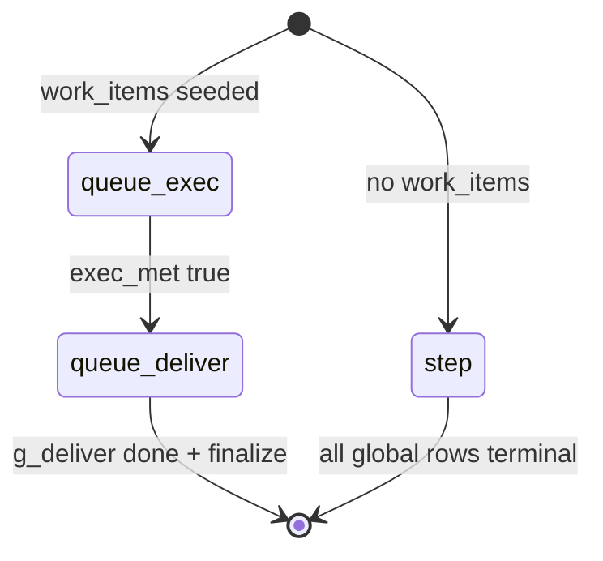

# Task board unified milestone injection

Design for reducing model burden: **one milestone layer in inject**, unified section names, host-managed global phase for queue (work_item) campaigns.

**Status:** implemented (inject projection + milestone-driven queue; `work_item_delta` removed from model API).

Related: [`taskboard-lifecycle-and-fields.md`](taskboard-lifecycle-and-fields.md), [`task-board-v2-schema.md`](task-board-v2-schema.md).

## Problem

Current `[TASK_BOARD]` inject exposes **two milestone tables** (`## Global milestones` + `## Item milestones`) and two current-row sections. Models confuse Type1 vs Type2, patch the wrong `task_board_patch` field, or skip item SOP patches.

## Principles

1. **Inject one milestone list per turn** — model reads and patches a single visible ladder.
2. **Unified inject labels** — always `## Milestones` / `## Current milestone` (never `global_*` / `item_*` in inject).
3. **Storage unchanged** — `global_milestones[]` + `item_milestones[]` remain in the document; only **inject projection** changes.
4. **Patch API simplified** — queue-exec uses **`milestones` only**; **`work_item_delta` removed** from model surface (host applies queue updates internally). `work_item_claim` remains for **dynamic** mode only.

## Modes

| Mode | `has_work_items` | Inject `## Milestones` source | Model patches |
| --- | --- | --- | --- |
| **step** | false | full `global_milestones[]` | `global_milestones` (one row) |
| **queue-exec** | true, `exec_met=false` | full `item_milestones[]` template | **`milestones` only** (one row → `done`); host drives work_item queue (see below) |
| **queue-deliver** | true, `exec_met=true` | **only** `g_deliver` row | `global_milestones` (`g_deliver`) |

`exec_met` = existing host predicate (`work_items_apply::exec_met`).

### Mode diagram



## Inject block layout (runtime)

### Common prefix — `## Task`

Always present. Add **host progress** for queue mode (replaces listing `g_plan` / `g_exec` as milestones):

```markdown
## Task
- goal: …
- constraint: …
- done_when: …
- work_item_mode: enumerated
- expected_total: 42
- campaign_progress: g_plan done · g_exec in_progress · 3/42 terminal · 1 in_progress
- patch_layer: milestones
```

`patch_layer` values:

| Mode | `patch_layer` |
| --- | --- |
| step | `global_milestones` |
| queue-exec | `milestones` |
| queue-deliver | `global_milestones` |

`campaign_progress` only when `has_work_items`. Built from store stats + global row statuses (read-only).

### Milestone sections (unified names)

```markdown
## Milestones
- m1: Open form | done_when: … | done
  remark: …
- m2: Fill fields | done_when: … | in_progress

## Current milestone
- id: m2
- title: Fill fields
- status: in_progress
- done_when: …
- done_when_resolved: …   (queue-exec, placeholders resolved)
- work_item: id=3 title=北京·大厦 payload=city=北京 location=大厦

## Current milestone plan
(patch text, when non-empty)
```

**Removed from inject** (queue-exec / queue-deliver):

- `## Global milestones`, `## Item milestones`
- `## Current global_milestone`, `## Current item_milestone`
- Standalone `[WORK_ITEM_FOCUS]` line — folded into `work_item:` under Current milestone

**Kept** (queue modes):

- `## Work items` — compact window (stats + recent rows). Optional future trim: hide when `work_item` is on Current milestone.

### step mode (no work_items)

Same unified sections; `## Milestones` lists all `global_milestones`. No `campaign_progress` / `work_item` lines.

## Rule mapping (user requirements)

| # | Requirement | Implementation |
| --- | --- | --- |
| 1 | No work_item → global as milestones | **step** mode |
| 2 | With work_item → item milestones are the milestones | **queue-exec** mode |
| 3 | All items done → inject deliver global milestone | **queue-deliver** mode; only `g_deliver` in `## Milestones` |
| 4 | With work_item → global auto progress | Host updates global rows + `campaign_progress` line; model does not patch `g_plan`/`g_exec` during queue-exec |

## Host auto-update (global rows)

Model **does not patch** `g_plan` / `g_exec` while in **queue-exec**. Host maintains globals:

| Event | Global transition |
| --- | --- |
| `task_board_init` success with work_items seeded | `g_plan` → `done`; `g_exec` → `in_progress` |
| Init seed or internal queue advance | First `pending` work_item → `in_progress` (enumerated); refresh `campaign_progress` |
| Internal queue row terminal (from milestone patch) | Refresh `campaign_progress`; `maybe_auto_complete_g_exec` |
| `exec_met` becomes true | `g_exec` → `done`; `g_deliver` → `ready` (existing `maybe_auto_complete_g_exec`) |
| Model patches `g_deliver` → `in_progress` | Deliver phase starts; inject switches to **queue-deliver** |

Optional: auto `g_plan` → `done` on planner init without model turn (planner already seeded list).

**Planner init prompt** should align: Type2 examples use `g_plan: done`, `g_exec: in_progress` after seed (not all `pending`).

## Milestone-driven progress (queue-exec + step)

**Goal:** model has **one progress action** — patch the **current** milestone terminal status (`done` or `failed`). Host moves all pointers (next SOP step, next work_item, campaign stats, globals). **No `work_item_delta` in tool schema or prompts.**

### Model contract (queue-exec)

**Success** — each substantive desktop step, same turn:

```json
{
  "milestones": [{ "id": "m2", "status": "done", "remark": "城市=北京" }]
}
```

**Failure on last SOP step** — same shape, terminal `failed`:

```json
{
  "milestones": [{ "id": "m3", "status": "failed", "remark": "保存超时；下拉未出现大厦选项" }]
}
```

Rules:

- **Do not** send `work_item_delta` (field **removed**; host rejects if sent).
- **Do not** patch the next row to `in_progress` — host advances on `done` only.
- **Last template row** is the only row that closes the current work_item (success → `done`, failure → `failed`).
- Put outcome or error text in **`remark`** on that last row (`result_summary` / `error_message` are host-derived from `remark`).

**Non-last step failure / retry** — patch the **current** row only:

```json
{ "milestones": [{ "id": "m1", "status": "failed", "remark": "表单未打开" }] }
```

Host marks that template row `failed` but **does not** close the work_item. Model retries by patching the same row → `in_progress`, then continues the ladder.

### Host `after_milestone_patch` (queue-exec)

Run after each successful `milestones` patch while `patch_layer == milestones`:

1. **Row → `done`, not last template row**
   - Next template row (order + deps) → `in_progress`; single `in_progress` in template.
2. **Last template row → `done`**
   - Internal `WorkItemStore::apply_delta`: focus → `done`, `result_summary` ← `remark`
   - `reset_item_milestones`; enumerated: next `pending` → `in_progress`; first template row → `in_progress`
   - dynamic: no auto next row — model uses `work_item_claim` when quota allows
3. **Last template row → `failed`**
   - Internal delta: focus → `failed`, `error_message` ← `remark`
   - `reset_item_milestones`; enumerated: next `pending` → `in_progress`; first template row → `in_progress`
   - (Same queue advance as success — failed rows still count toward `exec_met` for enumerated)
4. **Non-last row → `failed`**
   - Template row stays `failed` until model sets `in_progress` for retry; work_item unchanged.
5. **No `in_progress` work_item** (enumerated): auto first `pending` on init / after seed.
6. Update `campaign_progress`; `maybe_auto_complete_g_exec` when applicable.

Internal queue updates use existing `WorkItemStore` APIs — only the **model-facing `work_item_delta` JSON field** is deleted.

### step mode (no work_items)

Auto-advance within `global_milestones` on row → `done` (next → `in_progress`). Row → `failed` on non-last steps same retry pattern.

### dynamic mode only

| Case | Model patch |
| --- | --- |
| Pick new runtime target | `work_item_claim` (unchanged) |
| Complete / fail target | `milestones` only (last row `done` / `failed` + `remark`) |

### Inject reflection

After host advance, `## Current milestone` shows the new pointer. Model never selects the next work_item id on success/fail close — host advances enumerated queue automatically.

### Benefits

- Single API field (`milestones`) for all queue-exec progress and terminal outcomes.
- Success and failure symmetric on the **last SOP step**.
- Eliminates `work_item_delta` id copy errors and missed terminal patches.

### Risks / mitigations

| Risk | Mitigation |
| --- | --- |
| Empty `remark` on last row | Warn `terminal_without_remark`; soft-block `done` close or auto-fill from title |
| enumerated: two `in_progress` work_items | Host enforces single focus |
| Legacy clients send `work_item_delta` | Reject with `work_item_delta_removed` warning (one release) |
| History trim checkpoint | Host sets flag `internal_work_item_terminal` on apply path; trim on last-row `done`/`failed` |

### Removing `work_item_delta` (implementation checklist)

| Area | Action |
| --- | --- |
| `task_board.schema.yaml` | Remove `work_item_delta` property |
| `task_board.md`, `communication.md`, `sub_agent_hint.rs` | Delete all `work_item_delta` instructions |
| `work_items_apply.rs` | Reject model `work_item_delta`; add `apply_work_item_terminal_from_milestone(...)` for host |
| `apply.rs` | Call `after_milestone_patch` instead of model delta branch |
| `checkpoint.rs` | Trim on milestone last-row terminal or `remark` |
| `args.rs` | Remove stringify coerce for `work_item_delta` |
| Tests | Replace delta fixtures with milestone last-row patches |

## Prompt / tool doc changes (`task_board.md`)

Replace dual-layer inject docs with:

- **One visible ladder** — whatever appears under `## Milestones` is what you patch (use `patch_layer` from Task).
- **Queue exec cadence** — same turn as evidence: `task_board_patch` with `milestones` only (`status: done` + optional `remark`). Host advances SOP and work_item queue; do not send `work_item_delta` on success.
- **Queue deliver** — after `campaign_progress` shows `exec_met` / all items terminal: patch `g_deliver` via `global_milestones`; `work_items_export` + MEDIA.
- Remove conditions like “when inject shows Item milestones and WORK_ITEM_FOCUS” — use `patch_layer: milestones` instead.

`communication.md` (computer): one line — follow `patch_layer` in `[TASK_BOARD]`; patch same turn after each completed milestone step.

## Code changes

| File | Change |
| --- | --- |
| `task_board/snapshot.rs` | `inject_milestone_mode()`; branch `markdown_runtime_block_for_inject`; unified section builders; `campaign_progress` + `patch_layer` in Task |
| `task_board/work_items_apply.rs` | `maybe_auto_start_g_exec_on_init`, `maybe_auto_complete_g_plan_on_init` (or fold into init apply) |
| `task_board/apply.rs` | `after_milestone_patch` auto-advance; internal queue terminal from last milestone row |
| `task_board/prompts/task_board.md` | Unified inject + patch routing |
| `agents/computer/.../communication.md` | Simplify Type2 cadence |
| `task_board/planner/prompts/task_board_init.md` | Align initial statuses |
| `docs/taskboard-lifecycle-and-fields.md` | Injection order table |

### `inject_milestone_mode` (sketch)

```rust
enum MilestoneInjectMode {
    Step,           // global list
    QueueExec,      // item template list
    QueueDeliver,   // g_deliver only
}

fn milestone_inject_mode(
    doc: &BoardDocument,
    work_items: Option<&WorkItemStore>,
    store_key: &str,
) -> MilestoneInjectMode {
    if !doc.has_work_items() {
        return MilestoneInjectMode::Step;
    }
    let store = work_items.expect("work_items store required when has_work_items");
    if exec_met(doc, store, store_key) {
        return MilestoneInjectMode::QueueDeliver;
    }
    MilestoneInjectMode::QueueExec
}
```

`QueueExec` does **not** require `g_exec.status == InProgress` for inject (fixes prior gap where `g_plan` phase hid item blocks). Item milestones appear as soon as work_items exist and `exec_met` is false.

### Tests

- step doc → `## Milestones` from globals, `patch_layer: global_milestones`
- queue doc, not exec_met → item milestones, no global list, `patch_layer: milestones`
- queue doc, exec_met → single `g_deliver` row, `patch_layer: global_milestones`
- `campaign_progress` reflects stats after delta
- init with work_items → `g_plan` done, `g_exec` in_progress, first work_item in_progress, first template step in_progress
- milestone m1 done → m2 in_progress, work_item unchanged
- milestone last done with remark → work_item done, template reset, next work_item in_progress, m1 in_progress

## UI / parent tunnel

- **TaskBoardPanel** continues to show full document (both layers) — inject simplification is prompt-only.
- **`[TASK_BOARD_PARENT]`** tunnel block may keep compact `global: g_plan done · g_exec in_progress` + `exec_progress` (already similar).

## Migration / compatibility

- No schema version bump.
- Existing sessions: first inject after deploy uses new projection; stored rows unchanged.
- Models trained on old inject names: one release note; `patch_layer` makes routing explicit.

## Rollout

1. Implement snapshot + auto global transitions + tests.
2. Update `task_board.md` and computer communication.
3. Align planner init examples.
4. Observe: item SOP patch rate per desktop step, erroneous `global_milestones` patches during queue-exec.
