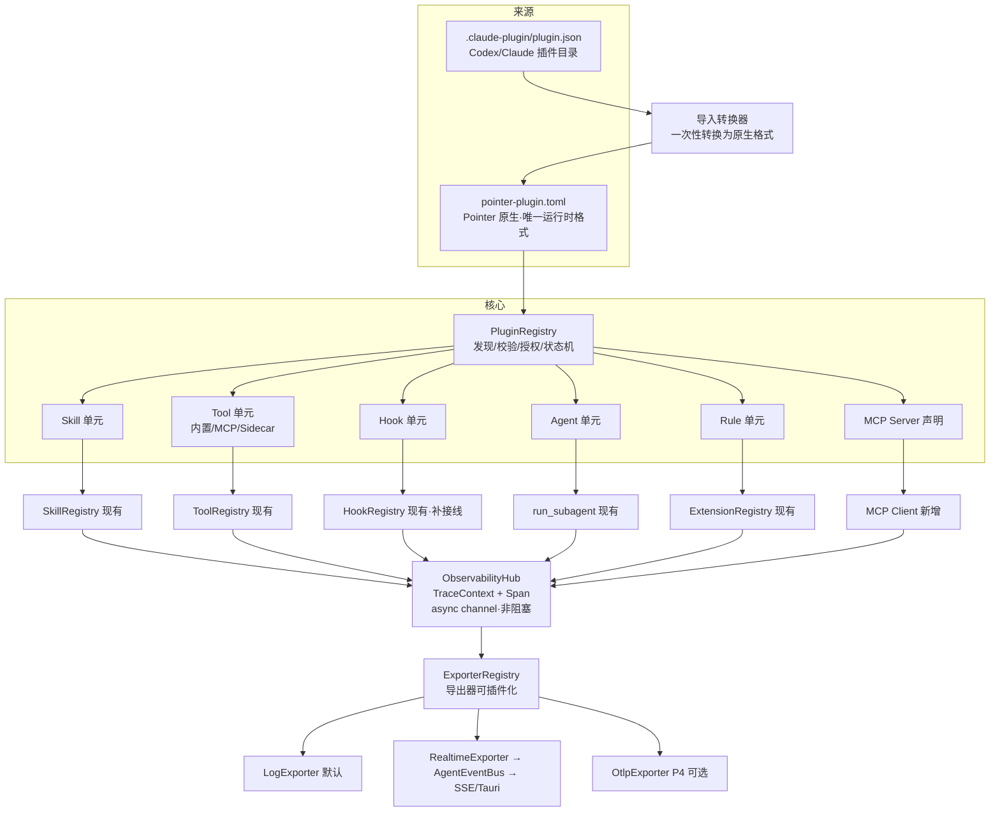

# Pointer 插件机制 + 运行监控 设计稿

> 状态：**插件机制 + 运行监控已实现（P0–P3 + P2b）**；**P4 ③ OtlpExporter 已完成（2026-08-19）**；**① marketplace 不做（用户决策 2026-08-20，见 §9）**；剩余 ② Sidecar 高级能力（可选）/ ④ Pointer MCP Server（可选）。
> 面向插件作者的用户文档见 **[`docs/user/plugins.md`](../user/plugins.md)**；本稿保留设计上下文供实施/扩展参照。
> 创建：2026-08-18
> 审查修订：2026-08-18（对照仓库现状逐条核查 + 设计内部一致性审查；修订以"审查注/审查补充"标注）
> 依据：仓库现状调研（explore）+ Codex / Claude Code / Cursor 插件语义调研（官方文档 + agentskills.io 标准）

---

## 0. 目标

1. **插件机制**：Pointer 拥有自己的原生插件注册格式（`pointer-plugin.toml`，**唯一运行时格式**）；Codex / Claude Code 插件通过**导入**（一次性转换为原生格式）支持，不直接运行时加载其格式；能力单元（Skills、MCP、Hooks、Subagents、Rules、AGENTS.md）统一由 Pointer 内部模型承载；MCP 除插件声明外，另支持**非插件全局配置**（独立于插件启停），见 §6.1 与阶段表 P2b。
2. **运行监控**：LangChain4j 式全链路观测——一次 Run 内 LLM 调用、工具调用、审批、重试、插件来源、耗时、Token、错误可追踪；**只做 trace 语义 + 异步非阻塞管道 + 可插拔 Exporter**（默认日志 + 实时事件/前端时间线）；OTel（OTLP）是 Exporter 之一，P4 可选；SQLite 持久化不做，未来按需以 `SqliteExporter` 补充。

## 1. 现状基线（调研结论）

仓库已有、可直接复用：

| 现有机制 | 位置 | 与插件/监控的关系 |
|---|---|---|
| `ToolRegistry` / `ToolEntry`（risk/approval/parallel/conflict_class 等元数据） | `crates/pointer-core/src/tools/mod.rs` | 插件工具的落点 |
| 内置工具编译期注册 + `.schema.yaml` 驱动 | `tools/builtin.rs`、`tools/tool_doc.rs` | 适配为 `BuiltinToolProvider` |
| 工具执行波次（`ToolWave::Serial/Parallel/ParallelSelfFork`；SelfFork 波为 subagent 自 fork 专用）+ 计时 | `chat_service/agent_tool_pass/`（`batch.rs`） | Tool Span 采集点 |
| Skills 注册 + `~/.agents/skills` 只读 + `~/.codex/skills` 一次性导入探测（**非运行时加载根**） + `allowed-tools` 别名 | `skills/` | Codex 兼容面已存在 |
| `ExtensionRegistry`（Prompt 注入扩展点） | `extensions/mod.rs` | Rule / AGENTS.md 落点 |
| `HookRegistry`（8 钩子；`pre_tool_call`/`post_tool_call` **已接线**，P0 落地于 `agent_tool_pass`） | `dispatcher/hooks.rs` | 监控与外部 Hook 的关键前置 |
| `AgentEventBus`（Run/ToolCall 生命周期事件） | `agent_events.rs` | 实时事件出口 |
| `runs` 表状态机 + `token_usage_store` + `llm_token_stats` | `conversation_store/runs.rs` 等 | 持久化基础 |
| SSE（`/api/runs/:run_id/events`、`/api/chat/:conversation_id/stream`）+ Tauri `chat://stream`（`src-tauri/src/chat_service.rs`、`commands.rs` 的 `STREAM_EVENT`） | `server/src/main.rs`、`src-tauri/` | 前端消费出口 |

缺口：

- 无 MCP 实现（全仓 0 命中）；
- 无动态插件发现/加载层（`extensions/mod.rs` 明确不做运行时目录扫描）；
- `pre_tool_call`/`post_tool_call` 未接线（`run_pre_tool_call` 已实现，且 `HookOutcome{Continue/Rewrite/Reject{reason}}` 已预留阻断语义，仅差调用点，见 §5 注 5.2）；
- 工具入参/出参不持久化，`AgentEvent` 的 ToolCall 事件不含 args/result（`ToolCallResult` 仅有 `status`）；
- 已有贯穿的 `trace_id` 体系（`models/message.rs`、`StreamEvent`、`sub_agent_trace_id`、`agent_tool_pass::sub_trace_id`），用途为 sub-agent 路由与前端 UI 关联；**缺口是缺 span 树语义（span_id / parent_span_id）与统一观测模型，而非"无 trace_id"**——观测 trace_id 与现有 trace_id 的关系见 §7.1 注 7.1。

> 审查补充（2026-08-18）：以下现有机制与本设计强相关，原稿未列出：
> - `chat_service/agent_tool_allowlist.rs`：按 agent allow/deny 解析工具白名单 —— "插件工具同一审批链路"的现成载体；
> - `user_rules.rs`：USER RULES 注入（4000 字截断）—— Rule 单元需与之协调，避免双写；
> - `skills/provenance.rs`：来源标注（system/user/external）已存在 —— 插件能力来源标注可复用；
> - `tools/mod.rs:34`：`ToolHandler = Arc<dyn Fn(Value) -> Result<String>>` 为**同步闭包** —— MCP 异步桥接的关键约束（见 §6 注 6.1）；
> - `dispatcher/hooks.rs:32`：`HookOutcome{Continue/Rewrite/Reject{reason}}` —— 外部 Hook 阻断决策的既有返回类型（见 §5 注 5.2）。

## 2. 行业语义调研结论（设计输入）

| 语义层 | Codex | Claude Code | Cursor | 结论 |
|---|---|---|---|---|
| Skills（SKILL.md） | ✅ `.agents/skills`、`.codex/skills` | ✅ `.claude/skills` | ✅ `.cursor/skills`、`.agents/skills`，兼容读 `.claude/`、`.codex/` | **唯一跨家开放标准**（agentskills.io） |
| MCP | ✅ | ✅ | ✅ | 三家一致，必做 |
| AGENTS.md | ✅ 分层 | ✅（CLAUDE.md） | ✅ 根+子目录嵌套 | 三家一致，纯 Prompt 层 |
| Plugin 打包 | Agent Plugins v1.0.0（⚠️二手资料） | ✅ `.claude-plugin/plugin.json` | 无独立包 | 格式互不兼容；**Plugin 只是分发箱，能力单元才是核心** |
| Hooks | ❌ | ✅ PreToolUse/PostToolUse/SessionStart/SessionEnd，可阻断 | ✅ | 以 Claude 语义为基线 |
| Subagents | 部分 | ✅ `agents/*.md` | ✅ `.cursor/agents/*.md`（`name/description/model/readonly/is_background`），兼容 `.claude/`、`.codex/` | md + frontmatter 趋同 |
| Rules | ❌ | ❌ | ✅ `.cursor/rules/*.mdc`（`alwaysApply`/`globs`/`description`） | Cursor 独有，映射到 Prompt 扩展点 |
| Commands | ✅ | 并入 Skills（`disable-model-invocation`） | 并入 Skills | **不建独立机制** |
| Marketplace | 部分 | ✅ `marketplace.json` | ❌ | **不做**（用户决策 2026-08-20，见 §9） |

关键设计原则（由调研推出）：

1. **原生格式是唯一运行时格式**：运行时只识别 `pointer-plugin.toml`；Codex / Claude 插件通过**导入转换器**一次性转为原生格式，不直接运行时加载其格式（用户决策，2026-08-18）。
2. **能力单元优先**：内部统一模型 = Skill / Tool / Hook / Agent / Rule / MCP Server 六类；外部格式只是导入来源，不是运行时适配层。
3. **发现 ≠ 执行**：扫描目录只读 manifest；授权后才加载/启动。
4. **插件工具不绕过审批**：与内置工具走同一 `risk_level + requires_approval + allowlist` 链路。
5. **监控由核心统一采集**，插件只是被观测对象；OTel 是导出层不是核心接口。

## 3. 总体架构



## 4. 统一模型定义

### 4.1 插件 manifest（Pointer 原生，`pointer-plugin.toml`）

```toml
[plugin]
id = "com.example.demo"          # 反向域名，全局唯一
name = "DEMO 报销工具"
version = "1.2.0"
api_version = "v1"
description = "示例 报销提交与预审"
author = "example"
license = "MIT"

[permissions]
network = ["https://plugin.example.com"]   # 域名白名单
filesystem = ["workspace:read"]       # 路径范围
env = []
secrets = ["DEMO_TOKEN"]              # 声明式密钥引用

[skills]
path = "skills/"                      # 子目录各含 SKILL.md

[agents]
path = "agents/"                      # *.md + frontmatter

[hooks]
path = "hooks/hooks.json"

[[mcp_servers.server]]
name = "demo"
transport = "stdio"                   # stdio | http
command = "bin/demo-mcp"
args = ["serve"]
env = { DEMO_TOKEN = "${secrets.DEMO_TOKEN}" }

[[tools.tool]]                        # 进程外工具声明（Sidecar 执行，执行载体必填）
name = "demo_submit"
risk_level = "high"
requires_approval = true
parallel_eligible = false
exec = { command = "bin/demo-tool", transport = "sidecar" }  # 执行载体：MCP server 或 sidecar 进程，二选一必填
```

> 审查注 4.1.1（2026-08-18）：**插件工具只有两种执行载体：MCP server 或 Sidecar 进程，无进程内代码执行**（§9 明确不做 dylib，且 `ToolEntry.handler` 是必填的同步实现，插件无法提供）。因此 `[[tools.tool]]` 必须携带 `exec`；只有元数据而无执行器的工具声明为无效配置，P1 校验阶段直接 `rejected`。为此 `ProcessToolProvider`（基础版：stdio + JSON 入参/出参协议）**从 P4 提前至 P1**（见 §8），否则 P1 验收"示例插件可启用"覆盖不到工具单元。

### 4.2 目录与发现优先级

**运行时只扫描 Pointer 原生目录**（外部格式目录不直接加载，仅作为导入来源）：

```text
~/.pointer/plugins/            # Pointer 原生插件（可执行，需授权）
~/.pointer/skills/             # 现有用户 Skills（保持）
~/.agents/skills/              # Codex/Agent 标准 Skills（只读，现有，保持）
~/.codex/skills/               # Codex Skills 探测（现有，保持）
<workspace>/.pointer/plugins/  # 项目级插件（需项目显式启用）
~/.pointer/AGENTS.md           # 全局工程指令
<workspace>/AGENTS.md          # 项目链：git 根 → 工作区路径上每层一份（不扫旁支）
```

**导入来源目录**（只读探测，供"导入"入口列出可导入项，不直接生效）：

```text
~/.claude/skills/、~/.claude/agents/、~/.claude/plugins/（含 .claude-plugin/plugin.json）
~/.codex/agents/、Codex 插件目录
<workspace>/.cursor/rules/、<workspace>/.claude/、<workspace>/.codex/
```

同名冲突优先级：`Pointer 原生 > 项目级 > 用户级`。
冲突不静默覆盖：UI 显示"被遮蔽"状态与来源，可手动切换。

> 审查注 4.2.1（2026-08-18）：`<workspace>/.pointer/plugins/` 随仓库分发（clone 即携带），是供应链投毒面。workspace 级插件与用户级同等对待：首次启用仍需用户授权 + manifest 哈希留痕，UI 默认提示来源（工作区/用户级）。

### 4.3 导入转换器（Codex / Claude → Pointer 原生）

- 入口：插件管理 UI 的"导入"按钮（桌面端 Tauri 目录选择弹窗，Web 端路径输入降级）+ 外部来源探测（`~/.claude/plugins` / Codex 目录，新装后主动提示可导入项；`plugins/external_probe.rs`）；CLI（`pointer plugin import <path>`）未建（当前无 CLI 二进制，可复用 `SkillRegistry::import_path` 范式后续补）；
- 输入：Claude 插件目录（`.claude-plugin/plugin.json` + commands/agents/skills/hooks/.mcp.json）或 Codex 插件/Skills 目录；
- 输出：写入 `~/.pointer/plugins/<id>/` 的完整原生插件（生成 `pointer-plugin.toml`，拷贝/改写能力单元文件）；
- 转换规则：
  - `plugin.json` 的 name/version/description/author → `[plugin]` 段；id 缺省由 name 生成反向域名占位并提示用户确认；
  - `skills/` → 原样拷贝（SKILL.md 本身是开放标准，格式一致）；
  - `agents/*.md` → 拷贝，frontmatter 字段映射（`model/readonly/is_background` → 原生字段）；
  - `commands/*.md` → 转为 Skill（`disable-model-invocation: true` 语义）；
  - `hooks/hooks.json` → 原样保留路径引用，命令路径按插件根目录重写；
  - `.mcp.json` / `mcpServers` → `[[mcp_servers.server]]`；
  - 无法映射的字段：保留在 `[metadata]` 段并在导入报告中标注"未映射"；
- 导入是一次性快照：源目录后续变更**不自动同步**，UI 显示"来源版本"，可重新导入覆盖（需重新授权，manifest 哈希变化）；
- 哈希留痕范围 = **manifest + 能力单元文件清单（含各文件内容哈希）**：仅更新 SKILL.md 内容也触发"重新授权"提示，避免"内容被替换但 manifest 未变"的投毒口（审查注 4.3.1，2026-08-18）；
- 导入报告：列出每个组件的转换结果（成功/跳过/未映射），用户确认后才落盘。

### 4.4 能力单元 → 现有代码映射

| 能力单元 | 内部落点 | 现状 |
|---|---|---|
| Skill | `SkillRegistry` + `skill_read` | 已具备；来源标注（原生/导入） |
| Tool（MCP） | 新增 `McpToolProvider` → `ToolRegistry` | 新建 |
| Tool（Sidecar） | 新增 `ProcessToolProvider` → `ToolRegistry` | 新建，复用 `ToolEntry` 元数据 |
| Hook | `HookRegistry`（补 `pre/post_tool_call` 接线） | 补接线 |
| Agent（subagent） | `run_subagent` + agent 定义 | 新增 `agents/*.md` 解析 |
| Rule | `ExtensionRegistry`（`MessageLoopPromptsAfter`） | 新增 `.mdc` 解析 |
| AGENTS.md | `ExtensionRegistry` | 新增发现链（嵌套合并） |
| MCP Server 声明 | 新增 MCP Client 管理 | 新建 |

### 4.5 插件生命周期状态机

```text
discovered → parsed → validated → (用户授权) → enabled → running
                                      ↓ 校验失败
                                   rejected（UI 显示原因）
running → degraded（MCP 崩溃/健康检查失败，指数退避重试）
running/enabled → disabled（用户关闭 / 版本不兼容）
任意状态 → uninstalled
```

安全铁律：

1. 发现 ≠ 执行：扫描只读 manifest，不启动进程；
2. 授权留痕：首次启用记录 manifest 哈希，manifest 变更需重新授权（防投毒）；
3. 权限最小化：`permissions` 超范围的网络/文件访问直接拒绝；
4. 插件工具与内置工具同一审批链路。

> 审查注 4.5.1（2026-08-18）：`[permissions]` 的执行点（enforcement）需在 P1 明确，否则"超范围直接拒绝"无落点。P1 最小集：
> - env/secrets：启动 MCP/sidecar 进程时按 manifest 剥离/注入（进程级，成本低）；
> - filesystem：复用现有工作区边界（`docs/developer/file-tool-write-scope.md`）+ ToolRegistry 按 plugin_id 校验参数路径；
> - network 域名白名单：P2 在 MCP/sidecar 进程包装层实施，或明确"暂不做、靠审批兜底"。

## 5. Hook 语义（对齐 Claude Code）

```json
{
  "hooks": {
    "PreToolUse":  [{ "matcher": "terminal|file_write", "command": "bin/check-policy.sh", "timeout_ms": 5000 }],
    "PostToolUse": [{ "matcher": "*", "command": "bin/record-audit.sh" }],
    "SessionStart": [],
    "SessionEnd":   []
  }
}
```

| 事件 | 对应现有 HookRegistry | 可阻断 | 状态 |
|---|---|---|---|
| `PreToolUse` | `pre_tool_call` | ✅ | ✅ 已实现（P3） |
| `PostToolUse` | `post_tool_call` | ❌ 观察 | ✅ 已实现（P3） |
| `SessionStart` | `on_run_started` | ❌ | ✅ 已实现（2026-08-20，Run 级，见注 5.3） |
| `SessionEnd` | `on_run_finished/failed/cancelled` | ❌ | ✅ 已实现（2026-08-20，Run 级，见注 5.3） |
| `LlmBefore/LlmAfter` | 新增 | ❌（监控用） | ❌ 未实现（框架节点不存在） |

执行协议：

- hook 为外部命令；stdin 收 JSON（tool_name、args、run_id、trace_id）；
- exit 0 = 放行/观察；exit 2 = 阻断（仅 PreToolUse）；其他 = 错误；
- stdout 可输出 JSON 决策 `{"decision":"block","reason":"..."}`；
- 监控类 hook 失败 **fail-open**（warning 不阻断）；安全策略类 hook 失败 **fail-closed**；
- 每个 hook 执行生成 `Hook` Span（耗时、exit code、阻断原因）；
- matcher 规则（审查注 5.1，2026-08-18）：glob 匹配工具名，`*` = 全部；`|` 为 OR 分隔的工具名列表；大小写不敏感。示例 `terminal|file_write` = 匹配 `terminal` 或 `file_write`。

> 审查注 5.2（2026-08-18）：阻断决策的回传通道复用现有 `HookOutcome::Reject{reason}`（`dispatcher/hooks.rs:32`）：外部 hook 的 block 决策 → `run_pre_tool_call` 返回 `Reject` → `agent_tool_pass` 在 PreToolUse 阶段短路该工具（不计入成功/失败统计，UI 显示阻断原因）。被阻断工具不阻塞同 wave 其他工具的执行；阻断不触发自动重试（模型可见原因后可自行决定）。
> 审查注 5.3（2026-08-18）：`SessionStart/SessionEnd` 在 Pointer 中映射为 **Run 级**事件（`on_run_started/finished/failed/cancelled`），与 Claude Code 的"整场会话"语义不同——按 Claude 语义编写的插件迁移后 SessionStart 会每 Run 触发一次。Hook 文档与导入转换器需明示该语义差异（可用 `RunStarted/RunFinished` 别名）。

## 6. MCP 接入

- 传输：先 **stdio**，后 **Streamable HTTP**（不做旧式 SSE）；
- 生命周期：插件启用 → 启动 server 进程 → `initialize` 握手 → `tools/list` → 注册进 `ToolRegistry`（命名空间 `mcp.<server>.<tool>`）→ 禁用/崩溃时注销；
- 健康：心跳 + 崩溃重启（指数退避，上限后 `degraded`，UI 显示）；
- 安全：MCP 工具必须过 approval gate + allowlist，manifest `risk_level` 生效；
- 监控：每次 `tools/call` 生成 `McpRequest` Span（server、tool、耗时、状态、重试）。

> 审查注 6.1（2026-08-18）：**同步 handler × 异步 MCP 桥接**：`ToolHandler` 是同步闭包（`tools/mod.rs:34`），而 MCP `tools/call` 是异步进程 I/O。桥接方案（P2 前置决策）：MCP 调用在独立异步任务中执行，handler 内经 oneshot channel + 超时（如 60s）等待结果后同步返回；同步等待会短暂占用 wave 执行器，接受该约束（超时上限 + 并发信号量控制），**不改动** `ToolRegistry::invoke` 现有同步接口（最小改动原则）。若未来 MCP 工具成为主要路径，再评估引入 async invoke 链（单独 RFC）。

### 6.1 全局 MCP（非插件，P2b）

> 审查补充（2026-08-19）：原稿 MCP 仅作为插件能力单元（§0 目标 1、§4.1）。用户确认增加**非插件全局 MCP**：不装插件、直接在配置里挂 MCP server，独立于插件启停。
> **进度（2026-08-19 收尾核对）**：✅ 已实现——**界面直接配置**（设置面板「MCP」分区：添加/编辑/删除表单，配置持久化到**客户端用户配置** `UserSettings.global_mcp_servers`，桌面/web 共用；`pointer-server.toml` 仅作 server 部署兼容来源，用户配置为空时才读取）；支持 **stdio**（本机命令）与 **http**（streamable HTTP，连接远程 MCP 服务，URL + 可选请求头如 Authorization）两种传输；AppState 启动装配 + 热重载（`reload_global_mcp` / `save_global_mcp_servers`）；watchdog 扩展全局分支（key `__global__`，崩溃自动重启 + degraded）；管理 API `/api/mcp`（GET list / PUT save）+ Tauri 命令；工具命名 `mcp.<server>.<tool>`（与插件裸名区分）；同名冲突全局优先（plugin_enable 拒绝插件方）。

- 配置载体：**客户端用户配置**（`UserSettings.global_mcp_servers`，界面直接读写，桌面 `user_settings.json` / Web 同一载体）；`pointer-server.toml` 的 `[[mcp_servers.server]]` 保留为 server 部署兼容来源（仅当用户配置为空时读取）；结构复用 `McpServerDecl`（name / transport / command / args / env / url / headers）；
- 传输：`transport = "stdio"` 启动本机进程（command/args/env）；`transport = "http"` 连接远程 MCP 服务（**url** 必填 + 可选 headers，如 `Authorization: Bearer <token>`），客户端场景主路径；
- 装配：AppState 启动时从用户配置加载并启动 server（stdio → `connect_stdio`，http → `connect_http` + `McpSessionManager`），工具注册命名空间与插件 MCP 一致 `mcp.<server>.<tool>`；
- 生命周期：**不绑定插件启用状态**；支持界面保存即热更新/重载；崩溃重启与 `degraded` 语义同 §6；
- 冲突：全局配置在启动时先注册；插件启用同名 server（同 `<server>`）时插件方注册被拒并报错，避免静默覆盖；
- 安全：与插件 MCP 同一 approval gate + allowlist 链路；
- UI：设置面板新增「MCP」管理页（服务列表 + 状态 + 添加/编辑/删除表单弹窗，连接方式二选一：远程服务 URL / 本机程序命令，保存即生效）。

## 7. 监控设计（LangChain4j 式）

### 7.1 Trace 模型

```rust
pub struct TraceEvent {
    pub trace_id: String,
    pub span_id: String,
    pub parent_span_id: Option<String>,
    pub run_id: String,
    pub conversation_id: String,
    pub kind: SpanKind,          // Run | AgentLoop | LlmCall | ToolCall | PluginLoad
                                  // | PluginHealthCheck | Approval | Retry | Hook | McpRequest
    pub name: String,
    pub status: SpanStatus,
    pub started_at_ms: i64,
    pub ended_at_ms: Option<i64>,
    pub duration_ms: Option<u64>,
    pub attributes: serde_json::Value,   // 含 plugin_id
    pub input_summary: Option<RedactedPayload>,
    pub output_summary: Option<RedactedPayload>,
    pub error: Option<TraceError>,
}
```

Span 树：

```text
Run Span
 ├── LlmCall Span（LlmBefore/LlmAfter）
 │    └── Retry Span（重试决策点；重试后的新一轮 LLM 调用产生新的 LlmCall Span）
 ├── ToolCall Span（PreToolUse → 审批 → invoke → PostToolUse）
 │    └── McpRequest Span（MCP 工具时）
 ├── Hook Span（每个 hook 执行）
 ├── PluginLoad Span（加载/崩溃/重启）
 └── Approval Span（审批等待时长）
```

> 审查注 7.1（2026-08-18）：观测 trace_id 与现有 trace_id 的关系：**观测 trace_id = run_id**（一个 Run 一条 trace）；Run 内子任务（sub-agent、self-fork、sidecar 调用）沿用现有 `sub_agent_trace_id` 生成链，作为嵌套关联键。两者并存：现有 trace_id 继续服务 UI 消息路由（不改动），观测 span 树新增 span_id/parent_span_id 挂在 TraceEvent 上。P0 实施前先确认 run_id 在 dispatcher 所有执行路径（含子 agent）均可达。
> Retry Span 采集点（审查注 7.2，2026-08-18）：现有重试分布在 `single_agent.rs` / `sub_agent.rs`（格式/空响应重试，指数退避）与 `provider_stream.rs`（rate-limit 重试）——在各"重试决策点"（决定注入重试轮次/延迟时）记录。

### 7.2 异步管道（不干扰模型执行）

- 埋点（LLM/工具/审批/重试边界）只做**有界 channel 的 `try_send`**（tokio mpsc），纳秒级，**永不阻塞** agent 主循环；
- 背压策略：channel 满 → **丢弃 + 计数**（丢弃计数本身作为指标暴露），绝不排队等待；
- 单个后台消费任务：批量 → 脱敏 → 扇出到各 Exporter；
- Exporter 故障隔离：单个 exporter 错误/超时只影响自身（熔断），不影响其他 exporter 与主循环；
- 载荷捕获：span 结束时仅移动 `Arc` 引用 + 大小上限截断（廉价操作）；完整脱敏与序列化全部在后台任务完成；
- 进程退出：`shutdown` 带超时上限 flush 剩余队列。

### 7.3 Exporter 插件接口（OTel-ready）

```rust
#[async_trait]
pub trait TraceExporter: Send + Sync {
    fn name(&self) -> &str;
    async fn export(&self, batch: Vec<TraceEvent>);
    async fn shutdown(&self);
}
```

- `ExporterRegistry` 持有一组 exporter；exporter 本身是**插件能力**（`ObservabilityExporter`），插件可注册自己的导出器；
- Trace 结构对齐 OTel（trace_id / span_id / parent_span_id / attributes / status 一一对应）；`input/output_summary`、`error` 等扩展字段映射进 span attributes——**本层即为 OTel 做准备**：`OtlpExporter` 只是薄适配，核心无需改动；
- 内置 exporter：

| Exporter | 默认 | 用途 |
|---|---|---|
| `LogExporter` | ✅ | 结构化日志行（复用现有 flexi_logger） |
| `RealtimeExporter` | ✅ | 桥接 AgentEventBus → SSE/Tauri，前端时间线 |
| `OtlpExporter` | ❌（P4） | OTLP 导出到 Collector / Langfuse 等 |
| `SqliteExporter` | ❌（不做） | 持久化非核心需求；未来需要时作为 exporter 补充，表结构参考 §7.5 |

### 7.4 脱敏策略（默认值）

| 数据 | 默认策略 |
|---|---|
| LLM Prompt / Completion | 只存长度、哈希、摘要；完整内容可选采样 |
| Tool arguments | 按字段脱敏（token/cookie/password） |
| Tool result | 摘要、字节数、状态码 |
| 文件内容 | 不写入 trace |
| 终端输出 | 仅截断摘要 + 错误尾部 |
| MCP 负载 | server/tool/耗时/状态，不存原文 |
| 用户显式调试 | 本机临时会话保存详情，TTL 24h 或会话结束清理 |

### 7.5 存储（参考，P0 不实现）

SQLite 持久化**不是 P0 范围**（用户决策，2026-08-18）：trace 只做语义 + 异步管道 + 可插拔导出，默认导出到日志与实时事件。未来若需要本地查询/统计，以 `SqliteExporter` 插件形式补充，表结构参考：

```sql
CREATE TABLE run_traces (
  trace_id TEXT PRIMARY KEY,
  run_id TEXT NOT NULL,
  conversation_id TEXT NOT NULL,
  started_at_ms INTEGER NOT NULL,
  ended_at_ms INTEGER,
  status TEXT NOT NULL,
  root_span_id TEXT NOT NULL,
  created_at_ms INTEGER NOT NULL
);
CREATE TABLE run_spans (
  span_id TEXT PRIMARY KEY,
  trace_id TEXT NOT NULL,
  parent_span_id TEXT,
  kind TEXT NOT NULL,
  name TEXT NOT NULL,
  status TEXT NOT NULL,
  started_at_ms INTEGER NOT NULL,
  ended_at_ms INTEGER,
  duration_ms INTEGER,
  attributes_json TEXT NOT NULL,
  input_summary_json TEXT,
  output_summary_json TEXT,
  error_json TEXT
);
CREATE INDEX idx_run_spans_trace_time ON run_spans(trace_id, started_at_ms);
CREATE INDEX idx_run_spans_run_time   ON run_spans(run_id, started_at_ms);
```

保留期（仅当启用 SqliteExporter 时适用）：Run 总览长期；Span 元数据 30–90 天；脱敏摘要 7–30 天；原始 Debug Payload 默认关闭。

### 7.6 前端

- 用户层（执行概览）：总耗时、LLM 次数/Token、工具成功失败数、审批等待；工具卡片显示 `✓ file_read · 38ms`。
- 开发者层（Trace 时间线，调试模式）：Span 树 + 按 plugin_id / tool / 状态 / 耗时筛选。
- 插件维度聚合：某插件调用次数、失败率、平均耗时。

> 审查注 7.6（2026-08-18）：现 SSE 通道传输 `StreamEvent`/`AgentEvent`（`server/src/main.rs` `broadcast::Sender<StreamEvent>`），TraceEvent 是不同模型。前端时间线协议二选一（P0 定）：① SSE 新增 TraceEvent 消息类型（同通道扩展）；② 新端点 `/api/runs/:id/traces`（按 run 拉取 span 树）。建议 P0 用 ②（开发者调试场景按需拉取，不增加主通道负载）；实时概览事件继续走现有 SSE。

## 8. 未来实施路线（启动时参照，当前不执行）

> 以下为将来启动开发时的建议顺序与验收标准。启动前需重新核对代码现状（本设计基于 2026-08-18 的仓库快照）。
>
> **进度（2026-08-18 核对）**：**P0 观测基线已完成**——Rust 侧 ①–⑤ 全部落地（`crates/pointer-core/src/observability/`：trace / pipeline / exporters / redact，埋点覆盖 LLM、Tool、审批、重试，含单测）。**⑥ 前端 Run 概览 + 工具耗时详情经用户决策不做**（P0 范围收敛为日志侧观测，不引入 RealtimeExporter 与前端时间线端点）。
>
> **进度（2026-08-19 核对）**：**P1 插件核心已完成**——`crates/pointer-core/src/plugins/`（manifest / registry / activation / tool_provider / importer / agents_md）；ToolEntry 增 `plugin_id` 与 `ToolRegistry::unregister_by_plugin`，SkillDef/AgentDef 增 `plugin_id`，ExtensionRegistry 改内部 RwLock 支持运行时注册/移除；AppState 装配 `PluginRegistry` + `apply_plugins` + `plugin_enable/disable/uninstall/import`；server `/api/plugins*` 路由 + Tauri commands + 前端 Settings「插件」分区（PluginsPanel：列表/启用/禁用/导入）。全量 `cargo test -p pointer-core --lib` 1330 passed（3 个失败为预存，与 P1 无关）；`pnpm build` 通过。下一步进入 **P2 MCP Client**。
>
> **进度（2026-08-19 更新）**：**P2 MCP Client（插件内）部分完成**——`crates/pointer-core/src/plugins/mcp.rs`（stdio 客户端 + `McpSessionManager`）+ manifest `[[mcp_servers.server]]` + 插件启用时 `tools/list` 注册 `mcp.<server>.<tool>`、禁用/卸载注销 + e2e 真实链路测试（`plugins::e2e_tests`）；P2 ① ② ⑤ 已落地，③ 健康检查/崩溃重启 与 ④ McpRequest Span 待补。同日用户决策新增 **P2b 全局 MCP（非插件）**（§6.1）：启动时从 `pointer-server.toml` 装配。全量 `cargo test -p pointer-core --lib` 1355 passed（url_safety 网络用例受沙箱 DNS 影响偶发失败，与改动无关）。
>
> **进度（2026-08-19 收尾核对）**：**P2 ③④ 与 P3 ③④ 已完成**——P2③ `McpClient` 存活探测（读线程 EOF 标记 + `try_wait`）+ `McpSessionManager` 状态表（指数退避 / degraded）+ `AppState::spawn_mcp_watchdog`（2s 周期，崩溃/启动失败自动重建，sidecar 工具保留），degraded 透出到 UI 插件状态；P2④ dispatch 层透传 run_id/span_id，MCP 工具调用生成 `McpRequest` Span（父 = ToolCall span，attrs=plugin_id/server/tool/耗时）；P3③ `HookEntry` 增 `fail_closed`（默认 fail-open，可配 fail-closed 阻断）+ 修复超时不 kill 子进程缺陷（tokio 进程 + timeout）；P3④ Pre/PostToolUse 均生成 `Hook` Span（parent=run-root，attrs=plugin_id/matcher/command/tool_name/decision/reason）。e2e 增至 6 项（崩溃重启 / degraded / McpRequest Span / Hook Span / auth 隔离 / 全生命周期）。全量 `cargo test -p pointer-core --lib` 1362 passed（url_safety 网络用例除外，环境 flaky）；`pnpm exec vue-tsc --noEmit` 通过。**P2/P3 完成，下一阶段 P2b 全局 MCP 或 P4 分发与导出。**
>
> **进度（2026-08-19 收尾核对）**：**P2b 全局 MCP 已完成**——`server_config.rs` 新增 `mcp_servers` 段解析 + `PARSED_MCP` 缓存 + `reload_mcp_servers_config`（热重载/桌面兜底）；`McpSessionManager` 预留 key `__global__`，`activate_global_mcp_servers` 复用 connect_stdio/register（全局工具命名 `mcp.<server>.<tool>`，doc_source `plugin:__global__:mcp:...`）；`AppState` 新增 `global_mcp` 配置 + `reload_global_mcp(_from_config)` + `global_mcp_view`；watchdog 全局分支（崩溃自动重启 + degraded）；管理 API（GET /api/mcp、POST /api/mcp/reload|restart）+ Tauri `list_mcp_servers/reload_mcp_servers/restart_mcp_server`；设置面板「MCP」分区（McpPanel）。同名冲突全局优先（plugin_enable 拒绝）。e2e 增至 9 项（全局装配/冲突拒绝/崩溃自动恢复）。全量 `cargo test -p pointer-core --lib` 1366 passed（url_safety 除外）；`pnpm exec vue-tsc --noEmit` 通过。**P0–P2b 完成，剩余 P4 分发与导出（暂缓）。**

> **进度（2026-08-19 更新）**：**P4 ③ OtlpExporter 已完成**——`crates/pointer-core/src/observability/otlp.rs`（OTLP/HTTP + JSON 编码，无 protobuf/grpc 依赖；实现 `TraceExporter` + `build_export_request` 纯函数；trace/span id 优先 uuid-hex 解码、否则 sha256 稳定派生；payload 已由 pipeline 脱敏后导出，导出故障 fail-open）。激活走标准 OTel 环境变量：`OTEL_EXPORTER_OTLP_TRACES_ENDPOINT` / `OTEL_EXPORTER_OTLP_ENDPOINT`（协议仅支持 `http/json`，其余打 warn 跳过）+ `OTEL_SERVICE_NAME`；`start_default()` 检测到 env 时自动追加进 ExporterRegistry。`cargo test -p pointer-core --lib observability::` 18 passed（含本地回环 mock collector 的 HTTP 集成测试；全量 1358 passed，30 个失败为 Windows 预存环境问题，与本次改动无关）。剩余 P4 ① marketplace（**不做**，用户决策 2026-08-20，见 §9）/ ② Sidecar 高级（可选）/ ④ Pointer MCP Server（可选）。

> **进度（2026-08-20 更新）**：**P3 补完 SessionStart / SessionEnd（Run 级）**——`plugins/hooks.rs` 的 `HooksDecl` 新增 `SessionStart` / `SessionEnd` 字段，桥接到 dispatcher 既有 Run 级槽位：`SessionStart` → `on_run_started`；`SessionEnd` → `on_run_finished` / `on_run_failed` / `on_run_cancelled`（三槽位各注册一份，任一终态触发一次）。纯观察者（不可阻断，恒 fail-open），复用 `run_hook_command` + `Hook` Span（attrs 含 `status` 区分终态）。`dispatcher/hooks.rs` 补 4 个 `remove_on_run_*_by_prefix`（插件禁用/卸载按前缀注销）。语义差异按审查注 5.3 在用户文档明示（Run 级 ≠ Claude 整场会话）。`LlmBefore/LlmAfter` 仍未实现（框架节点不存在）。`cargo test -p pointer-core --lib` 1377 passed / 30 failed（30 个失败为 Windows 预存环境问题，与本次改动无关；新增 2 个测试 `session_hooks_register_to_run_slots_and_unregister` / `session_start_end_hooks_execute_command` 均通过）。

| 阶段 | 内容 | 依赖 | 验收标准 |
|---|---|---|---|
| **P0 观测基线** ✅ 已完成（2026-08-18 核对） | ① 接通 `pre/post_tool_call`；② 新增 LLM before/after hook（统一 provider 包装，见 §8.1）；③ 观测 TraceContext（trace_id = run_id，见 §7.1 注 7.1）贯穿 Run→LLM→Tool；④ 异步管道（有界 channel + 后台消费）+ ExporterRegistry（LogExporter）；⑤ 脱敏器；~~⑥ 前端 Run 概览 + 工具耗时详情~~（**用户决策：不做**，见下注） | 无 | 任意 Run 可在结构化日志看到 LLM/Tool/审批/重试 Span，含耗时与 Token；埋点为 try_send 非阻塞，channel 满时丢弃计数不阻塞主循环 |
| **P1 插件核心** ✅ 已完成（2026-08-19 核对） | ① `pointer-plugin.toml` 解析 + 校验（`[[tools.tool]]` 必须有 `exec` 执行载体，见 §4.1 注 4.1.1）；② PluginRegistry + 状态机 + 授权（manifest + 文件清单哈希留痕，见 §4.3 注 4.3.1）；③ Skill/Agent/Rule 单元接入现有 Registry；④ `AGENTS.md`（嵌套）发现链；⑤ **导入转换器**（Claude `plugin.json` / Codex 插件目录 → 原生格式，含导入报告）；⑥ 冲突遮蔽 UI；⑦ **`ProcessToolProvider` 基础版**（stdio + JSON 协议，承载 `[[tools.tool]]` 的 `exec`） | P0 | 一个含 skills+agents+rules+sidecar 工具的示例插件目录可被发现、授权、启用，能力出现在对应 Registry 且带 plugin_id；一个 Claude 格式插件目录可成功导入为原生插件 |
| **P2 MCP Client（插件内）** ✅ 已完成（2026-08-19 核对） | ① stdio 传输 + initialize/tools/list/tools/call；② `McpToolProvider` 注册（`mcp.<server>.<tool>`）；③ 健康检查 + 崩溃重启；④ `McpRequest` Span；⑤ 审批/allowlist 接入 | P1（前置：同步×异步桥接方案定稿，§6 注 6.1） | 接入一个本地 stdio MCP server，工具可被模型调用，审批生效，Span 可查 |
| **P2b 全局 MCP（非插件）** ✅ 已完成（2026-08-19 核对） | ① `pointer-server.toml` 新增 `[[mcp_servers.server]]`（结构复用 `McpServerDecl`）；② AppState 启动装配（复用 McpClient + McpSessionManager），工具命名 `mcp.<server>.<tool>`；③ 热更新/重载（server 重启）+ 崩溃重启；④ 设置面板 MCP 管理页（列表/状态/启停/编辑）；⑤ 与插件 MCP 同一审批链路；同名冲突全局优先（§6.1） | P2（客户端与会话管理） | 在 server.toml 配置一个本地 stdio MCP server，启动后工具可被模型调用、UI 可管理，插件启用同名 server 时插件方报错不静默覆盖 |
| **P3 外部 Hook** ✅ 已完成（2026-08-19 核对；2026-08-20 补完 SessionStart/SessionEnd） | ① `hooks.json` 执行器（stdin JSON / exit code / JSON 决策）；② PreToolUse 阻断语义（回传通道见 §5 注 5.2）；③ fail-open/fail-closed 策略（entry 级 `fail_closed` 字段，默认 fail-open）；④ `Hook` Span；⑤ **SessionStart/SessionEnd（Run 级，2026-08-20，见 §5 注 5.3）** | P0 | 一个 PreToolUse hook 可阻断 terminal 调用并在 UI/trace 显示原因；SessionStart/SessionEnd 在 Run 开始/结束时触发 |
| **P4 分发与导出（③ 已完成）** | ① ~~marketplace~~ **不做**（用户决策 2026-08-20，见 §9）；② Sidecar 高级能力（守护进程管理、热更新，可选；基础版已在 P1）；③ `OtlpExporter` ✅ 已完成（2026-08-19：OTLP/HTTP + JSON，标准 OTel env 激活，见进度注）；④ 可选：Pointer MCP Server（白名单只读能力） | P1–P3 | OTLP 导出到本地 Collector 可验证（原"从 GitHub 仓库安装 Claude 格式插件"验收随 ① 取消） |

### P0 前置探索（已完成，审查注 8.1，2026-08-18）

1. 读 `dispatcher/hooks.rs` 与 `chat_service/agent_tool_pass/`，确认 `pre/post_tool_call` 接线点（原风险表已列）；
2. **全量 LLM 调用点清单**：`single_agent_stream.rs` / `sub_agent_stream.rs` / `computer_pipeline_loop.rs` 等，据此决定 LlmBefore/LlmAfter 是统一 provider 包装还是逐点埋点——逐点埋点与"最小改动"原则张力最大，倾向统一包装；
3. **观测 trace_id 复用决策**：确认 run_id 在 dispatcher 全路径可达性，落定 §7.1 注 7.1 的关系。

### 阶段内提交节奏（启动后适用）

- 每阶段拆 2–4 个 commit 批次，commit message 说明行为变化；
- 每阶段结束跑：`cargo test -p pointer-core`（相关模块）+ 前端 `pnpm build`（涉及前端时）；
- 每阶段交付后**等用户确认**再进入下一阶段；
- 实施时遵循"最小改动"：优先新增模块，不重构现有链路；接入点（如 `pre/post_tool_call` 接线）以增量方式加入。

## 9. 明确不做（Out of scope）

- **Marketplace（P4 ①）不做**（用户决策 2026-08-20）：GitHub 仓库安装 + Claude `marketplace.json` 兼容均不实现；插件分发仅保留"本地目录 + 导入转换器"路径（§4.3）；
- 运行时直接加载 Codex / Claude 插件格式（只通过导入转换器转为原生格式后加载；现有 `~/.agents/skills`、`~/.codex/skills` 的只读 Skills 探测保持现状，属 Skills 开放标准而非插件格式）；
- 动态 Rust dylib 加载（ABI/崩溃隔离成本高；用 MCP stdio / Sidecar 替代）；
- 为 Commands 建独立机制（并入 Skill，`disable-model-invocation` 语义）；
- 第一期 MCP Server（Pointer 对外暴露能力）——P4 可选；
- 完整 OTel SDK 内嵌（P4 才做导出层，核心接口不依赖 OTel 类型）；
- trace 的 SQLite 持久化（P0 只做语义 + 异步管道 + 日志/实时导出；`SqliteExporter` 未来按需补充）；
- 修改现有 `~/.pointer/skills` 导入流程与 `skill_import` 安全校验（保持现状）。

## 10. 风险与待核实

| 项 | 说明 | 处理 |
|---|---|---|
| Codex "Agent Plugins v1.0.0" manifest 格式 | 官方文档站 403，仅二手资料 | 导入转换器 P1 先支持高置信度面（Skills 目录 / AGENTS.md / MCP 声明）；Codex 插件包格式官方可达后再补 |
| Claude `plugin.json` 完整 schema | 官方文档站不可达，字段来自社区实践 | 导入转换器按"宽容解析 + 未知字段进 `[metadata]` + 导入报告标注未映射"实现 |
| `pre/post_tool_call` 接线影响面 | 注释标 "Phase 3"，可能有未完成的依赖 | P0 第一步先读 `dispatcher/hooks.rs` 与 `agent_tool_pass` 确认接线点 |
| 脱敏器误伤业务字段 | 报销/医疗场景字段多 | P0 提供字段级白名单配置，默认保守（多脱敏） |
| 插件工具执行载体 | 插件不带代码（禁 dylib），`[[tools.tool]]` 需进程外载体 | 已定：`exec` 必填 + `ProcessToolProvider` 提前至 P1（§4.1 注 4.1.1） |
| 同步 handler × 异步 MCP | `ToolHandler` 为同步闭包，MCP 调用为异步 I/O | 桥接方案已定：独立任务 + oneshot + 超时（§6 注 6.1），P2 前验证 |
| 全局 MCP 配置载体与热更新 | 现状无独立配置段，MCP 仅插件声明 | P2b：配置结构复用 `McpServerDecl` + AppState 启动装配 + 热重载重启（§6.1） |
| `[permissions]` enforcement | 现状无按插件粒度的网络/文件权限执行点 | P1 最小集：env/secrets 进程级剥离 + filesystem 复用工作区边界；network 白名单 P2 或审批兜底（§4.5 注 4.5.1） |

## 11. 参考来源

- Cursor 官方文档：Rules / Skills / Subagents（一手）
- agentskills.io Specification（一手，Agent Skills 开放标准）
- openai/codex GitHub docs（stub，指向官网）
- Codex / Claude Code 插件细节：二手资料（CSDN/知乎/OSCHINA 等，已在调研中标注）
