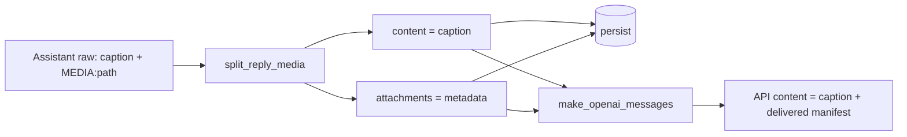

# Delivered attachments in LLM context

Date: 2026-07-16  
Status: approved for implementation planning

## Problem

When the assistant delivers a file via `MEDIA:<path>`:

1. The host moves resolvable paths into `ChatMessage.attachments`.
2. Visible / persisted `content` keeps only the caption (`MEDIA:` stripped).
3. On later turns, `make_openai_messages` sends assistant `content` only.

User uploads already re-enter the API payload through
`<!-- pointer-user-attachments -->`. Assistant-delivered files do not, so later
turns lose path / ref / localPath and follow-up work (re-send, edit, understand)
is harder.

This is a delivery-context gap, not a UI bug.

## Goal

Inject assistant `attachments` into the LLM wire payload the same way as user
attachments: API-only Markdown manifest, not written back into persisted
`content` or shown in the bubble.

## Non-goals

- Changing `MEDIA:` parse / strip / IM outbound delivery
- Inlining file bytes or text bodies into context
- Auto-running `media_understand` on delivered files
- Changing Composer / user-upload flow

## Approach (chosen)

**Same entry fields, distinct marker** (vs reusing the user marker or restoring
raw `MEDIA:` lines on the wire).

| Aspect | Choice |
|--------|--------|
| Marker | `<!-- pointer-delivered-attachments -->` |
| Entry fields | Reuse user manifest entry formatting (`fileName`, kind, mime, `ref`, `localPath`, size / remote rules) |
| Intent marker | Do **not** append `<!-- pointer-attachment-needs-intent -->` |
| Persistence | Unchanged: DB / UI still store stripped caption + structured `attachments` |
| Surfaces | App, Web, IM — all go through `make_openai_messages` |

## Data flow

## Implementation plan (code)

### `media/manifest.rs`

- Add `DELIVERED_ATTACHMENTS_MARKER = "<!-- pointer-delivered-attachments -->"`.
- Add `format_delivered_attachments_api_manifest(attachments)` — same body as
  user manifest, different marker; empty input → empty string.
- Add `append_delivered_attachments_api_context(content, attachments)` — append
  manifest after trimmed content; no needs-intent branch.
- Keep `format_attachment_entry` shared (no duplicate field logic).

### `media/mod.rs`

- Export the new constant and helpers.

### `models/openai_convert.rs`

- In `Role::Assistant`, before inserting `content` into the OpenAI object:
  - `api_content = append_delivered_attachments_api_context(&m.content, m.attachments.as_deref().unwrap_or(&[]))`
  - Use `api_content` as the wire string.
- User path remains `append_user_attachments_api_context` unchanged.

### Prompts

- `agents/_shared/COMMUNICATION_PUBLIC.md`: short bullet — delivered marker means
  files already sent to the user; reuse `ref` / `localPath` for follow-up; do not
  treat as a new user upload; do not ask intent solely because of this block.
- `agents/general/AGENT.md`: mirror the same distinction next to the existing
  user-attachments section.
- Optional one-line cross-link in `MEDIA_DELIVERY.md` if it helps agents find the
  rule (no filename-only prose that is useless at runtime).

### Docs

- `docs/design/multimedia-support.md`: note that assistant reply attachments are
  also API-only injected (delivered marker), symmetric to user uploads.

## Edge cases

| Case | Behavior |
|------|----------|
| No / empty `attachments` | No append (today’s behavior) |
| Caption empty, attachments present | Wire content is the delivered manifest only |
| Compression summary rows | No attachments → no inject |
| Failed / unresolved `MEDIA:` | Still left in visible content; no attachment row → no inject for that path |
| Sub-agent history | Same `make_openai_messages` path when those messages include attachments |

## Testing

- Unit: delivered manifest includes marker + fileName + ref/localPath when
  `storage_rel_path` is set; no needs-intent marker.
- Unit: `append_delivered_attachments_api_context` with empty attachments
  returns content unchanged.
- Unit: `make_openai_messages` — assistant with attachments → API content
  contains delivered marker; user with attachments still uses user marker only.

## Compatibility

- macOS / Windows / Linux: path resolution already in `attachment_local_abs_path`;
  no new FS assumptions.
- App client and Web: both use the same core conversion; no UI change required
  for correctness (markers must not appear in user-visible bubbles — they are
  wire-only, same as user manifests).

## Observability

- No new log spam required on the happy path.
- If append is skipped due to empty attachments after a successful delivery
  parse failure, existing media warn paths remain the signal.

## Success criteria

- After a successful `MEDIA:` delivery, the next LLM request’s assistant history
  turn includes `<!-- pointer-delivered-attachments -->` with resolvable
  `localPath` / `ref`.
- Chat UI still shows caption + attachment chips only (no path dump, no HTML
  comment markers).
- User attachment injection behavior unchanged.
