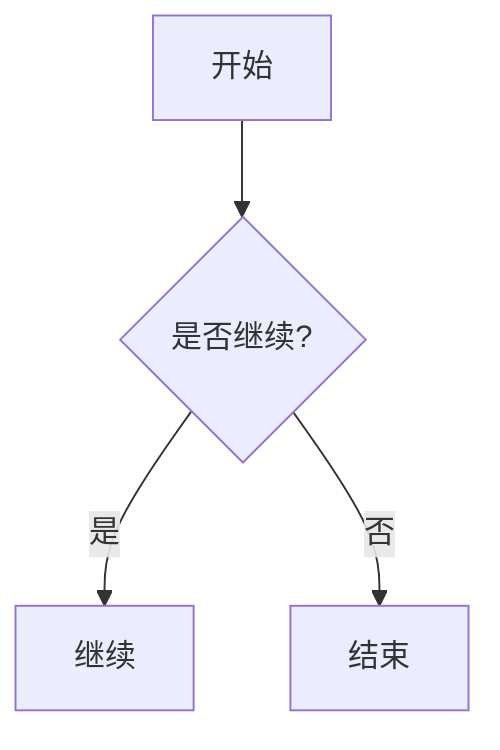

# Markdown Mermaid

Chat (and markdown file preview) render process / architecture diagrams from a fenced Mermaid block. The model emits nodes and edges only; the client paints with the **app light/dark tokens** (no CDN).

## Fence format

Language: `mermaid`.

Supported types: `flowchart`, `sequenceDiagram`, `classDiagram`, `stateDiagram`, `erDiagram`, `gantt`. Other types are not bundled — use `svg` instead.

Example:

````md

````

## Theme

- Default Mermaid skin is light cream / lavender. The host paints from diagram tokens (`--mermaid-node`, `--mermaid-cluster`, `--mermaid-node-border`, `--mermaid-edge`). Do not reuse `--accent-muted` as a node fill — in dark mode it is a 16% wash and blends into the card.
- Light tracks markdown chrome: cluster well = `--card-elevated` / table `th` (`240 5% 94%`); nodes are low-chroma accent plates (`211 40% 93%`, same sat family as dark, not 70% pastel and not paper-white); borders/edges stay in the `--border` / `--muted` grey family.
- Dark: lifted charcoal-blue plates on a 20% well. Cluster titles use `--muted`; node / edge labels use `--foreground`.
- Diamonds / stadiums / cylinders / subgraphs use the same node or cluster fill. Host CSS uses `!important` because Mermaid prefixes its own rules with the SVG id, which would otherwise leave pastel subgraphs and white-on-cream labels.
- Some Mermaid 11 labels still land in `<foreignObject>`. The mermaid sanitizer keeps those tags (scripts/handlers stripped). User `svg` fences still drop `foreignObject`.
- Switching `html.light` / `html.dark` remounts diagrams (same as xterm following the html class).
- Diagram-level `%%{init}%%` / `initialize` theme directives are stripped so they cannot fight the host palette.
- Do not tell the model to emit `classDef` / `style` colors.

## UI

- Card chrome matches GFM tables / code / charts (`--card`, rounded border).
- Toolbar: zoom, copy source, export SVG, toggle source. Export uses the themed SVG currently on screen.
- **Streaming:** do not layout Mermaid until the fence (and usually the turn) is complete; show “图示生成中…”.
- **Switch / scroll:** same in-view gate as Chart.js / SVG. Hidden workspace tabs wait until shown.

Model prompt: [`crates/pointer-core/src/agents/_shared/MERMAID_DIAGRAMS.md`](../../crates/pointer-core/src/agents/_shared/MERMAID_DIAGRAMS.md).

Implementation: [`src/lib/markdownMermaid.ts`](../../src/lib/markdownMermaid.ts), [`src/composables/useMarkdownMermaid.ts`](../../src/composables/useMarkdownMermaid.ts).
