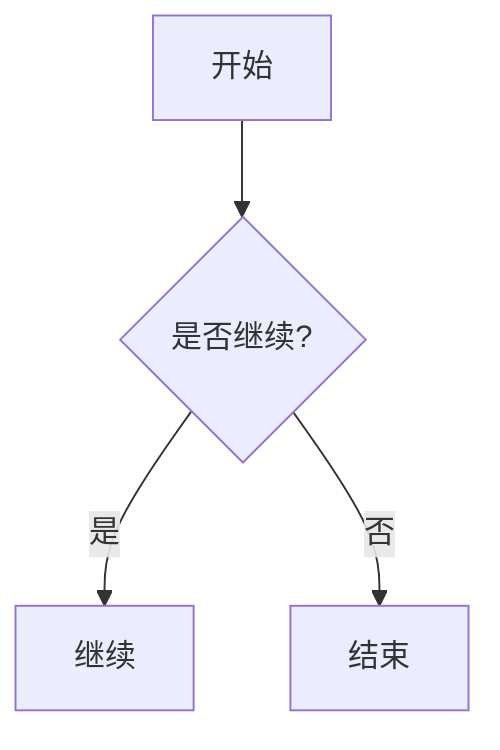

# Markdown Mermaid

Chat (and markdown file preview) render process / architecture diagrams from a fenced Mermaid block. The model emits nodes and edges only; the client paints with the **app light/dark tokens** (no CDN).

## Fence format

Language: `mermaid`.

Supported types: `flowchart`, `sequenceDiagram`, `classDiagram`, `stateDiagram`, `erDiagram`, `gantt`. Other types are rejected at render time — use `svg` instead.

Example:

````md

````

## Theme

- Default Mermaid skin is light cream / lavender. The host paints from diagram tokens (`--mermaid-node`, `--mermaid-cluster`, `--mermaid-node-border`, `--mermaid-edge`). Do not reuse `--accent-muted` as a node fill — in dark mode it is a 16% wash and blends into the canvas.
- Light tracks UI cards: white node fill (`--mermaid-node`), hairline `--border` family, grey arrows — not pastel blue plates. Dark uses charcoal plates lifted off the chat canvas (same outline language, inverted). Cluster titles use `--muted`; node / edge labels use `--foreground`.
- Diamonds / stadiums / cylinders / subgraphs use the same node or cluster fill. Host CSS uses `!important` because Mermaid prefixes its own rules with the SVG id, which would otherwise leave pastel subgraphs and white-on-cream labels. Flowchart `[]` rects get an 8px corner radius (clusters 10px). Decision `{ }` diamonds are rewritten to a rounded path with the same radius.
- Some Mermaid 11 labels still land in `<foreignObject>`. The mermaid sanitizer keeps those tags (scripts/handlers stripped). User `svg` fences still drop `foreignObject`.
- Switching `html.light` / `html.dark` remounts diagrams (same as xterm following the html class).
- Diagram-level `%%{init}%%` / `initialize` theme directives are stripped so they cannot fight the host palette.
- Model `[]` labels with `/`, `()`, `*`, nested `[]` (`vouchers[]`), or `<br/>` are quoted before parse (`A["draft.json (v2)"]`). The quoter matches brackets so `vouchers[]` is not cut at the first `]`. Unquoted subgraph titles with `（，）` / `()` are quoted the same way (`subgraph "明细路径（入账，正确）"`). Copy source stays the original fence.
- Do not tell the model to emit `classDef` / `style` colors.

## UI

- Fence chrome matches code / charts / SVG (`--fence-bg` = `--shell-chat`, rounded border).
- After render, crop the SVG `viewBox` to the graph plus padding so Mermaid’s
  unused canvas (often empty space above/beside a TD flowchart) does not stay
  in the frame. Crop maps each node’s `getBBox` through its CTM into SVG user
  space — Mermaid wraps the graph in translated `<g>`s, and local boxes alone
  leave a blank band at the top. A second crop runs on the next animation frame
  after fonts / `foreignObject` labels settle. The diagram stays horizontally
  centered (`margin: 0 auto`).
- Toolbar: zoom, copy source, export SVG, toggle source. Default **hidden**; show on diagram hover / focus-within (same idea as code-block copy). Stay visible while source view is active. Touch / coarse pointers keep the toolbar always visible. Export uses the themed SVG currently on screen. Zoom overlay clones the SVG outside `.md-body`; host paint rules also target `.diagram-zoom-overlay` so fills match the inline diagram.
- **Streaming:** do not layout Mermaid until the fence (and usually the turn) is complete; show “图示生成中…”.
- **Switch / scroll:** same in-view gate as Chart.js / SVG. Hidden workspace tabs wait until shown.

Model prompt: [`crates/pointer-core/src/agents/_shared/MERMAID_DIAGRAMS.md`](../../crates/pointer-core/src/agents/_shared/MERMAID_DIAGRAMS.md).

Implementation: [`src/lib/markdownMermaid.ts`](../../src/lib/markdownMermaid.ts), [`src/composables/useMarkdownMermaid.ts`](../../src/composables/useMarkdownMermaid.ts).
