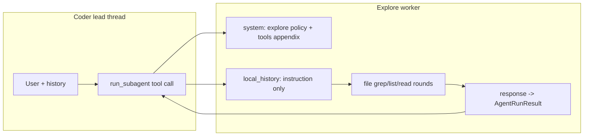

# Explore 子代理实现方案（供 Coder 使用）

> 设计对照稿：描述目标行为与实现落点；若与代码不一致，以仓库当前实现为准，并应回更本文或实现。

## 1. 与官方文档的对齐关系

参考 [Cursor Subagents / 内置 Explore](https://cursor.com/cn/docs/subagents) 的设计要点，映射到本仓库现状：

| Cursor 概念 | pointer-app 对应 |
|------------|------------------|
| 独立上下文窗口 | [`run_sub_agent`](../../../crates/pointer-core/src/chat_service/sub_agent.rs) 构造隔离 `local_history`（stub user）+ system **Assigned task**；无主线程历史。 |
| 中间过程噪声隔离在子会话 | 子 Agent 内工具往返留在子循环；父线程收到序列化 [`AgentRunResult`](../../../crates/pointer-core/src/agents/mod.rs)（元数据 + **`content`**：**Markdown** 侦察摘要）。 |
| Explore：搜索与分析代码库 | 子 worker 专注 `file:list` / `file:grep` / `file:glob` / `file:read`（只读），产出 **Markdown** 结构化结论（路径、符号、数据流）。 |
| 子代理默认更快模型（成本/速度） | 当前子调用复用同一 `OpenAIProvider`（`prov.stream_chat`），**未**按 Agent 切换模型；若要对齐官方「更快模型」，需后续在 `AgentDef.config` 或设置中增加「子 Agent 覆盖模型」并在 `run_sub_agent` 构造 provider 时应用（可选阶段）。 |
| 自定义子代理 `readonly: true` | 本仓库工具粒度为**工具名**（[`resolve_agent_tools`](../../../crates/pointer-core/src/chat_service/agent_tool_allowlist.rs)），`file` 单工具包含读写方法；只读采用 **提示词约束 + 线程上下文内硬拒绝**（见 §3.4）。 |
| 不可嵌套委派 | 已改为深度门控：默认 `maxSubAgentSpawnDepth=2`；见 [`subagent-goal-context-and-nesting.md`](../design/subagent-goal-context-and-nesting.md)。 |

同一 assistant turn 内多个独立 **`run_subagent(explore)`**（以及 **`self`**）可进入 owned-outcome 并行 wave（受 `maxParallelSubAgents` 限制）；**`coder`** / **`computer`** 仍串行。多区域探索优先在同一轮发出多个独立 explore 调用。

## 2. 目标行为（产品语义）

- **explore** 是一个 **builtin worker**（`role: worker`），`id` 固定为 **`explore`**。
- **职责**：在 workspace 内完成「定位代码 / 追踪引用 / 理清模块边界」类任务，**不**改代码、**不**跑 shell、**不**跑 lint（避免与「探索」无关的副作用和噪声）。
- **输出**：统一交付 **Markdown** 摘要（章节化证据与 trace）。子 Agent 通过 **`response`** 的 **`tool_args.text`** 提交；父级从 **`run_subagent`** 工具结果的 **`content`** 字段读取同一字符串（旁路为 id / 名等元数据）。子会话每轮仍遵循宿主 **JSON tool envelope**（见通信层），**不得**把裸 Markdown 当作 assistant 正文。
- **启用方式**：在 Lead Agent 的 [`AGENT.md` frontmatter `allowAgents`](../developer/pointer-run-subagent.md) 中列入 `explore` 后，[`delegatable_sub_agents_system_block`](../../../crates/pointer-core/src/agents/mod.rs) 会注入元数据，coder 才能合法 `run_subagent`。内置 **coder** 已默认包含 `explore`。

## 3. 代码与资源改动（核心）

1. **builtin bundle**  
   在 [`BUILTIN_AGENT_BUNDLES`](../../../crates/pointer-core/src/agents/mod.rs) 中注册 `id: "explore"`：
   - [`crates/pointer-core/src/agents/explore/AGENT.md`](../../../crates/pointer-core/src/agents/explore/AGENT.md)
   - [`crates/pointer-core/src/agents/explore/COMMUNICATION.md`](../../../crates/pointer-core/src/agents/explore/COMMUNICATION.md)

2. **`AgentProfile` 扩展**  
   在 [`AgentProfile`](../../../crates/pointer-core/src/agents/mod.rs) 中增加 `Explore`（serde `snake_case` → `explore`），供扩展点与 `file` 工具按 profile 做只读硬闸（与 `AgentProfile::Computer` 用法类似）。

3. **访问策略（工具白名单）**  
   frontmatter 建议：
   - `allowTools`: **`file`**, **`task_board`**
   - **不要**包含：`terminal`, `read_lints`, `run_subagent`, `skill`（默认）
   - `denyTools`: 可空

4. **只读硬闸**  
   在 [`file` 工具注册处](../../../crates/pointer-core/src/tools/file/mod.rs)：当线程上下文为 `AgentProfile::Explore` 且 `method` 为 `write` / `edit` 时拒绝并打 **warn** 日志。主/子会话在 `ToolRegistry::invoke` 前通过 [`FileToolLeadProfileGuard`](../../../crates/pointer-core/src/agents/mod.rs) 设置 `lead_agent_profile`。

5. **单元测试**  
   [`agents/mod.rs` builtin 测试](../../../crates/pointer-core/src/agents/mod.rs)、[`run_subagent.rs` 校验测试](../../../crates/pointer-core/src/tools/run_subagent.rs) 覆盖 `explore` 注册与 `allowAgents` 校验。

## 4. Explore 提示词结构（重构后）

正文不再集中在单文件 `AGENT.md`；运行时由 [`explore/mod.rs`](../../../crates/pointer-core/src/agents/explore/mod.rs) **`composed_system_body()`** 拼接：

| 顺序 | 切片 |
|------|------|
| 1 | `prompts/role.md` |
| 2 | `prompts/flow/router.md`, `standard.md`, `fast_narrow.md`, `fast_reachability.md` |
| 3 | `prompts/scenarios/*.md` |
| 4 | `_shared/exploration/impact_scan.md`, `handoff_contract.md`, `trace_when.md`, `file_discipline.md` |
| 5 | `prompts/deliverable.md` |

`AGENT.md` 仅保留 manifest + 短 mission；`COMMUNICATION.md` 只读约束。

**使命**：只读探索，返回 **高信号 Markdown**（Summary、Key files、Evidence、Coverage；Impact map 按需；**无**顶级 `## Forward trace` / `## Backward trace`）。

**Execution paths**：可选 **`### Execution paths`** 子节，仅当 [`trace_when.md`](../../../crates/pointer-core/src/agents/_shared/exploration/trace_when.md) 触发（含 **`production_debug`**）；hop 默认 **≤5**。

**场景路由**：`instruction` 首行 **`Scenario: <id>`** → `prompts/scenarios/*.md` playbook。

维护索引：[`docs/agents/coder-explore-prompts.md`](../agents/coder-explore-prompts.md)。旧正文归档：`explore/author/legacy_agent.md`（不加载）。

### 4.1 ~~How to explore workdir~~（已移除）

固定「How to explore workdir」章节与双向 trace 顶级标题已删除；流程见 **flow/** + **file_discipline.md** + **handoff_contract.md**。

### 4.2 是否「直接复用」通用智能体的标准流程？

- 方法论在 **`_shared/exploration/`** 与 **flow/** 中各写一处；子 Agent 无父对话系统提示。
- Coder 侧 **不** include 完整 impact 表 — 仅 **delegation.md** 中的 handoff 合并摘要。

## 5. Coder Agent 侧如何「使用」explore

实现落点：[`coder/mod.rs`](../../../crates/pointer-core/src/agents/coder/mod.rs) **`composed_system_body()`**（`prompts/delegation.md`、`prompts/scenarios/*`）；[`run_subagent.md`](../../../crates/pointer-core/src/tools/prompts/run_subagent.md) 为 schema + 指针；[`pointer-run-subagent.md`](../developer/pointer-run-subagent.md) 含用户向设置摘要。

- **何时委派**：多轮仍无法收敛地图、跨目录侦察、`instruction` 可自描述。
- **何时不委派**：单点修改、路径已明、完成标准写不清。
- **`instruction`**：目标、范围、禁止写代码、交付物、完成标准。
- **主→子事实传递**：已验证路径、排除项、空 grep、截断诚实；版式 **Lead context (trusted)** / **Already checked** / **Still unknown**；Lead context 以子 Agent **抽查验证**为准。

### 5.1 Lead→explore：补充检查清单

- **证据分级**：`USER_STATED` / `READ_AT path:Lx–Ly` / `GREPPED …`；推断放 **Assumptions (unverified)**。
- **显式否定与空结果**。
- **停止条件与深度上限**（与 `maxSubAgentToolRounds` 心理预期一致）。
- **非目标 / 排除区**。
- **假设排序**（高优先级先证）。
- **环境锚**（分支、flag、多 workspace）。
- **预算与截断诚实**（Partial / capped）。
- **子 Agent 回馈**：**Corrections to lead context**。
- **元数据**：`agentId: "explore"`；稳定 **`taskId`**。

## 6. 前端 / 设置

`allowAgents` 在 Lead Agent 的 **`AGENT.md`** 中配置，不在设置界面。设置中仅保留 **`maxSubAgentToolRounds`**（子 Agent 内工具轮次上限）。`explore` 为 builtin worker，经 `listAgents()` 可见；内置 **coder** 的 frontmatter 已默认 `allowAgents: [explore]`（见 [`pointer-run-subagent.md`](../developer/pointer-run-subagent.md)）。

## 7. 可选后续

- 子 Agent **模型覆盖**（`run_sub_agent` 内按 agent 覆盖 `model`）。
- **并行**多个 `run_subagent`（工具循环并发与取消、UI 状态）。

## 8. 相关用户文档

- [`pointer-run-subagent.md`](../developer/pointer-run-subagent.md) — `allowAgents`、`explore` 行为摘要。

## 9. 实现状态（对照用）

| 项 | 状态 |
|----|------|
| explore builtin + `AgentProfile::Explore` | 已实现 |
| `file` write/edit 硬闸 + `FileToolLeadProfileGuard` | 已实现 |
| coder / `run_subagent` 提示与示例 | 已实现 |
| 单测 `explore` 加载与 `validate_run_subagent_target` | 已实现 |
| 前端 `AgentProfile` 含 `explore` | 已实现（`src/types/chat.ts`） |
